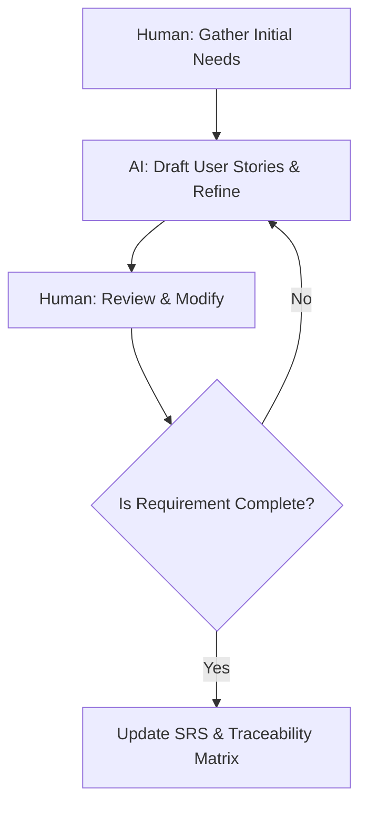
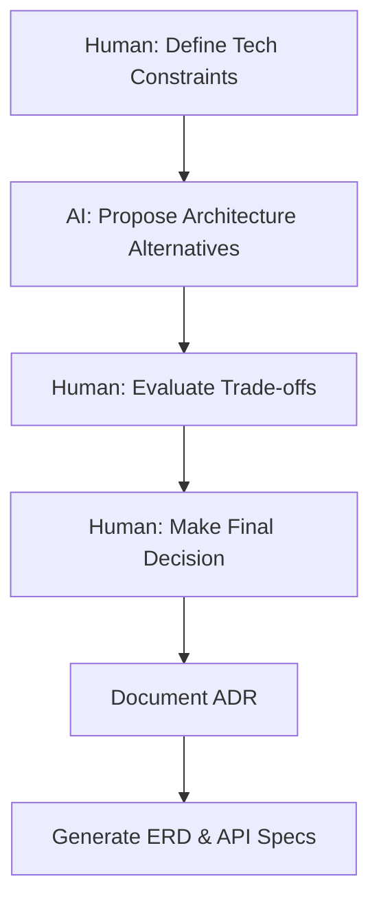
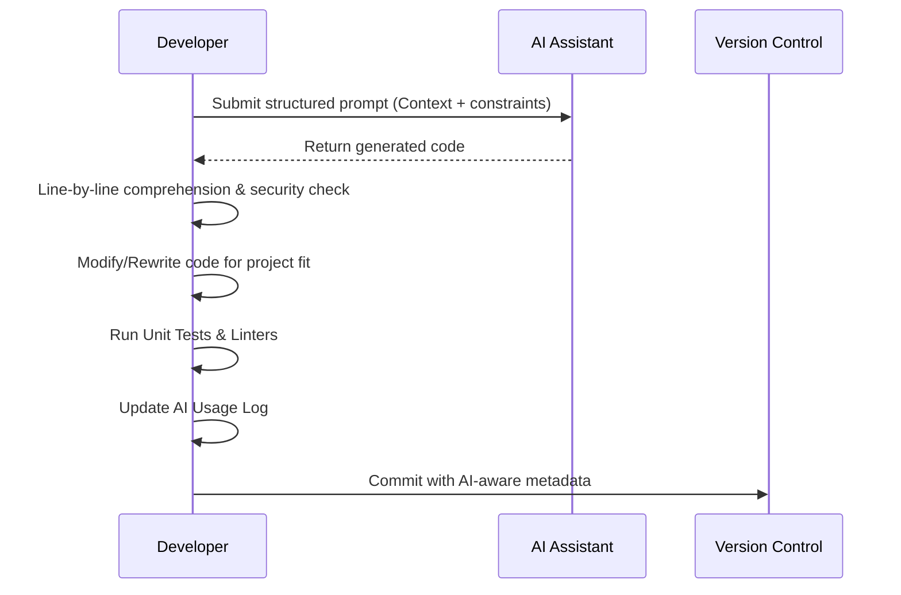
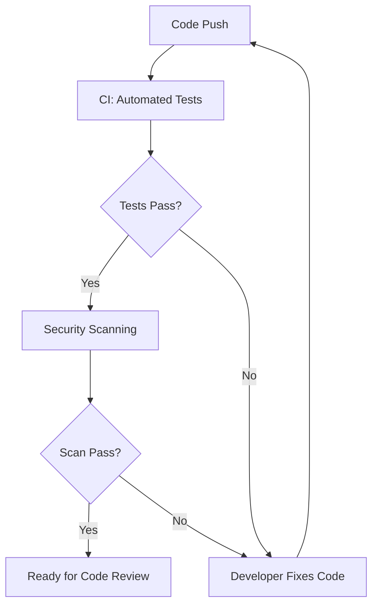
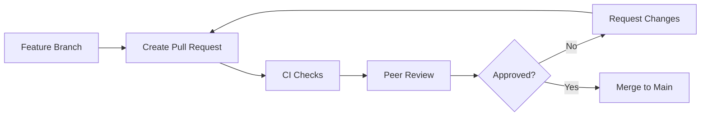
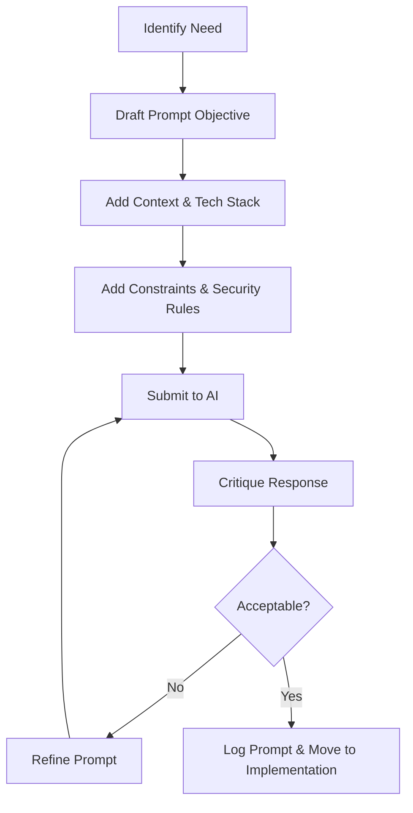
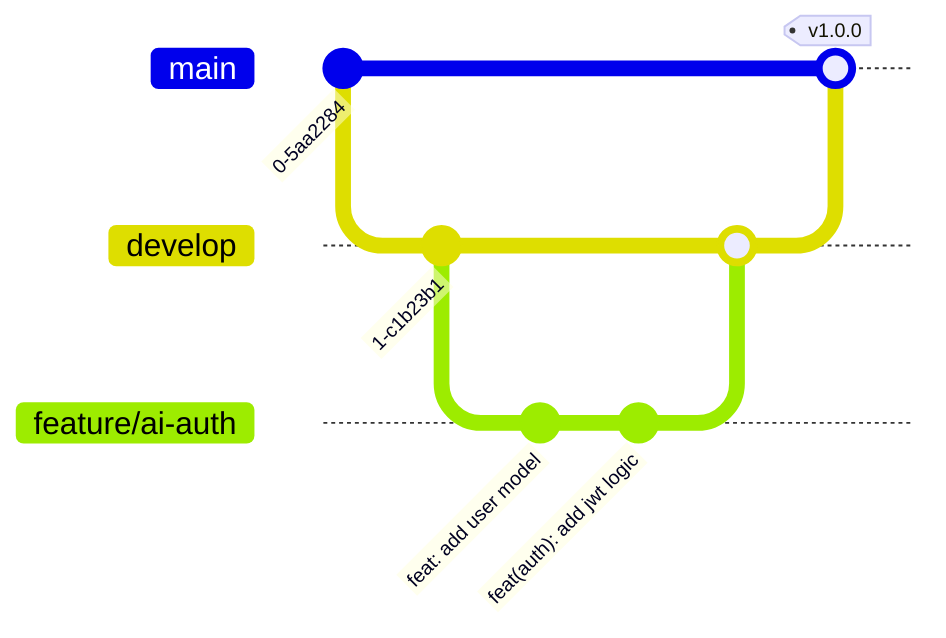

# MASTER Standard Operating Procedure (SOP): AI-Assisted Development Workflow

## Front Matter

### Document Information
- **Document Title:** AI-Assisted Development Workflow (AI + Vibe Coding Workflow)
- **Version:** 1.0.0
- **Date:** 2026-07-26
- **Authors:** Senior Software Engineering Architecture Team
- **Approval Status:** Approved for University of Transport Ho Chi Minh City (UTH) Capstone Projects
- **Course:** Deep Learning / Software Engineering

### Revision History

| Version | Date       | Author | Description of Changes |
|---------|------------|--------|------------------------|
| 1.0.0   | 2026-07-26 | Arch. Team | Initial Master Release |

### Table of Contents
1. Front Matter
2. Part I: Governance Framework
3. Part II: Development Lifecycle (SDLC Phases)
4. Part III: Cross-Cutting Concerns
5. Part IV: Roles & Responsibilities
6. Part V: Compliance & Standards Evaluation
7. Part VI: Appendices

### Document Purpose and Scope
This Master Standard Operating Procedure (SOP) defines the standardized workflow for AI-assisted software development (often termed "vibe coding") for student engineering teams (5-10 members) at the University of Transport Ho Chi Minh City (UTH). The workflow ensures absolute traceability (Prompt → AI Output → Human Modification → Commit), rigorous quality assurance, and compliance with academic integrity standards. **AI is strictly defined as a supporting tool; students hold full accountability for every line of code and architectural decision.**

### Glossary of Terms
- **SDLC (Vòng đời phát triển phần mềm):** Software Development Life Cycle.
- **ADR (Ghi chú Quyết định Kiến trúc):** Architecture Decision Record.
- **SOP (Quy trình thao tác chuẩn):** Standard Operating Procedure.
- **V&V (Xác minh và Thẩm định):** Verification and Validation.
- **CI/CD (Tích hợp và Triển khai liên tục):** Continuous Integration and Continuous Deployment.
- **Vibe Coding:** The practice of using AI assistants to generate boilerplate, conceptualize solutions, and draft logic, strictly under continuous human supervision and validation.

### Referenced Standards
- ISO/IEC 12207 (Software Life Cycle Processes)
- ISO/IEC 25010 (Software Quality Model)
- OWASP Secure Coding Practices
- GitHub Flow
- Conventional Commits

---

## Part I: Governance Framework

### Phase 0: AI Governance & Policy Setup
- **Objective:** Establish team AI governance policies before development begins.
- **Inputs:** Course requirements, team composition, project scope.
- **Activities:**
  - Define AI usage policy and ethical guidelines.
  - Register approved AI tools with versions (e.g., GitHub Copilot v1.xx, ChatGPT-4o, Claude 3.5 Sonnet).
  - Define data sensitivity classification (Public, Internal, Confidential).
  - Establish accountability matrix (RACI).
  - Define AI output risk levels (Low/Medium/High/Critical).
- **Outputs:** AI Governance Charter, Approved Tools Registry, RACI Matrix.
- **Responsible roles:** Project Lead, AI Governance Officer.
- **Required documents:** `AI_GOVERNANCE_CHARTER.md`, `APPROVED_AI_TOOLS.md`.

#### Quality Checklist (Phase 0)
- [ ] AI Governance Charter is approved by all team members and lecturer.
- [ ] Approved AI Tools Registry is documented with specific versions.
- [ ] Data sensitivity categories are clearly defined.
- [ ] RACI Matrix is complete and understood by the team.
- [ ] Risk levels for AI outputs are established.
- [ ] Emergency procedures for AI misuse are defined.
- [ ] Confidentiality rules regarding source code and API keys are strictly stated.
- [ ] Regular audit schedule for AI compliance is set.

---

## Part II: Development Lifecycle (SDLC Phases)

### Phase 1: Requirements Analysis
- **Objective:** Gather, analyze, and document system requirements with AI assistance while maintaining human primacy.
- **Inputs:** Project brief, stakeholder needs, domain knowledge.
- **Activities:**
  - Human-first requirements gathering.
  - AI-assisted requirements refinement (e.g., checking for edge cases, drafting user stories).
  - Requirements validation and prioritization by the human team.
  - Create traceability matrix.
- **Outputs:** Software Requirements Specification (SRS), Requirements Traceability Matrix.
- **Responsible roles:** Business Analyst, Project Lead.
- **Required documents:** `SRS.md`, `TRACEABILITY.md`.

#### Quality Checklist (Phase 1)
- [ ] All requirements are explicitly reviewed by human team members.
- [ ] AI was used only for structuring and refining, not fabricating requirements.
- [ ] Traceability matrix maps requirements to future design components.
- [ ] Non-functional requirements (performance, security) are documented.



### Phase 2: System Design
- **Objective:** Design system architecture with AI acting purely as an advisor/consultant.
- **Inputs:** Validated requirements, technology constraints.
- **Activities:**
  - Human-led Architecture design, consulting AI for trade-offs.
  - Database design (ERD generation/refinement).
  - API design (Swagger/OpenAPI drafting).
  - Security design and threat modeling.
  - AI Decision Records (ADR) for each major design choice.
- **Outputs:** System Design Document, Entity Relationship Diagram (ERD), API specifications.
- **Responsible roles:** Tech Lead / Architect.

#### Quality Checklist (Phase 2)
- [ ] Architecture choices are documented via ADRs.
- [ ] AI was not used to blindly select stacks without human justification.
- [ ] Security protocols are explicitly designed.
- [ ] Database normalization is verified by a human.



### Phase 3: Implementation (Vibe Coding)
- **Objective:** Implement features using AI-assisted coding with full traceability and human comprehension.
- **Inputs:** Design documents, coding standards, issue tracker.
- **Activities:**
  - Prompt engineering for code generation.
  - AI code generation.
  - **CRITICAL:** Human code review and line-by-line comprehension.
  - Code modification and integration into the existing codebase.
  - Security review of AI-generated code.
  - Unit testing (human-led or AI-assisted with human review).
  - AI Usage Log entry creation.
- **Outputs:** Source code, unit tests, `AI_USAGE_LOG.md`.

#### Quality Checklist (Phase 3)
- [ ] Developer understands EVERY LINE of generated code.
- [ ] Code adheres to OWASP secure coding practices.
- [ ] Original prompt is logged.
- [ ] AI output is logged.
- [ ] Human modifications are tracked and justified.
- [ ] Code compiles and passes linting.
- [ ] Unit tests are written and passing.
- [ ] Performance complexity (Big-O) is assessed.
- [ ] No hardcoded secrets or API keys exist.
- [ ] Unused generated code is deleted.
- [ ] Edge cases are handled appropriately.
- [ ] Logging and error handling are robust.
- [ ] Dependencies are checked for vulnerabilities.
- [ ] Commit message follows the strict AI-aware convention.
- [ ] AI Usage log is updated before pushing.

#### Complete Vibe Coding Sub-Workflow
1. **Understand:** Read the requirement completely.
2. **Design:** Mentally (or on paper) sketch the solution.
3. **Prompt:** Craft the prompt using the standard template.
4. **Generate:** Receive AI output.
5. **Comprehend:** Read and mentally execute EVERY line of code.
6. **Critique:** Identify logic, security, and stylistic issues.
7. **Modify:** Rewrite and adapt the code to fit the project context.
8. **Test:** Write unit tests for the modified code.
9. **Verify:** Run tests and linters.
10. **Log:** Record the interaction in the AI Usage Log.
11. **Commit:** Commit using the AI-extended Conventional Commits format.



### Phase 4: Testing & Verification
- **Objective:** Verify all code meets strict quality and security standards.
- **Inputs:** Source code, test plans, requirements.
- **Activities:**
  - Unit testing (Minimum 80% coverage).
  - Integration testing.
  - Security testing (OWASP Top 10 checklist).
  - AI output verification (ensuring no hallucinations).
  - Regression testing.
- **Outputs:** Test reports, defect logs.

#### Quality Checklist (Phase 4)
- [ ] Coverage requirements are met.
- [ ] Edge cases identified by AI are tested.
- [ ] AI-generated test cases are verified for correctness (testing the right things).
- [ ] Vulnerability scan is clean.



### Phase 5: Code Review & Integration
- **Objective:** Human peer review ensuring traceability and code quality.
- **Inputs:** Feature branches, PRs, Test results.
- **Activities:**
  - Self-review against AI Usage Logs.
  - Peer review (focusing on AI traceability and business logic).
  - PR approval and merge.
- **Outputs:** Approved PRs, Merged codebase.

#### Quality Checklist (Phase 5)
- [ ] PR description includes AI usage summary.
- [ ] Reviewer verifies AI Usage Log matches the diff.
- [ ] Reviewer confirms they understand the generated logic.
- [ ] CI pipeline passes completely.



### Phase 6: Documentation & Knowledge Management
- **Objective:** Maintain living documentation of the system and AI usage.
- **Inputs:** Artifacts, codebase, logs.
- **Activities:**
  - Update system documentation.
  - Compile the comprehensive AI Usage Report.
  - Maintain the Prompt Library (successful prompts).
- **Outputs:** Updated Wiki, Final AI Usage Report.

#### Quality Checklist (Phase 6)
- [ ] All API endpoints are documented.
- [ ] Database schema is up to date.
- [ ] AI Usage Report is fully compiled and formatted.

### Phase 7: Delivery & Defense Preparation
- **Objective:** Prepare deliverables and ensure students can defend all AI-generated code.
- **Inputs:** Complete artifacts.
- **Activities:**
  - Final compliance audit.
  - Prepare AI usage statement.
  - Defense rehearsal (Lecturer simulation).
- **Outputs:** Final Submission Package, Presentation slides.

#### Quality Checklist (Phase 7)
- [ ] Every team member can explain randomly selected code blocks.
- [ ] Traceability from Requirement to Commit is unbroken.
- [ ] Final report strictly follows university guidelines.

---

## Part III: Cross-Cutting Concerns

### Prompt Engineering Workflow
Effective prompt engineering is essential for traceability and quality.
1. **Define objective:** State precisely what is needed.
2. **Provide context:** Detail tech stack, frameworks, and related files.
3. **Specify output:** Define format (e.g., JSON, Markdown) and constraints.
4. **Include examples:** Provide input/output examples.
5. **Set constraints:** Enforce security and stylistic rules.
6. **Refine:** Review before sending.
7. **Evaluate:** Assess AI response critically.



### Git Workflow & Branching Strategy
- **Branches:** `main`, `develop`, `feature/xxx`, `bugfix/xxx`, `docs/xxx`.
- **Protection:** `main` and `develop` require PRs and passing status checks.
- **Merge Strategy:** Squash and merge for features to maintain a clean history.



### Commit Convention
Extending Conventional Commits to include AI Traceability:

```text
<type>(<scope>): <description>

[body: Detailed explanation of changes]

[AI-Assisted: Yes/No]
[AI-Tool: ChatGPT-4o / GitHub Copilot v1.xx]
[AI-Contribution: Generated initial boilerplate for JWT middleware]
[Human-Modification: Refactored secret retrieval to use secure Vault, fixed typing]
[Reviewed-By: Nguyen Van A]
```

### Risk Management for AI-Generated Content

| Risk Category | Impact | Likelihood | Mitigation Strategy |
|---------------|--------|------------|---------------------|
| Correctness / Hallucination | High | Medium | Human line-by-line review, strict unit testing. |
| Security Vulnerabilities | Critical | Low | Static analysis scanning, OWASP checklist verification. |
| Intellectual Property (IP) | Medium | Low | Use approved enterprise/academic AI models; do not feed proprietary data. |
| Bias | Low | Low | Human review of AI-generated content and logic flows. |

### Security Considerations (OWASP Alignment)
- **Injection:** Ensure AI doesn't generate concatenated SQL strings. Use ORMs.
- **Broken Authentication:** Validate AI-generated token handling.
- **Data Privacy:** NEVER paste `.env` files, API keys, or real user data into AI prompts.

### Traceability Matrix (Example)

| Req ID | Description | AI Prompt Link | Code Component | Human Mod | Test Case | Git Commit |
|--------|-------------|----------------|----------------|-----------|-----------|------------|
| REQ-01 | User Login | `prompts/p01.md` | `auth.controller.ts` | Fixed CORS config | `auth.test.ts` | `a1b2c3d` |

---

## Part IV: Roles & Responsibilities (RACI Matrix)

*R = Responsible, A = Accountable, C = Consulted, I = Informed*

| Role | Phase 0 (Setup) | Phase 1 (Req) | Phase 2 (Design) | Phase 3 (Code) | Phase 4 (Test) | Phase 5 (Review) |
|------|-----------------|---------------|------------------|----------------|----------------|------------------|
| **Project Lead** | A, R | A, R | I | I | I | C |
| **AI Governance Officer** | A, R | C | C | C | C | R (AI Audit) |
| **Tech Lead / Architect** | C | C | A, R | A, C | C | R |
| **Developers (Dev)** | I | C | C | A, R | R | R |
| **QA / Testing Lead** | I | C | I | C | A, R | C |
| **Doc Manager** | I | R | R | R | R | A, R |

---

## Part V: Compliance & Standards Evaluation

### 1. ISO/IEC 12207 (Software Life Cycle Processes)
- **Requirement:** Structured lifecycle processes from conception to retirement.
- **SOP Alignment:** Phases 1-7 map directly to primary lifecycle processes (Acquisition, Supply, Development, Operation, Maintenance).
- **Gap:** Academic projects rarely cover full Maintenance/Retirement.
- **Suggestion:** Focus strictly on the Development process group.

### 2. ISO/IEC 25010 (Software Quality Model)
- **Requirement:** Quality characteristics (Functional suitability, Performance efficiency, Security, Maintainability).
- **SOP Alignment:** Phase 4 explicitly targets these via testing. AI code is strictly evaluated for maintainability during Phase 5 (Code Review).
- **Gap:** AI can introduce complex, hard-to-maintain code.
- **Suggestion:** Strict enforcement of "Human comprehension" rules.

### 3. OWASP Secure Coding Practices
- **Requirement:** Mitigation of Top 10 web vulnerabilities.
- **SOP Alignment:** Explicit security reviews (Phase 3) and Security Testing (Phase 4).
- **Gap:** Students may lack security expertise.
- **Suggestion:** Integrate automated SAST tools in the CI pipeline.

### 4. GitHub Flow & Conventional Commits
- **Requirement:** Trunk-based development and structured commit history.
- **SOP Alignment:** Fully integrated via the custom AI-extended commit convention and PR workflow.

---

## Part VI: Appendices

### Appendix A: Quick Reference Card
> **Stop and Think:**
> 1. Did I write the prompt safely? (No secrets!)
> 2. Did I read every line of the AI output?
> 3. Did I modify it to fit my architecture?
> 4. Did I write tests?
> 5. Did I log it?
> 6. Is my commit message compliant?

### Appendix B: Decision Tree for AI Usage
- Is it boilerplate or a common pattern? **Use AI.**
- Is it core, complex, proprietary business logic? **Human first, AI for syntax help only.**
- Is it configuring infrastructure/security? **Human first, AI for validation.**

### Appendix C: Emergency Procedures
If AI generates harmful, biased, or broken code that makes it to main:
1. Immediately invoke a `hotfix` branch.
2. Revert the offending commit.
3. Notify the AI Governance Officer.
4. Document the incident in the final report.

### Appendix D: BPMN-Style Workflow summary
Start -> Define Policy -> Gather Reqs -> Design Architecture -> Draft Prompt -> Generate Code -> Human Review & Modify -> Test -> Log Usage -> Code Review -> Merge -> Final Audit -> End.

---
*Document officially prepared for the University of Transport Ho Chi Minh City (UTH) Capstone Projects.*
