# AI-Assisted Software Development Workflow Diagrams and Analysis

This document serves as the comprehensive workflow visualization and standards analysis companion to the main Standard Operating Procedure (SOP) for the AI-Assisted Development Workflow. It provides detailed structural models, standards compliance tracking, and gap analysis for university capstone software engineering projects.

---

## SECTION 1: Mermaid Diagrams

### 1.1 Overall AI-Assisted SDLC Flow

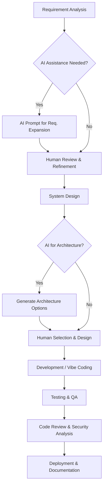

### 1.2 Vibe Coding Workflow

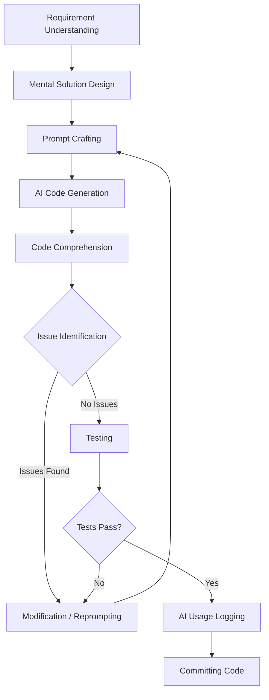

### 1.3 Prompt Engineering Workflow

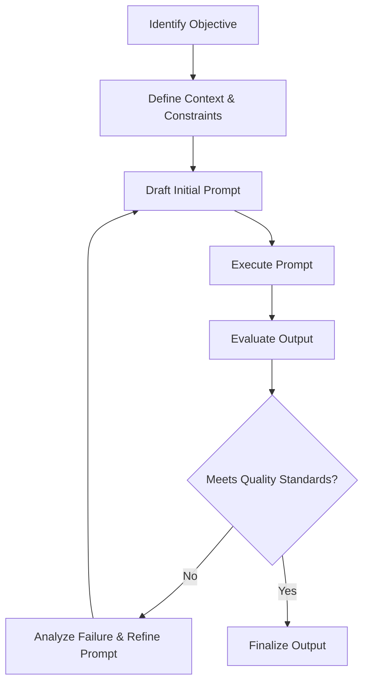

### 1.4 Git Branching Strategy

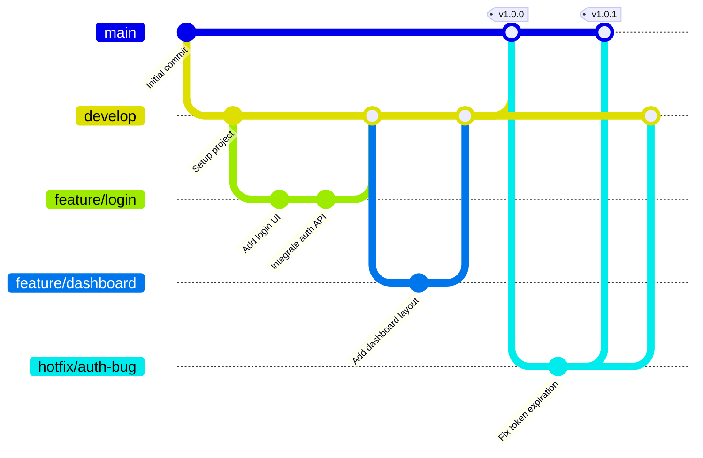

### 1.5 Code Review Process

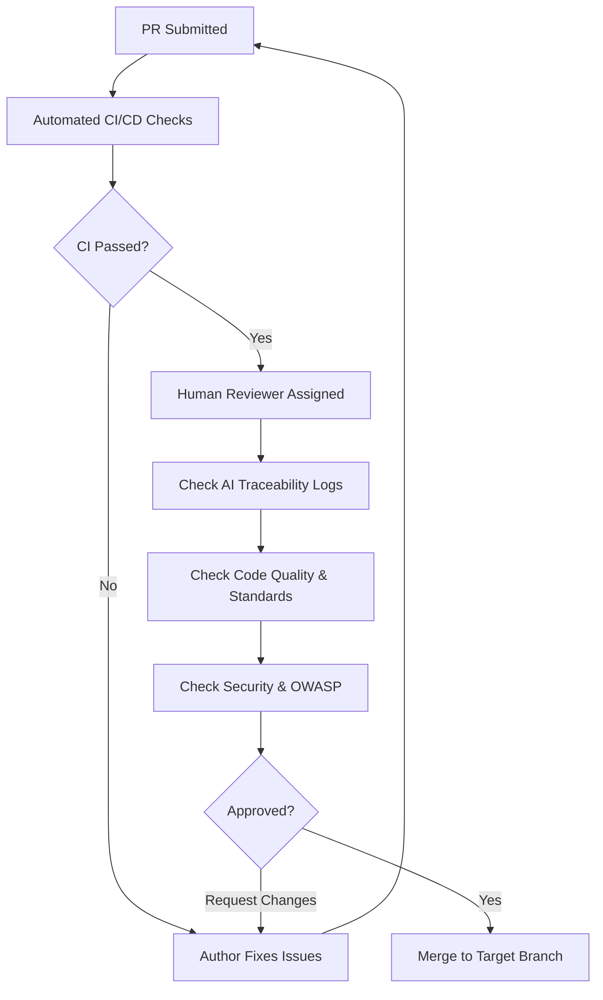

### 1.6 Pull Request Lifecycle

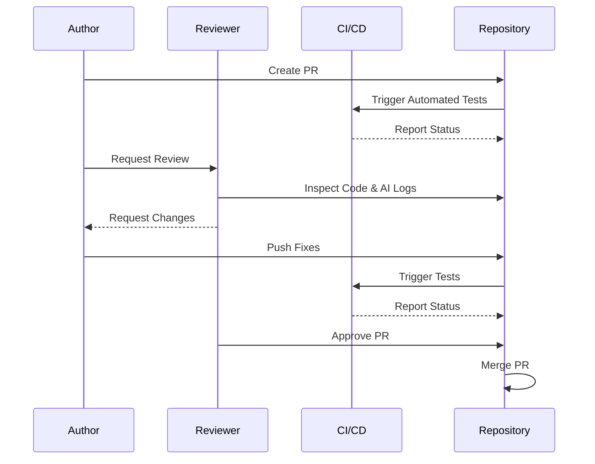

### 1.7 AI Usage Logging Flow

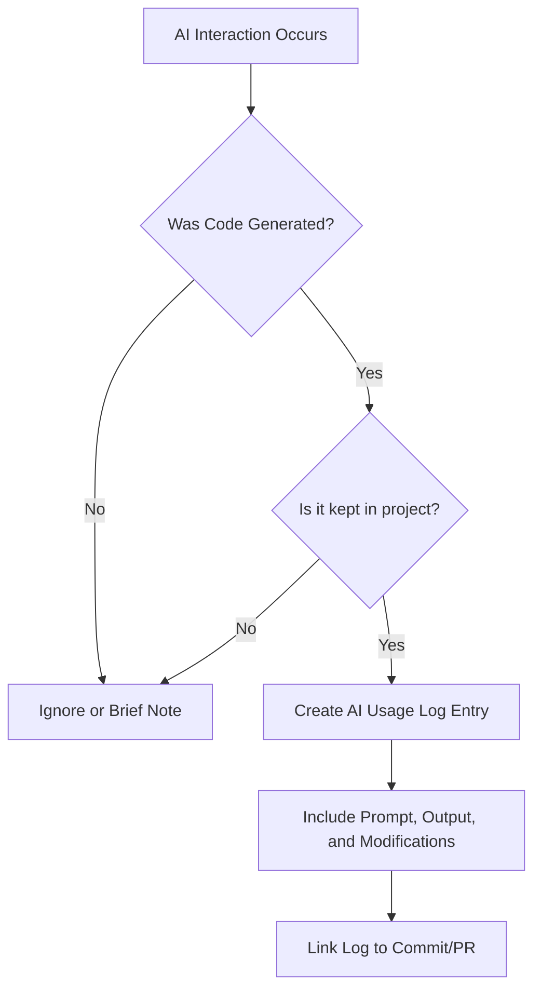

### 1.8 Testing Workflow

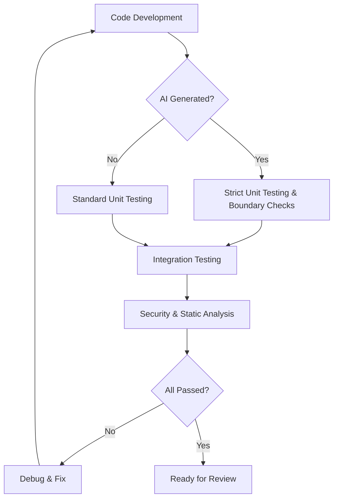

### 1.9 Traceability Chain

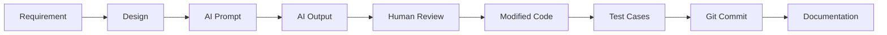

### 1.10 Risk Assessment Flow

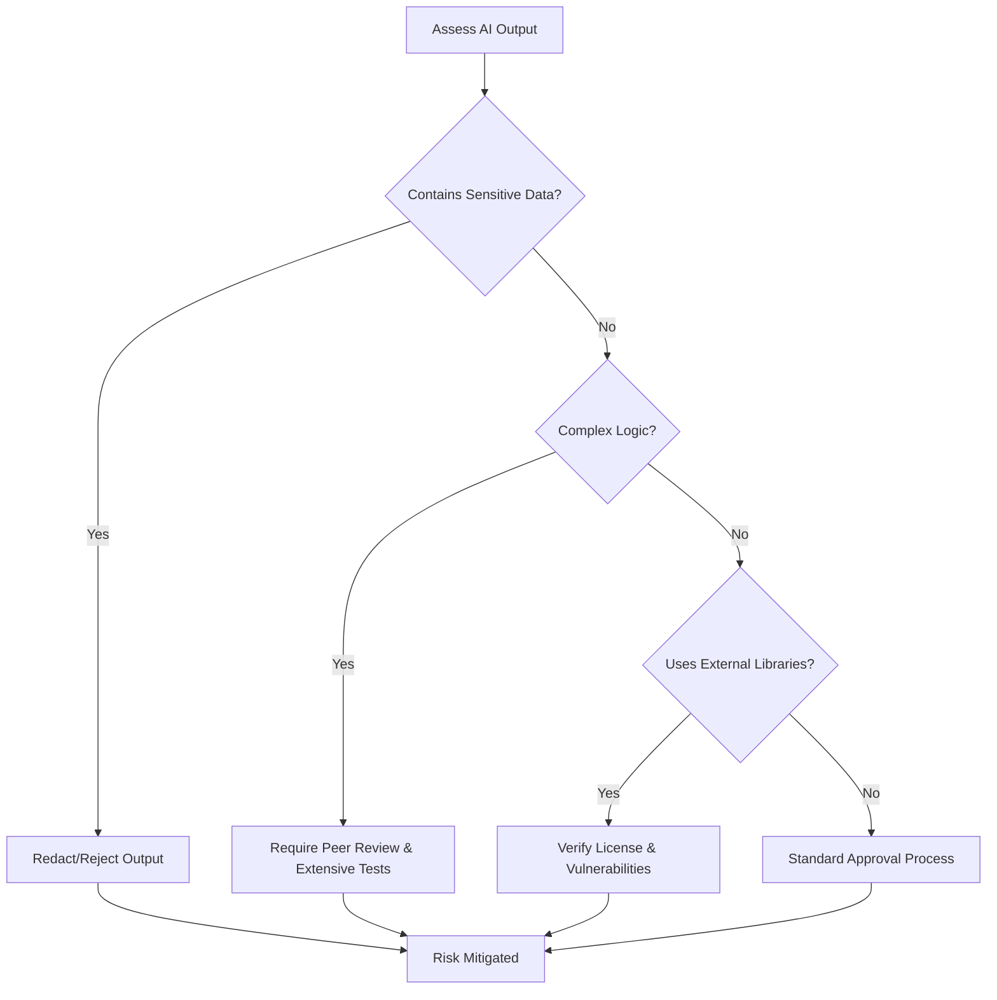

### 1.11 Defense Preparation Flow

```mermaid
flowchart TD
    A[Defense Preparation Phase] --> B[Compile AI Usage Logs]
    B --> C[Map AI Contributions to Requirements]
    C --> D[Review Traceability Matrix]
    D --> E[Identify Key Human Contributions]
    E --> F[Prepare Defense Presentation]
    F --> G[Mock Defense (Focus on AI Governance)]
    G --> H[Final Defense]
```

### 1.12 Team Collaboration Architecture

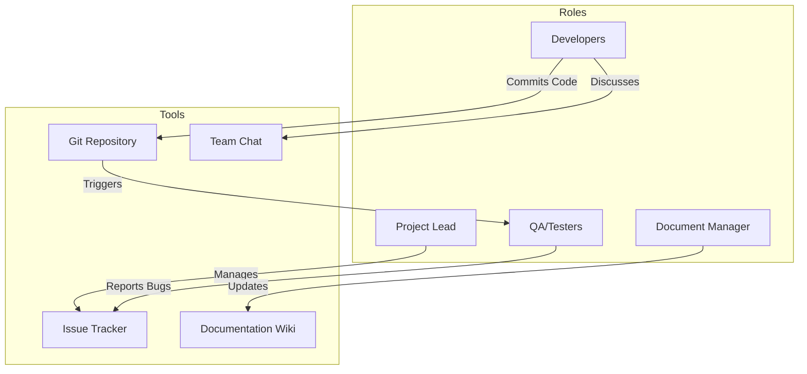

---

## SECTION 2: Sequence Diagrams

### 2.1 Developer-AI Interaction Sequence

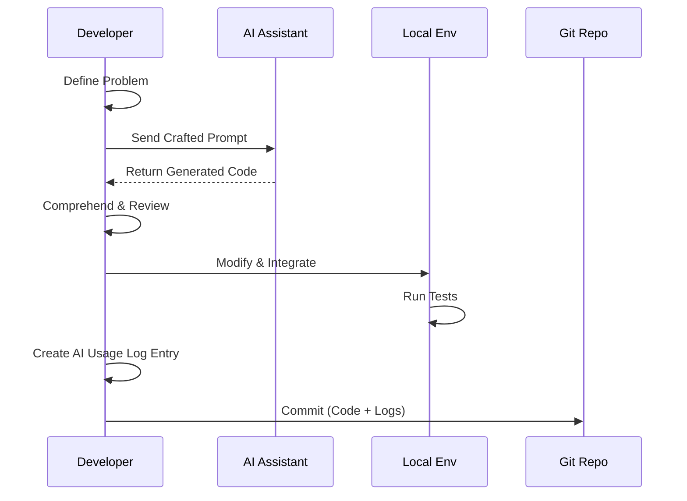

### 2.2 Code Review Sequence

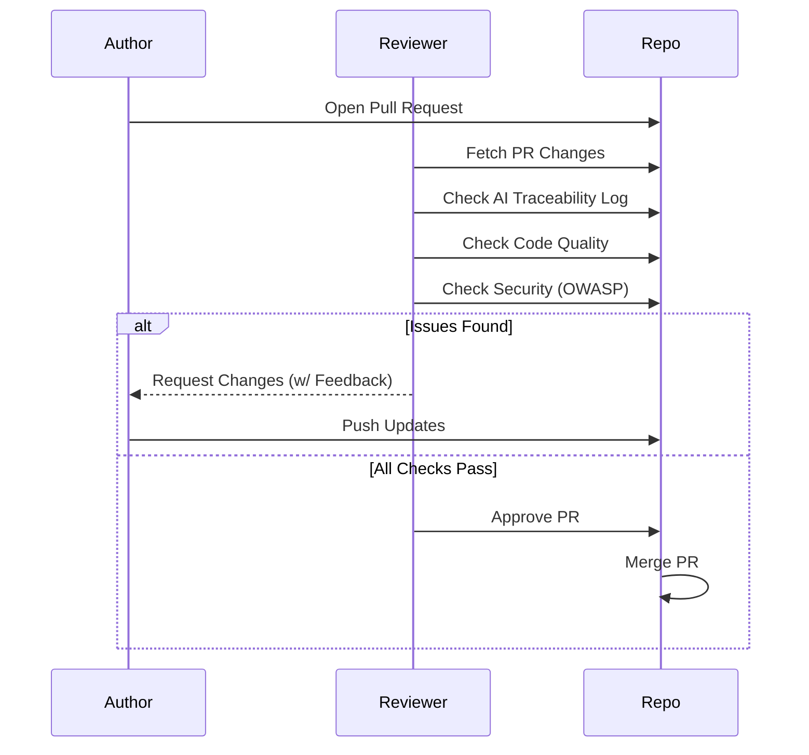

### 2.3 Sprint/Iteration Workflow

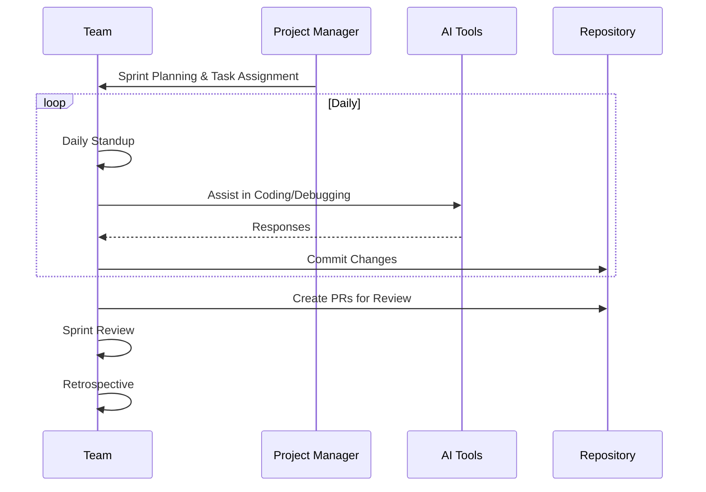

---

## SECTION 3: BPMN-Style Workflow (Text Version)

### Process: AI-Assisted Software Development

**Swimlanes:**
1. **Project Lead (PL)**
2. **Developer (DEV)**
3. **AI Tool (AI)**
4. **QA/Tester (QA)**
5. **Document Manager (DM)**
6. **Reviewer (REV)**

| Activity ID | Activity Name | Type | Description | Input Artifacts | Output Artifacts | Role | Preceding | Following | AI Involvement |
|---|---|---|---|---|---|---|---|---|---|
| A01 | Sprint Planning | Task | Define scope and assign tasks | Backlog | Sprint Plan | PL | None | A02 | None |
| A02 | Requirement Analysis | Task | Analyze assigned task details | Sprint Plan | Task Specs | DEV | A01 | A03 | Assisted |
| A03 | Prompt Crafting | Task | Create prompt for AI assistance | Task Specs | Prompt | DEV | A02 | A04 | Augmented |
| A04 | Generate Solution | Task | Produce code/design based on prompt | Prompt | AI Output | AI | A03 | A05 | Full |
| A05 | Review AI Output | Task | Assess AI generated content | AI Output | Reviewed Code | DEV | A04 | A06 | None |
| A06 | Modify/Integrate | Task | Refine and integrate code into project | Reviewed Code | Draft Code | DEV | A05 | A07 | None |
| A07 | Local Testing | Task | Run local unit tests | Draft Code | Test Results | DEV | A06 | A08 | Assisted |
| A08 | Create AI Log | Task | Document AI prompt and usage | Prompt, Draft Code | AI Usage Log | DEV | A07 | A09 | None |
| A09 | Commit & PR | Task | Push changes and open Pull Request | Draft Code, Log | Pull Request | DEV | A08 | A10 | None |
| A10 | Code Review | Task | Review code, logs, and security | Pull Request | Review Feedback | REV | A09 | A11 | Assisted |
| A11 | CI/CD Testing | Task | Automated integration testing | Pull Request | CI Report | QA | A09 | A12 | None |
| A12 | Merge PR | Task | Merge approved changes to main branch | Approved PR | Merged Code | REV | A10, A11 | A13 | None |
| A13 | Update Docs | Task | Update project documentation | Merged Code | Updated Docs | DM | A12 | End | Assisted |

---

## SECTION 4: Standards Compliance Evaluation

### 4.1 ISO/IEC 12207 Compliance

| ISO Process | SOP Phase | Coverage | Gap | Recommendation |
|---|---|---|---|---|
| 6.4.1 Req. Analysis | Requirements Analysis | High | AI bias in requirements | Add AI bias check in requirements phase |
| 6.4.2 Architecture | System Design | Medium | Traceability of AI architecture choices | Log AI architecture prompts specifically |
| 6.4.3 Detailed Design | System Design | High | None | Maintain current practice |
| 6.4.4 Construction | Vibe Coding | High | Over-reliance on AI | Enforce strict human comprehension checks |
| 6.4.5 Integration | CI/CD Pipeline | High | None | Maintain current practice |
| 6.4.6 Testing | QA Phase | High | Test coverage for AI edge cases | Implement mutation testing |
| 7.1 Doc. Management | Documentation | High | Versioning AI Prompts | Store complex prompts in a dedicated repository directory |
| 7.2 Config Management | Git Version Control | High | None | Maintain current practice |

### 4.2 ISO/IEC 25010 Quality Model Alignment

| Quality Characteristic | How SOP Ensures Attribute |
|---|---|
| **Functional Suitability** | Thorough requirement analysis and AI prompt traceability ensure features meet specifications. |
| **Performance Efficiency** | Review phase includes checks for unoptimized AI-generated loops or resource-heavy algorithms. |
| **Compatibility** | Standardized dev environments and CI/CD pipelines verify cross-component interoperability. |
| **Usability** | UX/UI designs are verified independently of AI back-end generation. |
| **Reliability** | Strict unit and integration testing mandates for all AI-generated code. |
| **Security** | Mandatory OWASP checklist during code review and automated static analysis tools in CI/CD. |
| **Maintainability** | Enforcement of conventional commits, code commenting standards, and clear AI traceability logs. |
| **Portability** | Use of containerization (e.g., Docker) and infrastructure-as-code principles. |

### 4.3 OWASP Secure Coding Practices Checklist Mapping

| OWASP Practice | Mapped SOP Activity |
|---|---|
| Input Validation | Vibe Coding (Explicitly Prompted), Code Review |
| Output Encoding | Code Review, Security Testing |
| Authentication | Design Phase, Integration Testing |
| Session Management | Design Phase, Security Review |
| Access Control | CI/CD Security Scans, Code Review |
| Cryptographic Practices | Dependency Audits, Architecture Review |
| Error Handling | Standardized in Vibe Coding phase |
| Data Protection | Risk Assessment Phase (1.10) |
| Communication Security | Architecture Design |
| System Configuration | Configuration Management |
| Database Security | Vibe Coding constraints, DB Code Review |
| File Management | Secure AI usage policies (No sensitive file uploads) |
| Memory Management | Code Quality Analysis during CI/CD |
| General Practices | AI Code Comprehension step (Human check) |

### 4.4 GitHub Flow Compliance
The Git Branching Strategy (Diagram 1.4) strictly adheres to GitHub Flow principles. Development happens on feature branches off `develop` (or `main`), and merges occur via Pull Requests after passing CI checks and mandatory reviews. `main` acts as the stable release branch, with hotfixes addressing immediate production issues.

### 4.5 Conventional Commits Compliance
The SOP enforces Conventional Commits (`feat:`, `fix:`, `docs:`, `refactor:`, `test:`, `chore:`). This facilitates automated semantic versioning, clear changelog generation, and better readability for code reviewers assessing AI-assisted commits versus human-only chore commits.

### 4.6 AI Governance Best Practices
- **Transparency:** AI Usage Logs provide full visibility into what code is machine-generated.
- **Human-in-the-Loop:** Mandatory "Code Comprehension" and "Human Review" steps prevent blind acceptance of AI code.
- **Academic Integrity:** By documenting prompts and distinguishing between AI-generated boilerplate vs human logic, the workflow adheres to academic honesty standards.
- **Data Privacy:** The Risk Assessment Flow (Diagram 1.10) ensures no sensitive data is passed to external AI models.

---

## SECTION 5: Gap Analysis and Improvement Recommendations

### 5.1 Gaps Found in the Original Workflow

| Gap ID | Description | Severity | Related Standard | How We Addressed It |
|---|---|---|---|---|
| G01 | No formalized prompt logging mechanism | High | Governance | Added AI Usage Logging flow and template |
| G02 | Vague AI code review guidelines | Critical | OWASP | Integrated OWASP checklist into Code Review |
| G03 | Missing risk assessment for AI data sharing | Critical | EU AI Act/Privacy | Added Risk Assessment Workflow (1.10) |
| G04 | Lack of human comprehension verification | High | ISO 12207 | Added "Code Comprehension" step to Vibe Coding |
| G05 | Unclear testing strategy for AI code | Medium | ISO 25010 | Created dedicated Testing Workflow (1.8) |
| G06 | Missing academic integrity defense prep | High | Academic Stds | Added Defense Preparation Flow (1.11) |
| G07 | No standard commit formatting | Low | Conv. Commits | Enforced Conventional Commits |
| G08 | Unstructured peer review process | Medium | GitHub Flow | Formalized PR Lifecycle sequence |
| G09 | Missing traceability from Req to Output | High | ISO 12207 | Defined Traceability Chain (1.9) |
| G10 | No guidelines for architectural AI usage | Medium | ISO 12207 | Included AI in Architecture design phase |
| G11 | Team roles not explicitly mapped | Low | Project Mgmt | Created Team Collaboration Architecture (1.12) |
| G12 | Missing criteria for rejecting AI code | Medium | Quality Model | Added failure analysis in Prompt Workflow |
| G13 | No dependency vulnerability checks for AI code | High | OWASP | Added library verification in Risk Flow |
| G14 | Missing feedback loop for prompt engineering | Medium | Process Impr. | Added Prompt Engineering cycle (1.3) |
| G15 | Lack of maturity tracking | Low | CMMI | Introduced 5-Level Maturity Model (5.3) |

### 5.2 Improvement Recommendations

1. **Implement Automated Log Checking:** (Priority: High, Effort: Medium, Benefit: Enforces compliance) Build a pre-commit hook to ensure AI logs exist if large code blocks are generated.
2. **Security Tool Integration:** (Priority: Critical, Effort: High, Benefit: Reduces vulnerabilities) Integrate SAST/DAST tools in the CI pipeline to catch AI hallucinations or bad security practices automatically.
3. **Periodic Prompt Reviews:** (Priority: Medium, Effort: Low, Benefit: Knowledge sharing) Hold weekly team meetings to share effective prompts and refine the team's prompt engineering skills.
4. **Standardized Environment:** (Priority: High, Effort: Low, Benefit: Consistency) Ensure all team members use the same IDE plugins and AI tool versions to guarantee consistent outputs.

### 5.3 Maturity Model

**Level 1: Ad Hoc (Original Workflow)**
Unstructured use of AI, copy-pasting without logging, no specific review process.

**Level 2: Managed**
Basic AI logging exists, but formats vary. Peer review happens but without AI-specific criteria.

**Level 3: Defined (Current Target with this SOP)**
Standardized SOP, explicit Vibe Coding workflow, mandatory traceability logs, formal risk assessment, and OWASP-aligned reviews.

**Level 4: Quantitatively Managed**
Metrics collected on AI efficiency, bug rates in AI vs human code, and prompt success rates.

**Level 5: Optimizing**
Continuous feedback loops refining prompt libraries, custom local models fine-tuned on project data, fully automated compliance checks.

---

## SECTION 6: Critical Review of Original Workflow

### What Was Good
- **Flexibility:** Allowed developers freedom to choose their preferred AI tools.
- **Velocity:** Encouraged rapid prototyping and boilerplate generation.
- **Awareness:** Acknowledged the need for some form of AI disclosure.

### What Was Missing
- **Traceability:** No mechanism to link a specific piece of code back to the prompt that generated it.
- **Security Protocols:** Failed to address the risk of AI models generating vulnerable code patterns.
- **Academic Defense Preparation:** Lacked a structured way for students to prove their understanding of the AI-generated code during a defense.
- **Risk Management:** No guidance on protecting sensitive project data from being ingested by public AI models.

### What Needed Improvement
- **Review Processes:** The review process treated AI code the same as human code, missing the nuances of AI hallucinations or logical gaps.
- **Logging Formats:** The requirement to log AI usage existed but lacked a standard template, leading to inconsistent documentation.
- **Testing rigor:** AI-generated code often requires stricter boundary testing, which was not emphasized.

### Comparison Table

| Feature | Original Workflow | Improved SOP |
|---|---|---|
| AI Usage Logging | Vague, unstructured mention | Mandatory standardized templates linked to PRs |
| Code Review | Standard human review | AI-specific traceability & OWASP security checks |
| Process Visualization | Text-only | 12 Mermaid diagrams mapping every phase |
| Risk Assessment | None | Formal flow for sensitive data & complex logic |
| Testing | General testing mentioned | Specific pathways for AI vs Human generated code |
| Compliance | None specified | Mapped to ISO 12207, ISO 25010, and OWASP |
| Team Collaboration | Implicit | Explicit architecture and BPMN structured roles |
| Academic Defense | Left to student discretion | Structured preparation phase and artifact generation |
