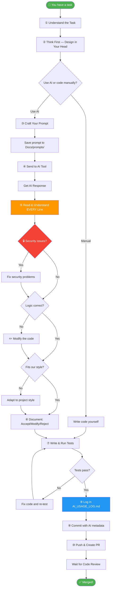

# 🚀 AI-Assisted Vibe Coding Pipeline

> **For:** All 6 Team Members  
> **Purpose:** Follow this pipeline EVERY TIME you use AI to help you code  
> **Rule:** AI is your assistant, YOU are the developer. You must understand every line.

---

## Quick Overview

```
┌─────────────────────────────────────────────────────────────────────┐
│                    VIBE CODING PIPELINE                             │
│                                                                     │
│  ① Understand Task                                                  │
│       ↓                                                             │
│  ② Think First (design in your head)                                │
│       ↓                                                             │
│  ③ Craft Your Prompt                                                │
│       ↓                                                             │
│  ④ Get AI Response                                                  │
│       ↓                                                             │
│  ⑤ Read & Understand EVERY Line                                    │
│       ↓                                                             │
│  ⑥ Accept / Modify / Reject                                        │
│       ↓                                                             │
│  ⑦ Test Your Code                                                   │
│       ↓                                                             │
│  ⑧ Log AI Usage                                                     │
│       ↓                                                             │
│  ⑨ Commit with Convention                                           │
│       ↓                                                             │
│  ⑩ Push & Create PR                                                 │
│                                                                     │
└─────────────────────────────────────────────────────────────────────┘
```

---

## Before You Start (One-Time Setup)

- [ ] Read the [AI Governance Charter](templates/AI_GOVERNANCE_CHARTER.md)
- [ ] Know which AI tools are approved → see [AI_TOOLS_REGISTRY.md](AI_TOOLS_REGISTRY.md)
- [ ] Know the [Commit Convention](templates/COMMIT_CONVENTION.md)
- [ ] Know the [Branching Strategy](templates/BRANCHING_STRATEGY.md)
- [ ] Have `Docs/AI_USAGE_LOG.md` open and ready

---

# THE 10-STEP PIPELINE

---

## Step ① — Understand the Task

**Before you touch AI, understand what you need to build.**

Ask yourself:
- [ ] What feature/fix am I working on?
- [ ] What are the inputs and outputs?
- [ ] Which files will I change?
- [ ] What are the constraints? (tech stack, security, performance)

**Example:**
> I need to create a REST API endpoint `POST /api/users` that registers a new user.
> Input: JSON with name, email, password.
> Output: Created user object with ID (no password).
> Constraints: Python Flask, MySQL, must hash password, must validate email.

> ⚠️ **If you can't explain the task clearly, you're not ready to ask AI.**

---

## Step ② — Think First

**Design the solution in your head or on paper BEFORE asking AI.**

- [ ] What functions/classes do I need?
- [ ] What's the data flow?
- [ ] What could go wrong? (edge cases, errors)
- [ ] What security concerns exist?

**Sketch example:**
```
Request → Validate Input → Check if email exists → Hash password → Save to DB → Return user
```

> 💡 **Why?** If you design first, you can evaluate whether AI's answer is good or bad.
> If you skip this step, you'll blindly accept anything AI gives you.

---

## Step ③ — Craft Your Prompt

**A good prompt = a good result. A lazy prompt = garbage.**

### Prompt Template (Copy & Use)

```
I am working on [PROJECT NAME].

## Task
[What you need to build]

## Tech Stack
- Language: [Python/JavaScript/etc.]
- Framework: [Flask/React/etc.]
- Database: [MySQL/PostgreSQL/etc.]

## Requirements
- [Requirement 1]
- [Requirement 2]
- [Requirement 3]

## Constraints
- [Security: must hash passwords, validate input]
- [Performance: must handle N concurrent users]
- [Style: follow PEP8 / ESLint rules]

## Expected Output
[What format you want: code, explanation, both]

## Existing Code Context
[Paste relevant existing code or file structure]
```

### ❌ Bad Prompt vs ✅ Good Prompt

❌ **Bad:**
```
Write a login API
```

✅ **Good:**
```
I am building a disaster relief management system using Python Flask + MySQL.

## Task
Create a POST /api/auth/login endpoint.

## Requirements
- Accept JSON: { "email": string, "password": string }
- Validate email format
- Check user exists in database
- Compare password with bcrypt hash
- Return JWT token on success
- Return 401 with error message on failure

## Constraints
- Use parameterized queries (no SQL injection)
- Use bcrypt for password comparison
- JWT secret from environment variable
- Follow Flask blueprint pattern

## Expected Output
Complete Python code with error handling and comments.
```

### Save Your Prompt

Save to: `Docs/prompts/<category>/<your-name>-<description>.md`

**Example:** `Docs/prompts/coding/nam-login-api.md`

---

## Step ④ — Get AI Response

- Send your prompt to the approved AI tool
- Note which tool and version you used
- **Don't copy-paste the response yet!** → Go to Step ⑤ first

---

## Step ⑤ — Read & Understand EVERY Line

**This is the MOST IMPORTANT step. Skip this = FAIL your defense.**

Go through the AI response line by line:

- [ ] Do I understand what each line does?
- [ ] Can I explain this code to my lecturer?
- [ ] Is the logic correct?
- [ ] Are there any security issues?
- [ ] Does it match our tech stack?
- [ ] Are there hardcoded values that should be environment variables?
- [ ] Does it handle errors properly?
- [ ] Does it follow our coding style?

### Red Flags to Watch For 🚩

| Red Flag | Example | What to Do |
|---|---|---|
| **SQL Injection** | `"SELECT * FROM users WHERE email='" + email + "'"` | Replace with parameterized query |
| **No password hashing** | `if password == stored_password` | Use bcrypt/argon2 |
| **Hardcoded secrets** | `secret_key = "mysecret123"` | Move to `.env` |
| **Hallucinated imports** | `from flask_magic import SuperAuth` | Check if library exists |
| **No error handling** | No try/except or if checks | Add proper error handling |
| **Exposed stack traces** | `return str(error)` in production | Return generic error message |
| **No input validation** | Trusting all user input | Add validation |
| **Wrong tech stack** | AI gives Express.js when you use Flask | Reject and re-prompt |

> 🧠 **Test yourself:** Cover the AI code and try to write it yourself.
> If you can't write something similar, you don't understand it enough.

---

## Step ⑥ — Accept / Modify / Reject

For each part of the AI response, decide:

| Decision | When | Action |
|---|---|---|
| ✅ **Accept** | Code is correct, secure, fits our style | Use as-is |
| ✏️ **Modify** | Good idea but needs changes | Edit the code |
| ❌ **Reject** | Wrong, insecure, or doesn't fit | Don't use it, write manually |

### Common Modifications

```python
# ❌ AI Generated (SQL Injection risk)
def login(email, password):
    query = "SELECT * FROM users WHERE email='" + email + "'"
    cursor.execute(query)

# ✅ Your Modified Version (Safe)
def login(email, password):
    query = "SELECT * FROM users WHERE email = %s"
    cursor.execute(query, (email,))
```

```python
# ❌ AI Generated (Hardcoded secret)
app.config['SECRET_KEY'] = 'super-secret-key-123'

# ✅ Your Modified Version (From environment)
app.config['SECRET_KEY'] = os.environ.get('SECRET_KEY')
```

```python
# ❌ AI Generated (No validation)
@app.route('/api/users', methods=['POST'])
def create_user():
    data = request.get_json()
    name = data['name']

# ✅ Your Modified Version (With validation)
@app.route('/api/users', methods=['POST'])
def create_user():
    data = request.get_json()
    if not data or 'name' not in data:
        return jsonify({'error': 'Name is required'}), 400
    name = data['name'].strip()
    if len(name) < 2:
        return jsonify({'error': 'Name too short'}), 400
```

---

## Step ⑦ — Test Your Code

**Never commit untested code.**

### Minimum Testing Checklist

- [ ] **Does it run?** No syntax errors, no crashes
- [ ] **Happy path works?** Normal input gives correct output
- [ ] **Edge cases?** Empty input, very long input, special characters
- [ ] **Error cases?** Wrong password, missing fields, duplicate email
- [ ] **Security?** Try SQL injection, XSS, invalid tokens

### Quick Test Example

```python
# Test file: tests/unit/test_login.py

def test_login_success():
    """Normal login should return JWT token"""
    response = client.post('/api/auth/login', json={
        'email': 'test@example.com',
        'password': 'correct_password'
    })
    assert response.status_code == 200
    assert 'token' in response.get_json()

def test_login_wrong_password():
    """Wrong password should return 401"""
    response = client.post('/api/auth/login', json={
        'email': 'test@example.com',
        'password': 'wrong_password'
    })
    assert response.status_code == 401

def test_login_missing_email():
    """Missing email should return 400"""
    response = client.post('/api/auth/login', json={
        'password': 'some_password'
    })
    assert response.status_code == 400

def test_login_sql_injection():
    """SQL injection attempt should be safe"""
    response = client.post('/api/auth/login', json={
        'email': "' OR '1'='1",
        'password': 'anything'
    })
    assert response.status_code == 401  # Not 200!
```

---

## Step ⑧ — Log AI Usage

**Open `Docs/AI_USAGE_LOG.md` and add a new record.**

### Quick Log Template (Copy & Fill)

```markdown
### Record: AIL-2026-07-26-001

| Field | Details |
|---|---|
| **Date** | 2026-07-26 |
| **Member** | [Your Name] |
| **AI Tool** | ChatGPT — GPT-4o |
| **SDLC Phase** | Implementation |
| **Objective** | Create login API endpoint |
| **Related Files** | `src/backend/controllers/auth_controller.py` |

**Original Prompt:**
> Create a login API for Flask...

**Refined Prompt:**
> (paste if you improved it, or "Same as original")

**AI Response Summary:**
> AI generated a login function with JWT token generation, basic password check, and route handler.

**Decision:** Modified

| What was... | Details |
|---|---|
| ✅ Accepted | Route structure, JWT generation logic |
| ✏️ Modified | Changed to parameterized SQL, added bcrypt, added input validation |
| ❌ Rejected | AI's session-based auth suggestion (we use JWT) |

**Reason:** AI used string concatenation for SQL (injection risk) and plain text password comparison.

**Verification:**
- Method: Unit tests (4 test cases)
- Result: PASS ✅
- Security: Fixed SQL injection, added bcrypt

**Related Git Commit:** `abc1234` — `feat(auth): implement login endpoint`
```

> ⏱️ **This takes 3-5 minutes.** Do it right after coding, not later.

---

## Step ⑨ — Commit with Convention

### Commit Message Format

```
<type>(<scope>): <description>

<what you did and why>

AI-Assisted: Yes
AI-Tool: ChatGPT GPT-4o
AI-Contribution: Generated initial login route and JWT logic
Human-Modification: Fixed SQL injection, added bcrypt hashing, added input validation
Verified-By: 4 unit tests (all passing)
```

### Real Example

```bash
git add src/backend/controllers/auth_controller.py tests/unit/test_login.py Docs/AI_USAGE_LOG.md

git commit -m "feat(auth): implement login endpoint

Added POST /api/auth/login with email/password authentication.
Returns JWT token on success, 401 on failure.

AI-Assisted: Yes
AI-Tool: ChatGPT GPT-4o
AI-Contribution: Generated initial route structure and JWT token creation
Human-Modification: Replaced string concat SQL with parameterized query, added bcrypt password hashing, added input validation for email format
Verified-By: 4 unit tests (login success, wrong password, missing field, SQL injection)

Refs: #12"
```

### If NO AI was used:

```bash
git commit -m "fix(ui): correct button alignment on mobile

AI-Assisted: No"
```

---

## Step ⑩ — Push & Create PR

### Push your branch

```bash
git push origin feature/<issue-id>-<description>
```

### Create Pull Request on GitHub

The PR template will auto-fill. Complete these sections:

- [ ] Description of what you did
- [ ] AI Assistance section (tool, what AI did, what you changed)
- [ ] AI Usage Log reference (AIL-ID)
- [ ] Testing results
- [ ] Request reviewer

---

# 📋 QUICK REFERENCE CARD

**Print this or keep it open while coding:**

```
╔══════════════════════════════════════════════════════╗
║            VIBE CODING CHECKLIST                     ║
╠══════════════════════════════════════════════════════╣
║                                                      ║
║  □ 1. I understand the task clearly                  ║
║  □ 2. I designed the solution BEFORE asking AI       ║
║  □ 3. My prompt is detailed (tech stack,             ║
║       requirements, constraints)                     ║
║  □ 4. I saved my prompt to Docs/prompts/             ║
║  □ 5. I read EVERY line of AI output                 ║
║  □ 6. I checked for security issues                  ║
║  □ 7. I modified what needed fixing                  ║
║  □ 8. I wrote tests and they pass                    ║
║  □ 9. I logged it in AI_USAGE_LOG.md                 ║
║  □ 10. My commit message has AI metadata             ║
║  □ 11. I can explain this code to my lecturer        ║
║                                                      ║
║  ⚠️  If any box is unchecked, DO NOT push!           ║
║                                                      ║
╚══════════════════════════════════════════════════════╝
```

---

# 🔄 COMPLETE WORKFLOW DIAGRAM



---

# 👥 WHO DOES WHAT (6 Members)

| Step | Member 1<br>Project Lead | Member 2<br>Tech Lead | Member 3<br>Backend Dev | Member 4<br>Frontend Dev | Member 5<br>Frontend/QA | Member 6<br>Doc Manager/QA |
|---|:---:|:---:|:---:|:---:|:---:|:---:|
| ① Understand Task | ✅ | ✅ | ✅ | ✅ | ✅ | ✅ |
| ② Think First | ✅ | ✅ | ✅ | ✅ | ✅ | ✅ |
| ③ Craft Prompt | ✅ | ✅ | ✅ | ✅ | ✅ | ✅ |
| ④ Get AI Response | ✅ | ✅ | ✅ | ✅ | ✅ | ✅ |
| ⑤ Read Every Line | ✅ | ✅ | ✅ | ✅ | ✅ | ✅ |
| ⑥ Accept/Modify/Reject | ✅ | ✅ | ✅ | ✅ | ✅ | ✅ |
| ⑦ Test | ✅ | ✅ | ✅ | ✅ | ✅ | ✅ |
| ⑧ Log AI Usage | ✅ | ✅ | ✅ | ✅ | ✅ | **Reviews all logs** |
| ⑨ Commit | ✅ | ✅ | ✅ | ✅ | ✅ | ✅ |
| ⑩ Review PRs | Reviews all | Reviews backend | Reviews backend | Reviews frontend | Reviews frontend | Reviews docs |
| Audit AI compliance | **Owner** | — | — | — | — | **Supports** |

---

# ❌ WHAT NOT TO DO

| ❌ Never Do This | ✅ Do This Instead |
|---|---|
| Copy AI code and commit directly | Read, understand, modify, test, then commit |
| Use vague prompts like "write code" | Write detailed prompts with tech stack and constraints |
| Skip the AI Usage Log | Log every AI interaction (takes 3 min) |
| Share passwords/API keys with AI | Use placeholder values, keep secrets in `.env` |
| Trust AI-generated SQL queries | Always check for SQL injection |
| Commit without tests | Write at least happy path + error case tests |
| Merge without code review | Always create a PR and get 1+ approval |
| Say "AI wrote it" during defense | Say "I used AI to assist, here's what I changed and why" |

---

# 🎓 DEFENSE PREPARATION

When your lecturer asks about any code:

1. **Show the prompt** → `Docs/prompts/<your-name>-<topic>.md`
2. **Show what AI gave you** → `Docs/ai_outputs/` or `AI_USAGE_LOG.md`
3. **Show what you changed** → The "Modified" section in the log
4. **Show why you changed it** → The "Reason" section in the log
5. **Show your tests** → `tests/` folder
6. **Show the commit** → Git history with AI metadata

**Practice question:** *"Can you explain how this function works line by line?"*

If you followed this pipeline, you can answer this easily because you already understood it in Step ⑤.

---

*Last Updated: 2026-07-26*
