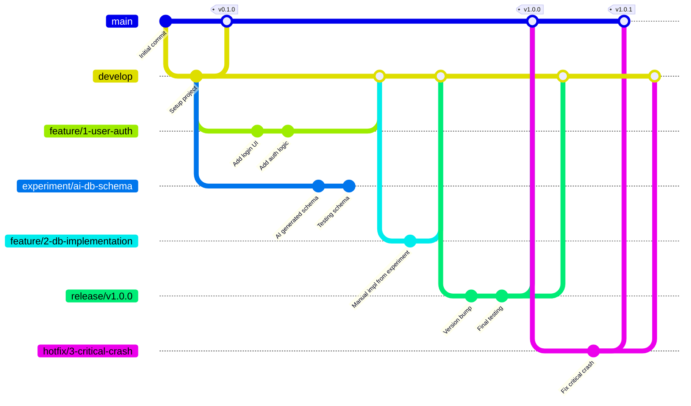
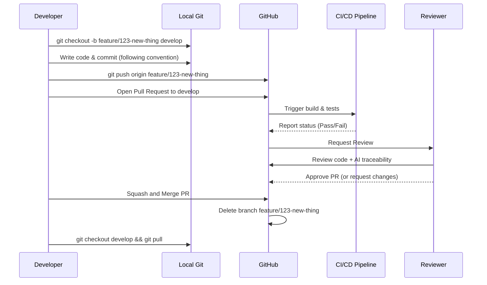

# Branching Strategy

## Strategy Overview
We use a modified version of **GitHub Flow**, optimized for academic capstone projects. It is designed to be simple, CI/CD friendly, and explicitly accounts for AI experimentation.

---

## Branch Types

| Branch Type | Purpose | Base Branch | Protected? |
|---|---|---|---|
| `main` | Production-ready code. Represents the latest stable release. | — | ✅ Yes |
| `develop` | Integration branch for the next release. | `main` | ✅ Yes |
| `feature/*` | New features or significant additions. | `develop` | ❌ No |
| `bugfix/*` | Non-critical bug fixes. | `develop` | ❌ No |
| `hotfix/*` | Emergency fixes directly applied to `main`. | `main` | ❌ No |
| `docs/*` | Documentation-only updates. | `develop` | ❌ No |
| `experiment/*` | AI spikes, proofs of concept, or exploratory code. | `develop` | ❌ No |
| `release/*` | Release preparation and stabilization. | `develop` | ❌ No |

---

## Branch Naming Convention

**Format:** `<type>/<issue-number>-<short-description>` (all lowercase, hyphen-separated).

**Examples:**
- `feature/42-jwt-authentication`
- `bugfix/51-race-condition-login`
- `hotfix/89-db-connection-crash`
- `docs/12-update-readme-setup`
- `experiment/ai-generated-ui-components`
- `release/v1.0.0`

---

## Branch Lifecycle

### 1. Creation
- Create branches from `develop` (except `hotfix/*` which branches from `main`).
- Always pull the latest changes before creating a new branch.

```bash
git checkout develop
git pull origin develop
git checkout -b feature/<issue-id>-<description>
```

### 2. Development
- Commit frequently with meaningful messages following the [Commit Convention](COMMIT_CONVENTION.md).
- Push regularly to the remote to enable collaboration and backup.
- Keep branches focused: one feature/fix per branch.

### 3. PR Requirements
- Open a Pull Request targeting `develop` (or `main` for hotfixes).
- Complete the [PR Template](PULL_REQUEST_TEMPLATE.md) fully.
- Ensure CI pipeline passes (build, lint, tests).
- Request at least 1 reviewer.

### 4. Merge Strategy

| Source → Target | Merge Method | Rationale |
|---|---|---|
| `feature/*` → `develop` | **Squash and Merge** | Clean history with one commit per feature |
| `bugfix/*` → `develop` | **Squash and Merge** | Clean history |
| `experiment/*` → `develop` | **Do NOT merge directly** | See AI Experimentation Rules below |
| `hotfix/*` → `main` | **Merge Commit** | Preserve fix history |
| `release/*` → `main` & `develop` | **Merge Commit** | Preserve release record |
| `docs/*` → `develop` | **Squash and Merge** | Clean history |

### 5. Deletion
- Delete branches immediately after they are merged.
- Remote branches are deleted via GitHub PR settings.
- Local branches should be cleaned up periodically:

```bash
git branch -d feature/42-jwt-authentication
git fetch --prune
```

---

## Branch Protection Rules

### `main` Branch
- ✅ Require Pull Request reviews before merging (minimum 2 approvals)
- ✅ Require status checks to pass before merging (CI build, tests, linting)
- ✅ Restrict who can push to matching branches (no direct pushes)
- ✅ No force pushes allowed
- ✅ Require conversation resolution before merging

### `develop` Branch
- ✅ Require Pull Request reviews (at least 1 approval)
- ✅ Require status checks to pass before merging
- ❌ Allow force pushes (for rebasing if needed)

---

## AI Experimentation Branch Rules (`experiment/*`)

### When to Use
- When asking an AI tool to generate a large scaffold or prototype.
- When testing a risky or unproven AI suggestion.
- When exploring multiple AI-generated approaches before choosing one.
- When the AI output needs significant validation before integration.

### How to Promote Experiments to Features
1. **Do NOT merge** `experiment/*` branches directly into `develop`.
2. Create a new `feature/*` branch from `develop`.
3. Manually copy and review the successful parts of the experiment.
4. Ensure full AI traceability documentation for promoted code.
5. Proceed with normal feature workflow (PR, review, merge).

### Documentation Requirements
- Every `experiment/*` branch must have at least one AI Usage Log entry.
- The branch description (in the PR or README) must explain:
  - What AI tool was used
  - What was being explored
  - Outcome: success, partial success, or failure
  - What was learned

---

## Branching Model Diagram



---

## Feature Lifecycle Diagram



---

## Common Workflows

### Starting a New Feature
```bash
git checkout develop && git pull
git checkout -b feature/<issue-id>-<description>
# ... develop, commit, push ...
# Open PR to develop on GitHub
```

### Fixing a Bug
```bash
git checkout develop && git pull
git checkout -b bugfix/<issue-id>-<description>
# ... fix, test, commit, push ...
# Open PR to develop on GitHub
```

### Releasing a Version
```bash
git checkout develop && git pull
git checkout -b release/v<major>.<minor>.<patch>
# ... version bump, final testing, commit, push ...
# Open PR to main AND develop
# Tag the merge commit on main: git tag v<major>.<minor>.<patch>
# Push tags: git push --tags
```

### Emergency Hotfix
```bash
git checkout main && git pull
git checkout -b hotfix/<issue-id>-<description>
# ... fix, test, commit, push ...
# Open PR to main
# After merge, backport: merge main into develop
```

### AI Experiment Workflow
```bash
git checkout develop && git pull
git checkout -b experiment/<description>
# ... paste AI output, test, iterate ...
# If successful:
git checkout develop && git pull
git checkout -b feature/<issue-id>-<promoted-feature>
# Manually copy validated code from experiment
# ... review, test, commit, push ...
# Open PR to develop
# Delete experiment branch
```

---

## Conflict Resolution Guidelines

1. **Pull the target branch frequently** to minimize conflicts:
   ```bash
   git checkout develop && git pull
   git checkout feature/my-feature
   git merge develop
   ```

2. **Resolve conflicts locally** using a merge tool (e.g., VS Code's built-in conflict resolver).

3. **Never blindly accept** AI-generated conflict resolutions without understanding the implications.

4. **Test after resolving** all conflicts before pushing.

5. **Ask for help** if the conflict involves code you didn't write — contact the original author.

---

## Release Tagging Convention

We use **Semantic Versioning** (`v<major>.<minor>.<patch>`):

| Version Part | When to Increment | Example |
|---|---|---|
| **Major** | Incompatible API changes or major milestones | `v1.0.0` → `v2.0.0` |
| **Minor** | Added functionality in a backwards-compatible manner (e.g., end of sprint) | `v1.0.0` → `v1.1.0` |
| **Patch** | Backwards-compatible bug fixes | `v1.0.0` → `v1.0.1` |

### Tagging Commands
```bash
git tag -a v1.0.0 -m "Release v1.0.0: Initial stable release"
git push origin v1.0.0
```

---

*This branching strategy is a living document. Update it as the team's workflow evolves.*
