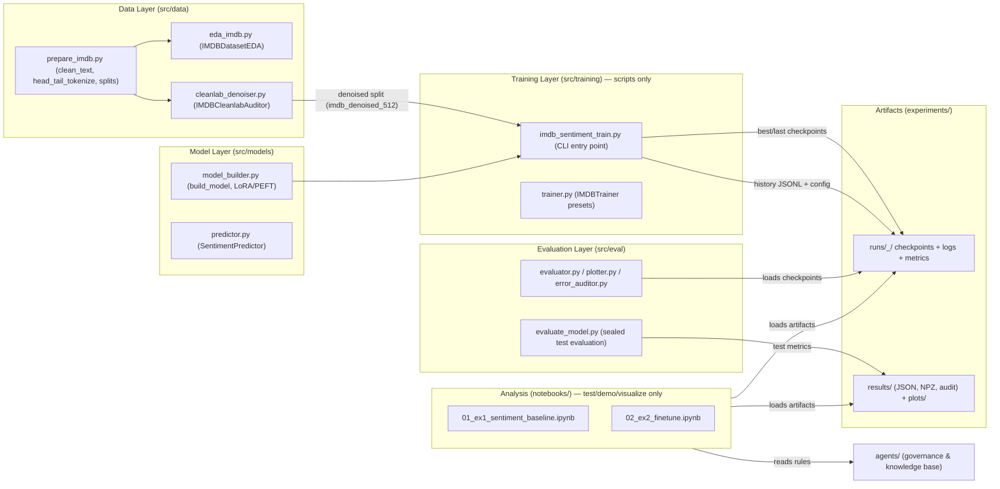

# Practice 3 — Get Started with Hugging Face

## Project Overview

Practice 3 — Get Started with Hugging Face is a **modular deep-learning
pipeline for binary IMDB sentiment classification**. It implements two
exercises:

- **Exercise 1** — zero-shot sentiment baseline with a pretrained HF pipeline.
- **Exercise 2** — fine-tuning `distilbert-base-uncased` with
  **data-centric AI** (Cleanlab label-error auditing), **Head+Tail
  Truncation**, and **PEFT LoRA**, reaching **93.14% test accuracy** (EX-14).

The code strictly follows Separation of Concerns (SoC): data processing, model
building, training, evaluation, and AI-Agent governance are decoupled layers,
and **all training runs as logged, resumable Python scripts** — notebooks are
reserved for testing, demos, visualization and analysis.

> This project was bootstrapped from the Deep Learning Project Template
> (`project_templates/Deep_learning_template`). To set up a new project from
> scratch, follow [SETUP.md](SETUP.md).

---

## 🏗️ Architecture Overview

Layered pipeline; each layer is a `src/` package; state flows forward,
artifacts flow backward for analysis:



Key properties of the architecture:

- **Script-only training** — every training loop lives in
  `src/training/*.py`; notebooks only load artifacts and analyze
  ([LOGGING_CHECKPOINT_RULES.md](agents/rules/LOGGING_CHECKPOINT_RULES.md)).
- **Implementation status** — **all 8 phases are complete**. Data-centric
  preprocessing, model building, training, sealed-test evaluation, error
  analysis and reporting are fully implemented. See
  [agents/CODEBASE_AUDIT_REPORT.md](agents/CODEBASE_AUDIT_REPORT.md) and the
  [experiment index](agents/experiments/README.md).
- **Data-centric AI** — an independent **5-Fold Out-Of-Fold** Cleanlab auditor
  ([`src/data/cleanlab_denoiser.py`](src/data/cleanlab_denoiser.py)) prunes
  label errors and exports a pristine `data/processed/imdb_denoised_512` split.
- **Head+Tail Truncation** — [`prepare_imdb.py`](src/data/prepare_imdb.py)
  keeps 128 head tokens + 384 tail tokens (512 total) so reviewer verdicts on
  long reviews are preserved.
- **PEFT LoRA** — [`model_builder.py`](src/models/model_builder.py) wraps
  `distilbert-base-uncased` with LoRA adapters, reaching near full fine-tuning
  parity at a fraction of the parameters and VRAM.
- **Full logging & resumability** — every run persists model + optimizer +
  scheduler + RNG state + history + config (best/last checkpoints, JSONL
  history, `--resume`/`--force-resume`).
- **5W1H reporting** — every reported metric carries full context
  ([agents/rules/RESULTS_REPORTING.md](agents/rules/RESULTS_REPORTING.md)).

---

## 📁 Repository Structure

```
Practice 3 — Get Started with Hugging Face/
│
├── agents/                    # AI Agent knowledge base & behavioral control
│   ├── README.md              # Navigation guide & architecture overview
│   ├── OVERVIEW.md            # Core project overview & roadmap
│   ├── CODEBASE_AUDIT_REPORT.md # Running audit log
│   ├── rules/                 # Conventions: naming, folder structure, MD,
│   │                          #   logging/checkpoints, 5W1H reporting
│   ├── phases/                # Stage-specific pipeline documentation
│   ├── plans/                 # Experiment/implementation plans
│   ├── templates/             # Standard templates & checklists
│   ├── progress/              # Live progress status per phase
│   ├── experiments/           # EX-01 … EX-14 reports (5W1H)
│   ├── bugs/                  # Documented bug reports
│   └── references/            # External guides
│
├── configs/                   # YAML experiment presets
│   ├── config.yaml.example    # Configuration skeleton (copy to config.yaml)
│   ├── config_imdb_sentiment.yaml          # Base full fine-tune (128 tokens)
│   ├── config_imdb_sentiment_512.yaml      # Full fine-tune, 512 tokens
│   ├── config_imdb_sentiment_lora.yaml     # LoRA on raw data
│   ├── config_imdb_sentiment_denoised.yaml # LoRA on cleanlab-denoised data (peak)
│   └── config_imdb_sentiment_denoised_fullft.yaml # Full FT on denoised data
│
├── data/                      # Dataset storage (single source of truth)
│   ├── raw/                   # never edited by scripts
│   ├── processed/             # tokenized splits (imdb_tokenized_512, imdb_denoised_512)
│   └── external/
│
├── src/                       # Core modules (SoC layers)
│   ├── data/                  # prepare_imdb.py, eda_imdb.py, cleanlab_denoiser.py
│   ├── models/                # model_builder.py (LoRA), predictor.py
│   ├── training/              # imdb_sentiment_train.py (CLI), trainer.py
│   ├── eval/                  # evaluate_model.py, evaluator.py, plotter.py, error_auditor.py
│   ├── experiments/           # baseline_imdb_sentiment.py
│   └── utils/                 # run_logger.py, checkpoint_utils.py, resource_monitor.py, truncation_viz.py
│
├── notebooks/                 # Analysis & demos ONLY (no training)
│   ├── 01_ex1_sentiment_baseline.ipynb   # Exercise 1 zero-shot baseline
│   └── 02_ex2_finetune.ipynb             # Exercise 2 end-to-end workflow
│
├── experiments/               # Run artifacts
│   ├── runs/<ts>_<run>/       # checkpoints/ logs/ metrics/ tensorboard/
│   ├── results/               # JSON / NPZ metrics + audit artifacts (5W1H index)
│   └── plots/                 # Generated figures
│
├── tests/                     # Unit tests + smoke suite
├── requirements.txt           # Top-level dependencies (pins in requirements.lock)
└── README.md
```

---

## 📈 Current Status & Results

All phases are complete. The experiment progression (full details in
[agents/experiments/README.md](agents/experiments/README.md)):

| Milestone | Approach | Test Accuracy | Notes |
|:---|:---|:---:|:---|
| EX-01 | Zero-Shot Baseline | 89.07% | Reference floor |
| EX-06 | Full Fine-Tune, 512 tokens | 93.23% | Token-length expansion breakthrough |
| EX-08 | Cleanlab Denoising (LoRA r16) | 92.66% | Data-centric label-error pruning |
| EX-09 | LoRA Rank 32 + regularization | 92.35% | Anti-overfitting triad |
| **EX-14** | **LoRA + Cleanlab + Head-Tail** | **93.14%** | **Peak** — 0.9314 macro F1, 0.9662 ROC-AUC, 1.11 GB VRAM |

- **Parameter efficiency:** EX-14 reaches within ~0.1% of full fine-tuning while
  training only **2.58%** of parameters and using **~half** the VRAM.
- Committed metrics live in
  [`experiments/results/imdb_sentiment_eval.json`](experiments/results/imdb_sentiment_eval.json);
  the Cleanlab audit in
  [`experiments/results/cleanlab_label_issues.json`](experiments/results/cleanlab_label_issues.json).

---

## 🚀 Quick Start

> Requires a CUDA-capable GPU for training (torch wheels are pinned to the
> `cu130` build and are **not** on PyPI — install with the `--extra-index-url`
> below). CPU fallback is available for evaluation/inference.

### 1. Install

```bash
python -m venv .venv
.venv\Scripts\activate          # Windows  (source .venv/bin/activate on Linux)
pip install -r requirements.txt --extra-index-url https://download.pytorch.org/whl/cu130
```

### 2. Train (script-only, logged & resumable)

The training entry point is
[`src/training/imdb_sentiment_train.py`](src/training/imdb_sentiment_train.py).
Each preset is a YAML config in `configs/`:

```bash
# Peak preset — LoRA on the cleanlab-denoised split with head-tail truncation
python -m src.training.imdb_sentiment_train --config configs/config_imdb_sentiment_denoised.yaml

# Alternatives: full fine-tune on denoised data, or LoRA on raw data
python -m src.training.imdb_sentiment_train --config configs/config_imdb_sentiment_denoised_fullft.yaml
python -m src.training.imdb_sentiment_train --config configs/config_imdb_sentiment_lora.yaml

# Useful flags
python -m src.training.imdb_sentiment_train --smoke           # tiny subset (CI/smoke)
python -m src.training.imdb_sentiment_train --tb              # + TensorBoard monitoring
python -m src.training.imdb_sentiment_train --resume          # resume interrupted run
python -m src.training.imdb_sentiment_train --force-resume    # rewind from best checkpoint
```

Every run writes `experiments/runs/<ts>_<run>/` with `checkpoints/`
(`<run>_best.pt`, `<run>_last.pt`), `logs/`, `metrics/` (config + JSONL
history) and optional `tensorboard/`. Naming, format, and the resume procedure
are defined in
[agents/rules/LOGGING_CHECKPOINT_RULES.md](agents/rules/LOGGING_CHECKPOINT_RULES.md).

### 3. Evaluate a checkpoint on the sealed test split

```bash
python -m src.eval.evaluate_model --checkpoint experiments/runs/<ts>_<run>/checkpoints/<run>_best.pt
# or auto-resolve the latest run's best checkpoint:
python -m src.eval.evaluate_model
```

### 4. Run the data-centric Cleanlab audit (from a notebook)

```python
from src.data.cleanlab_denoiser import IMDBCleanlabAuditor

auditor = IMDBCleanlabAuditor()
results = auditor.run_audit_and_visualize(use_oof=True, n_splits=5, epochs=2)
auditor.export_denoised_dataset(results)   # writes data/processed/imdb_denoised_512/
```

### 5. Analyze in notebooks

Notebooks load the artifacts (checkpoints, `registry.json`, `results/*`) and
only test / demo / visualize / analyze:

```bash
jupyter notebook notebooks/02_ex2_finetune.ipynb
```

### 6. Run tests

```bash
pytest
```

---

## 🤖 AI Agent Control & Knowledge Base

- **Setup**: follow [SETUP.md](SETUP.md), then
  [agents/HOW_TO_SETUP_AI_AGENT.md](agents/HOW_TO_SETUP_AI_AGENT.md).
- **Behavior Layer**: [agents/rules/AGENT_AI.md](agents/rules/AGENT_AI.md).
- **Audit Procedure**: [agents/rules/CODEBASE_AUDIT.md](agents/rules/CODEBASE_AUDIT.md)
  runs before multi-file tasks.
- **Key rules**: [LOGGING_CHECKPOINT_RULES.md](agents/rules/LOGGING_CHECKPOINT_RULES.md),
  [RESULTS_REPORTING.md](agents/rules/RESULTS_REPORTING.md),
  [FOLDER_STRUCTURE.md](agents/rules/FOLDER_STRUCTURE.md),
  [NAMING_CONVENTION.md](agents/rules/NAMING_CONVENTION.md).

---

## 📜 License

Coursework — deep learning course (Practice 3: Get Started with Hugging Face)
