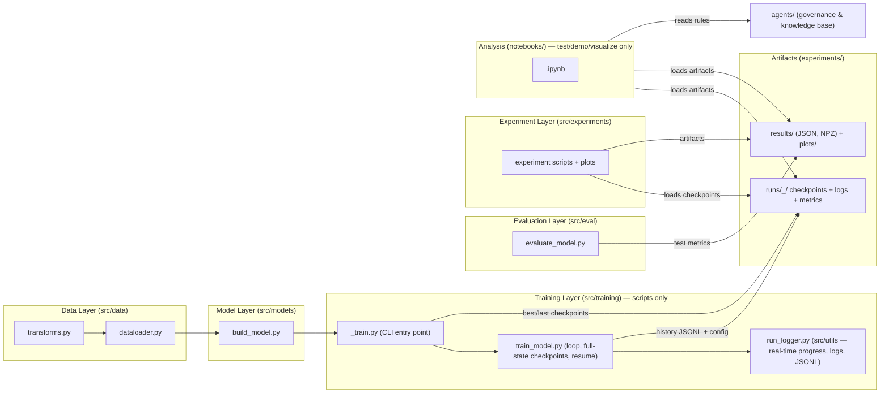

# Practice 3 — Get Started with Hugging Face

## Project Overview

Practice 3 — Get Started with Hugging Face implements a modular deep-learning pipeline. It strictly follows
Separation of Concerns (SoC): data processing, model building, training,
evaluation, and AI-Agent governance are decoupled layers, and **all training
runs as logged, resumable Python scripts** — notebooks are reserved for
testing, demos, visualization and analysis.

> This project was bootstrapped from the Deep Learning Project Template
> (`project_templates/Deep_learning_template`). To set up a new project from
> scratch, follow [SETUP.md](SETUP.md).

---

## 🏗️ Architecture Overview

Layered pipeline; each layer is a `src/` package; state flows forward,
artifacts flow backward for analysis:



Key properties of the architecture:

- **Script-only training** — every training loop lives in
  `src/training/*.py` / `src/experiments/*_train.py`; notebooks only load
  artifacts and analyze.
- **Implementation status** — all `src/` modules are **planned** (they land
  in roadmap Phases 3–7); the scaffold is governance-ready. See
  [agents/CODEBASE_AUDIT_REPORT.md](agents/CODEBASE_AUDIT_REPORT.md) `ARC-1`.
- **Full logging & resumability** — every run persists model + optimizer +
  scheduler + RNG state + history + config (see
  [agents/rules/LOGGING_CHECKPOINT_RULES.md](agents/rules/LOGGING_CHECKPOINT_RULES.md)).
- **Structured storage** — one run directory per experiment run
  (`experiments/runs/<ts>_<run>/`), JSONL histories, NPZ for large arrays,
  gzip rotation for logs.
- **5W1H reporting** — every reported metric carries full context
  ([agents/rules/RESULTS_REPORTING.md](agents/rules/RESULTS_REPORTING.md)).

---

## 📁 Repository Structure

```
Practice 3 — Get Started with Hugging Face/
│
├── agents/                    # AI Agent knowledge base & behavioral control
│   ├── README.md              # Navigation guide & architecture overview
│   ├── PURPOSE.md             # Original project brief & requirements
│   ├── OVERVIEW.md            # Core project overview & roadmap
│   ├── rules/                 # Conventions: naming, folder structure, MD,
│   │                          #   logging/checkpoints, 5W1H reporting, audits
│   ├── phases/                # Stage-specific pipeline documentation
│   ├── templates/             # Standard templates & checklists
│   ├── progress/              # Live progress status per phase
│   ├── experiments/           # Experiment reports
│   ├── bugs/                  # Documented bug reports
│   └── references/            # External guides
│
├── configs/
│   └── config.yaml.example    # Configuration skeleton (copy to config.yaml)
│
├── data/                      # Dataset storage (single source of truth)
│   ├── raw/                   # never edited by scripts
│   ├── processed/             # derived artifacts (splits, statistics)
│   └── external/              # external datasets
│
├── src/                       # Core modules (SoC layers)
│   ├── data/                  # Transforms, dataloader, statistics
│   ├── models/                # Model builders
│   ├── training/              # Training loop, full-state checkpoints, CLI
│   ├── eval/                  # Test metrics, confusion matrices, reporting
│   ├── experiments/           # Experiment scripts
│   └── utils/                 # run_logger, checkpoint_utils, misc helpers
│
├── notebooks/                 # Analysis & demos ONLY (no training)
├── scratch/                   # Generated-notebook build scripts
│
├── experiments/               # Run artifacts
│   ├── runs/<ts>_<run>/       # checkpoints/ logs/ metrics/ tensorboard/
│   ├── results/               # JSON / NPZ metrics (+ README with 5W1H)
│   ├── plots/                 # Generated figures
│   └── checkpoints/           # LEGACY flat checkpoints (read-only fallback)
│
├── tests/                     # Unit tests (smoke + per-layer)
├── requirements.txt
└── README.md
```

---

## 🚀 Quick Start

### 1. Install

```bash
python -m venv .venv
.venv\Scripts\activate          # Windows  (source .venv/bin/activate on Linux)
pip install -r requirements.txt
```

### 2. Train (script-only, logged & resumable)

```bash
python -m src.training.<feature>_train          # train all variants
python -m src.training.<feature>_train --epochs 30 --seed 42
python -m src.training.<feature>_train --tb     # + TensorBoard monitoring
python -m src.training.<feature>_train --resume # resume an interrupted run
```

Every run writes `experiments/runs/<ts>_<run>/` with `checkpoints/`
(`<run>_best.pt`, `<run>_last.pt`), `logs/`, `metrics/` (config + JSONL
history) and optional `tensorboard/`. Naming, format, and the resume procedure
are defined in
[agents/rules/LOGGING_CHECKPOINT_RULES.md](agents/rules/LOGGING_CHECKPOINT_RULES.md).

### 3. Analyze in notebooks

Notebooks load the artifacts (checkpoints, `registry.json`, `results/*`) and
only test / demo / visualize / analyze:

```bash
jupyter notebook notebooks/<analysis>.ipynb
```

### 4. Run tests

```bash
pytest tests/ -v
```

---

## 🤖 AI Agent Control & Knowledge Base

- **Setup**: follow [SETUP.md](SETUP.md), then
  [agents/HOW_TO_SETUP_AI_AGENT.md](agents/HOW_TO_SETUP_AI_AGENT.md) —
  the step-by-step recipe for wiring the agent workflow into a new project.
- **Behavior Layer**: [agents/rules/AGENT_AI.md](agents/rules/AGENT_AI.md) is
  the memory and second brain for AI coding assistants.
- **Audit Procedure**: [agents/rules/CODEBASE_AUDIT.md](agents/rules/CODEBASE_AUDIT.md)
  runs before multi-file tasks.
- **Key rules**: [LOGGING_CHECKPOINT_RULES.md](agents/rules/LOGGING_CHECKPOINT_RULES.md),
  [RESULTS_REPORTING.md](agents/rules/RESULTS_REPORTING.md),
  [FOLDER_STRUCTURE.md](agents/rules/FOLDER_STRUCTURE.md),
  [NAMING_CONVENTION.md](agents/rules/NAMING_CONVENTION.md).

---

## 📜 License

Coursework — deep learning course (Practice 3: Get Started with Hugging Face)
