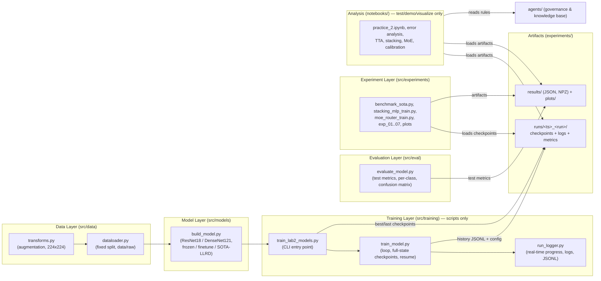

# Deep Learning Course - LAB2: Computer Vision & Transfer Learning

## Project Overview

LAB2 implements a modular, production-ready computer-vision pipeline for CIFAR-10
classification using pretrained PyTorch architectures (ResNet18, DenseNet121). It
strictly follows Separation of Concerns (SoC): data processing, model building,
training, evaluation, and AI-Agent governance are decoupled layers, and **all
training runs as logged, resumable Python scripts** — notebooks are reserved for
testing, demos, visualization and analysis.

---

## 🏗️ Architecture Overview

The lab is a layered pipeline. Each layer is a `src/` package with unit tests;
state flows forward, artifacts flow backward for analysis:



Key properties of the architecture:

- **Script-only training** — every training loop lives in `src/training/*.py` /
  `src/experiments/*_train.py`; notebooks only load artifacts and analyze.
- **Full logging & resumability** — every run persists model + optimizer +
  scheduler + RNG state + history + config (see
  [agents/rules/LOGGING_CHECKPOINT_RULES.md](agents/rules/LOGGING_CHECKPOINT_RULES.md)).
- **Real-time monitoring** — zero-dependency console progress always on; optional
  TensorBoard via `--tb`.
- **Structured storage** — one run directory per experiment run
  (`experiments/runs/<ts>_<run>/`), JSONL histories, NPZ for large arrays,
  gzip rotation for logs.
- **5W1H reporting** — every reported metric carries full context
  ([agents/rules/RESULTS_REPORTING.md](agents/rules/RESULTS_REPORTING.md)).

---

## 📁 Repository Structure

```
Deeplearning_Course_UTH/
│
├── agents/                    # AI Agent knowledge base & behavioral control
│   ├── README.md              # Navigation guide & architecture overview
│   ├── rules/                 # Conventions: naming, folder structure, MD,
│   │                          #   logging/checkpoints, 5W1H reporting, audits
│   ├── phases/                # Stage-specific pipeline documentation
│   ├── templates/             # Standard templates & checklists
│   ├── progress/              # Live progress status per phase
│   ├── experiments/           # Experiment reports & SOTA benchmarks
│   ├── bugs/                  # Documented bug reports (BUG-01, BUG-02)
│   └── references/            # External guides
│
├── configs/
│   └── data.yaml              # Centralized data configuration
│
├── data/                      # Dataset storage (single source of truth)
│   ├── raw/                   # CIFAR-10 batch files
│   └── processed/             # Fixed train/val split (seed 42)
│
├── src/                       # Core modules (SoC layers)
│   ├── data/                  # Transforms, dataloader, statistics
│   ├── models/                # Pretrained model builders (incl. SOTA LLRD)
│   ├── training/              # Training loop, full-state checkpoints, CLI
│   ├── eval/                  # Test metrics, confusion matrices, reporting
│   ├── experiments/           # Benchmark / stacking / MoE / EXP-01..07 scripts
│   └── utils/                 # run_logger, checkpoint_utils, misc helpers
│
├── notebooks/                 # Analysis & demos ONLY (no training)
│   ├── practice_2.ipynb       # Main deliverable (analysis of the 6 variants)
│   ├── practice_2_tta.ipynb            # Test-time augmentation analysis
│   ├── practice_2_stacking_mlp.ipynb   # Stacking meta-model analysis
│   ├── practice_2_moe.ipynb            # Mixture-of-experts analysis
│   ├── practice_2_error_analysis.ipynb # Confusion + misclassified-grid analysis
│   ├── practice_2_logit_bias_sweep.ipynb
│   └── practice_2_calibration_verification.ipynb
│
├── experiments/               # Run artifacts
│   ├── runs/<ts>_<run>/       # checkpoints/ logs/ metrics/ tensorboard/
│   ├── results/               # JSON / NPZ metrics (+ README with 5W1H)
│   ├── plots/                 # Generated figures
│   └── checkpoints/           # LEGACY flat checkpoints (read-only fallback)
│
├── tests/                     # Unit tests
├── requirements.txt
└── README.md
```

---

## 🚀 Quick Start

### 1. Install

```bash
python -m venv .venv
.venv\Scripts\activate          # Windows  (source .venv/bin/activate on Linux)
pip install torch torchvision --index-url https://download.pytorch.org/whl/cu130
pip install -r requirements.txt
```

### 2. Train (script-only, logged & resumable)

```bash
# Train all 6 variants (ResNet18/DenseNet121 × frozen/finetune/sota)
python -m src.training.train_lab2_models

# Subset / explicit config / monitoring
python -m src.training.train_lab2_models --modes frozen finetune --epochs 20 --seed 42
python -m src.training.train_lab2_models --tb            # + TensorBoard monitoring

# Resume an interrupted run exactly where it stopped
python -m src.training.train_lab2_models --resume

# Meta-model experiments (also script-only)
python -m src.experiments.stacking_mlp_train
python -m src.experiments.moe_router_train
```

Every run writes `experiments/runs/<ts>_<run>/` with `checkpoints/`
(`<run>_best.pt`, `<run>_last.pt`), `logs/`, `metrics/` (config + JSONL history)
and optional `tensorboard/`. Naming, format, and the resume procedure are
defined in [agents/rules/LOGGING_CHECKPOINT_RULES.md](agents/rules/LOGGING_CHECKPOINT_RULES.md).

### 3. Analyze in notebooks

Notebooks load the artifacts (checkpoints, `registry.json`, `results/*`) and
only test / demo / visualize / analyze:

```bash
jupyter notebook notebooks/practice_2.ipynb
```

### 4. Run tests

```bash
pytest tests/ -v
```

---

## 📊 Results & Reporting

- Results files are indexed and described in
  [experiments/results/README.md](experiments/results/README.md) (every metric
  carries a 5W1H description).
- Experiment reports: [agents/experiments/SUMMARY_RESULTS.md](agents/experiments/SUMMARY_RESULTS.md).
- Cost/latency is measured with **params (M), latency (ms), throughput (img/s)**
  — GFLOPs was removed as unstable and uninformative
  (see [agents/rules/RESULTS_REPORTING.md](agents/rules/RESULTS_REPORTING.md)).

---

## 🤖 Agent AI Control & Knowledge Base

- **Behavior Layer**: [agents/rules/AGENT_AI.md](agents/rules/AGENT_AI.md) is the
  memory and second brain for AI coding assistants.
- **Audit Procedure**: [agents/rules/CODEBASE_AUDIT.md](agents/rules/CODEBASE_AUDIT.md)
  runs before multi-file tasks; baseline report in
  [agents/codebase-audit-report.md](agents/codebase-audit-report.md).
- **Key rules**: [LOGGING_CHECKPOINT_RULES.md](agents/rules/LOGGING_CHECKPOINT_RULES.md),
  [RESULTS_REPORTING.md](agents/rules/RESULTS_REPORTING.md),
  [FOLDER_STRUCTURE.md](agents/rules/FOLDER_STRUCTURE.md),
  [NAMING_CONVENTION.md](agents/rules/NAMING_CONVENTION.md).

---

## 📜 License

Developed as part of the Deep Learning Course at UTH.
