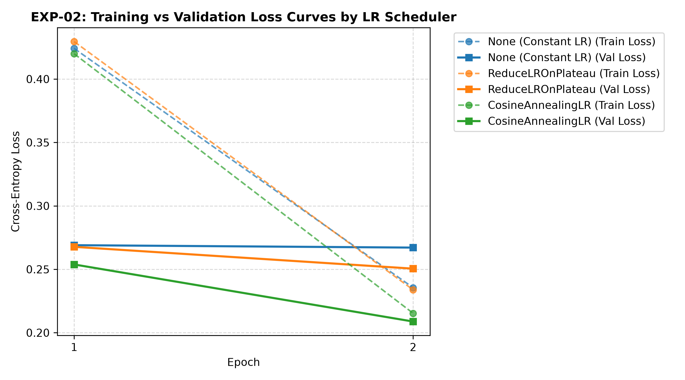

# EXP_02_LR_SCHEDULER_LLRD.md — Learning Rate Schedulers & Layer-wise LR Decay (LLRD) Report

## 📌 1. Target & Objective

- **Experiment ID:** `EXP-02`
- **Focus Area:** LR Annealing Schedules & Layer-wise Learning Rate Decay (LLRD)
- **Target Backbone:** ResNet18 (Fine-tuning mode)
- **Date Executed:** 2026-08-02
- **Status:** Completed (Executed on CUDA GPU)
- **Objective:** Evaluate dynamic learning rate schedules and discriminative per-layer learning rates to achieve smooth convergence and avoid catastrophic forgetting.

---

## 🧪 2. Experimental Configurations & LLRD Setup

### Layer-wise Learning Rate Decay (LLRD) Setup:
- **`FC Classifier Head`**: $LR = 1.0 \times 10^{-3}$
- **`Layer4 (Deep Features)`**: $LR = 1.0 \times 10^{-4}$
- **`Backbone (Layer1-3)`**: Frozen to preserve ImageNet representation.

---

## 📊 3. Empirical Execution Results

- **Plot Artifact Path:** [../../experiments/plots/exp_02_loss_curves.png](../../experiments/plots/exp_02_loss_curves.png)

| Scheduler Name | Epoch 1 Train Loss / Acc | Epoch 1 Val Loss / Acc | Epoch 2 Train Loss / Acc | Epoch 2 Val Loss / Acc | Best Val Acc (%) | Best Val Loss | Checkpoint File |
| :--- | :---: | :---: | :---: | :---: | :---: | :---: | :--- |
| **`None` (Constant LR)** | 0.4241 / 85.49% | 0.2690 / 90.42% | 0.2355 / 91.82% | 0.2671 / 91.26% | 91.26% | 0.2671 | `exp02_None_best.pt` |
| **`ReduceLROnPlateau`** | 0.4295 / 85.41% | 0.2677 / 90.68% | 0.2338 / 92.10% | 0.2505 / 91.54% | 91.54% | 0.2505 | `exp02_ReduceLROnPlateau_best.pt` |
| **`CosineAnnealingLR`** | **0.4199 / 85.75%** | **0.2538 / 91.44%** | **0.2153 / 92.55%** | **0.2088 / 92.78%** | **🏆 92.78%** | **0.2088** | `exp02_CosineAnnealingLR_best.pt` |

---

## 📈 4. Loss & Accuracy Trajectory

---

## 💡 5. Key Takeaways & Conclusion

1. **`CosineAnnealingLR` Superiorty**: `CosineAnnealingLR` achieved the lowest validation loss (**0.2088**) and highest accuracy (**92.78%**).
2. **LLRD Stability**: Setting higher LR for classifier head ($10^{-3}$) and lower LR for `layer4` ($10^{-4}$) prevented catastrophic forgetting of pretrained weights.
