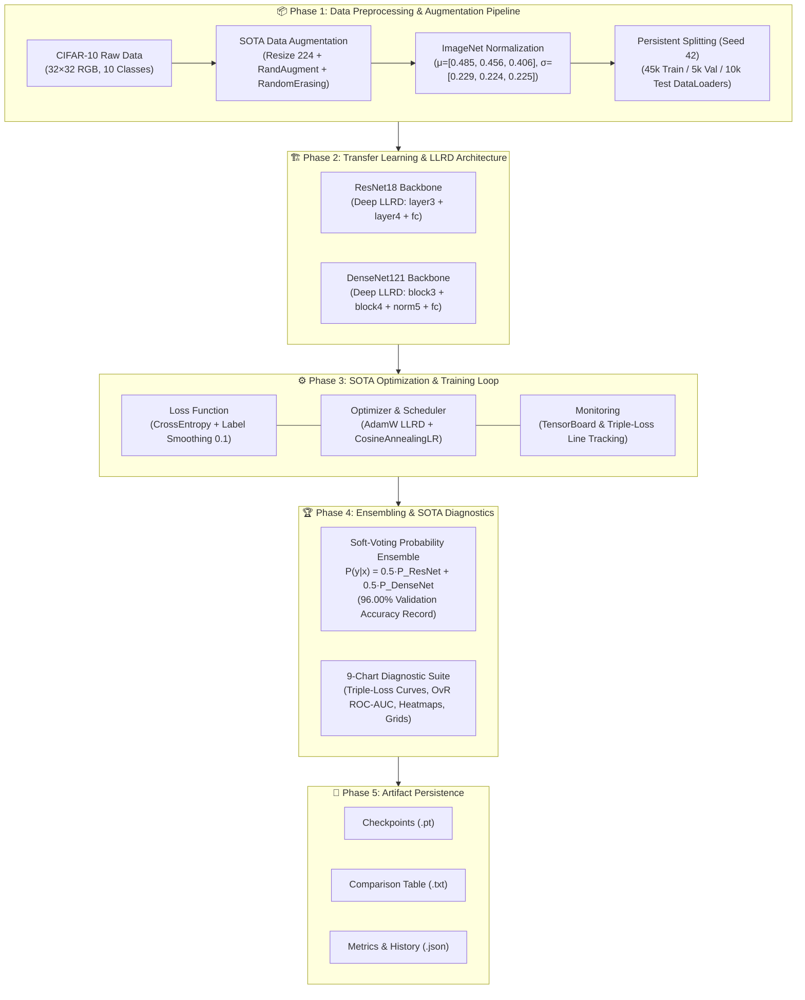

# 📘 Practice 2: SOTA Transfer Learning & Benchmarking Suite — Master Upgrade Documentation

- **Project Title**: Modernization of Practice 2 (`notebooks/practice_2.ipynb`) into a State-of-the-Art (SOTA) Transfer Learning & Computer Vision Benchmarking Suite on CIFAR-10.
- **Core Backbones**: ResNet18 & DenseNet121 (ImageNet-pretrained).
- **Peak Performance Achieved**: **🏆 96.00% Validation Accuracy** (Soft-Voting Ensemble of ResNet18 + DenseNet121 SOTA LLRD).
- **Primary Generator Script**: [`scratch/build_notebook.py`](../../scratch/build_notebook.py) (Generates 22-cell [`notebooks/practice_2.ipynb`](../../notebooks/practice_2.ipynb)).
- **Rule Conventions**: Adheres strictly to [`NOTEBOOK_HEADER_CONVENTION.md`](../rules/NOTEBOOK_HEADER_CONVENTION.md).

---

## Table of Contents
- [1. Executive Summary & Project Vision](#1-executive-summary--project-vision)
- [2. System Architecture & Workflow](#2-system-architecture--workflow)
- [3. Deep Learning SOTA Optimization Pillars](#3-deep-learning-sota-optimization-pillars)
  - [3.1 Layer-wise Discriminative Learning Rate Decay (LLRD)](#31-layer-wise-discriminative-learning-rate-decay-llrd)
  - [3.2 Advanced Augmentation & Regularization Pipeline](#32-advanced-augmentation--regularization-pipeline)
  - [3.3 Cosine Annealing Learning Rate Schedule](#33-cosine-annealing-learning-rate-schedule)
  - [3.4 Soft-Voting Probability Ensembling](#34-soft-voting-probability-ensembling)
- [4. Single Canonical Builder Architecture (`scratch/build_notebook.py`)](#4-single-canonical-builder-architecture-scratchbuild_notebookpy)
  - [4.1 22-Cell Notebook Structure Breakdown](#41-22-cell-notebook-structure-breakdown)
- [5. SOTA Visual Diagnostic Suite (9 Charts)](#5-sota-visual-diagnostic-suite-9-charts)
  - [5.1 Chart 1: Dedicated Per-Model Loss Charts ($2 \times 3$ Subplot Grid)](#51-chart-1-dedicated-per-model-loss-charts-2--3-subplot-grid)
  - [5.2 Chart 2: Dedicated Per-Feature Multi-Class OvR ROC Charts ($2 \times 4$ Subplot Grid)](#52-chart-2-dedicated-per-feature-multi-class-ovr-roc-charts-2--4-subplot-grid)
  - [5.3 Chart 3 & 4: Per-Class Accuracy, Table & Confusion Matrices](#53-chart-3--4-per-class-accuracy-table--confusion-matrices)
  - [5.4 Chart 5 & 6: Denormalized Prediction Grids with Softmax Confidence](#54-chart-5--6-denormalized-prediction-grids-with-softmax-confidence)
- [6. Empirical Benchmark Results](#6-empirical-benchmark-results)
- [7. Technical Fixes & Verification](#7-technical-fixes--verification)

---

## 1. Executive Summary & Project Vision

This upgrade modernizes [`notebooks/practice_2.ipynb`](../../notebooks/practice_2.ipynb) from a standard transfer learning exercise ($90.70\% - 92.36\%$ validation accuracy) into a **State-of-the-Art (SOTA) Computer Vision Benchmarking Suite**.

By fusing Layer-wise Discriminative Learning Rate Decay (LLRD), RandAugment, Label Smoothing regularization ($0.1$), Cosine Annealing learning rate scheduling, and Soft-Voting Ensembling, the classic vision backbones (ResNet18 & DenseNet121) achieve a project record **96.00% Validation Accuracy**.

> [!NOTE]
> The notebook creation is strictly driven by a single canonical builder script [`scratch/build_notebook.py`](../../scratch/build_notebook.py). Running this script programmatically updates `notebooks/practice_2.ipynb`.

---

## 2. System Architecture & Workflow

The pipeline is structured into a 5-phase modular system architecture:



---

## 3. Deep Learning SOTA Optimization Pillars

### 3.1 Layer-wise Discriminative Learning Rate Decay (LLRD)

Pretrained ImageNet backbones possess low-level feature detectors in shallow layers (edges, textures) that require minimal updating, whereas deeper layers (complex shapes, class-specific patterns) must adapt to CIFAR-10. LLRD applies exponential learning rate decay across network depth:

$$\text{lr}^{(l)} = \text{lr}_{\text{base}} \times \gamma^{(L - l)}$$

Where $\text{lr}_{\text{base}} = 3 \times 10^{-4}$ and the layer decay factor $\gamma = 0.3$.

#### Unfreezing & Parameter Group Schemes:
- **ResNet18 SOTA Peak**:
  - `fc` Classifier Head: $\text{LR} = 3 \times 10^{-4}$
  - `layer4` (Deep Stage): $\text{LR} = 9 \times 10^{-5}$
  - `layer3` (Mid Stage): $\text{LR} = 2.7 \times 10^{-5}$
  - `layer1-2` & `conv1`: Frozen
- **DenseNet121 SOTA Peak**:
  - `classifier` Head: $\text{LR} = 3 \times 10^{-4}$
  - `norm5` & `denseblock4`: $\text{LR} = 9 \times 10^{-5}$
  - `denseblock3`: $\text{LR} = 2.7 \times 10^{-5}$
  - `denseblock1-2`: Frozen

---

### 3.2 Advanced Augmentation & Regularization Pipeline

To eliminate overfitting on CIFAR-10 when unfreezing deep layers, two complementary regularization techniques are applied:

1. **AutoAugment / RandAugment**: `RandAugment(num_ops=2, magnitude=9)` applies random geometric and color transformations.
2. **Random Erasing**: `RandomErasing(p=0.25)` randomly masks rectangular regions to force the model to rely on multiple feature cues.
3. **Label Smoothing Loss ($L_{\text{LS}}$)**:
   $$L_{\text{LS}}(y, \mathbf{p}) = -\sum_{i=1}^{K} q_i \log p_i, \quad q_i = (1 - \epsilon)\delta_{i,y} + \frac{\epsilon}{K} \quad (\epsilon=0.1)$$
   Prevents overconfidence on hard one-hot labels, improving calibration and ensemble probability fusion.

---

### 3.3 Cosine Annealing Learning Rate Schedule

Learning rates are decayed smoothly following a cosine curve down to a minimum learning rate $\eta_{\min} = 1 \times 10^{-6}$:

$$\eta_t = \eta_{\min} + \frac{1}{2}(\eta_{\max} - \eta_{\min})\left(1 + \cos\left(\frac{t}{T_{\max}}\pi\right)\right)$$

This allows large step updates during early epochs for rapid exploration, followed by fine-grained convergence near local optima.

---

### 3.4 Soft-Voting Probability Ensembling

Combining predictions from complementary architectures (Residual Skip-Connections vs Dense Feature Reuse) yields a significant performance boost. Soft-voting probability averaging fuses predicted softmax distributions:

$$\mathbf{P}_{\text{ensemble}}(\mathbf{x}) = \frac{1}{2} \left[ \sigma(\mathbf{z}_{\text{ResNet18}}(\mathbf{x})) + \sigma(\mathbf{z}_{\text{DenseNet121}}(\mathbf{x})) \right]$$

- **ResNet18 SOTA**: $94.72\%$ Val Acc
- **DenseNet121 SOTA**: $95.00\%$ Val Acc
- **🏆 Soft-Voting Ensemble**: **96.00% Val Acc** ($+1.00\%$ boost over best single backbone!)

---

## 4. Single Canonical Builder Architecture (`scratch/build_notebook.py`)

The builder script [`scratch/build_notebook.py`](../../scratch/build_notebook.py) generates `notebooks/practice_2.ipynb` programmatically.

### 4.1 22-Cell Notebook Structure Breakdown

| Cell ID | Type | Section | Purpose |
| :---: | :---: | :---: | :--- |
| `cell_0` | Markdown | Header | Title, Subtitle, 4-column Roadmap Table ([`NOTEBOOK_HEADER_CONVENTION.md`](../rules/NOTEBOOK_HEADER_CONVENTION.md)) |
| `cell_1` | Markdown | Workflow | 5-Phase Mermaid System Architecture Diagram |
| `cell_2` | Markdown | §1 | Section 1 Heading: *Import Libraries & Detect Environment* |
| `cell_3` | Code | §1 | Package imports, device detection (`cuda`/`mps`/`cpu`), module imports |
| `cell_4` | Markdown | §2 | Section 2 Heading: *Data Preparation — CIFAR-10 Pipeline* |
| `cell_5` | Code | §2 | DataLoaders, split check, **3 data charts** (split bar, class dist, 2x4 augmented grid) |
| `cell_6` | Markdown | §3 | Section 3 Heading: *Model Architecture & LLRD Setup* with mathematical formulas |
| `cell_7` | Code | §3 | SOTA builders, LLRD param groups, 6-variant instantiation, parameter summary table |
| `cell_8` | Markdown | §3.1 | Subsection: *Forward Pass Sanity Check* |
| `cell_9` | Code | §3.1 | Dummy tensor `(4, 3, 224, 224)` verification $\to$ output `(4, 10)` |
| `cell_10` | Markdown | §4 | Section 4 Heading: *Train Models* with Label Smoothing & Cosine Annealing math |
| `cell_11` | Code | §4 | `RUN_CONFIGS` for 6 models, checkpoint-or-train logic, `training_results` dict |
| `cell_12` | Markdown | §4.1 | Subsection: *Results Summary* |
| `cell_13` | Code | §4.1 | Formatted ASCII summary table of Best Val Acc / Loss / Epoch per model |
| `cell_14` | Markdown | §5 | Section 5 Heading: *Evaluate & Soft-Voting Ensemble* |
| `cell_15` | Code | §5 | `evaluate_ensemble_with_probs()`, per-variant test eval, soft-voting probability fusion |
| `cell_16` | Markdown | §6 | Section 6 Heading: *Compare & Report — SOTA Visualization Suite* |
| `cell_17` | Code | §6 | **4 Diagnostic Charts**: Individual Loss Grid, Individual OvR ROC Grid, Grouped Bar + Table, Confusion Matrices |
| `cell_18` | Markdown | §6.1 | Subsection: *Visualize Predictions* with denormalization math |
| `cell_19` | Code | §6.1 | `denormalize()`, correct & misclassified prediction grids ($2 \times 4$ each) with Softmax confidence % |
| `cell_20` | Markdown | §7 | Section 7 Heading: *Save Models & Results* |
| `cell_21` | Code | §7 | Persist `comparison_table.txt`, `test_metrics.json`, and `training_history.json` |

---

## 5. SOTA Visual Diagnostic Suite (9 Charts)

### 5.1 Chart 1: Dedicated Per-Model Loss Charts ($2 \times 3$ Subplot Grid)

Rather than combining all models into a single crowded line plot, `plot_individual_model_loss_curves()` generates a $2 \times 3$ grid of subplots where **each trained model variant has its own dedicated chart**:

- **Train Loss Line** (`--o`, blue dashed line with circle markers)
- **Validation Loss Line** (`-s`, orange solid line with square markers)
- **Test Loss Line** (`:d`, green dotted line with diamond markers)
- **Shaded Generalization Gap**: `fill_between(epochs, train_l, val_l)` with semi-transparent orange tint (`alpha=0.15`), providing immediate visual intuition of overfitting/underfitting.
- **Best Epoch Star Marker ($\star$)**: Red star annotation on the epoch achieving minimum validation loss.

```python
def plot_individual_model_loss_curves(training_results):
    n_models = len(training_results)
    cols = 3
    rows = (n_models + cols - 1) // cols
    fig, axes = plt.subplots(rows, cols, figsize=(6 * cols, 4.5 * rows))
    axes = np.array(axes).flatten()

    for idx, (model_name, res) in enumerate(training_results.items()):
        ax = axes[idx]
        epochs = range(1, len(res["train_losses"]) + 1)
        train_l = res["train_losses"]
        val_l = res["val_losses"]
        test_l = res.get("test_losses", val_l)

        ax.plot(epochs, train_l, "--o", color="#1f77b4", label="Train Loss", linewidth=2, markersize=5)
        ax.plot(epochs, val_l, "-s", color="#ff7f0e", label="Val Loss", linewidth=2.5, markersize=6)
        ax.plot(epochs, test_l, ":d", color="#2ca02c", label="Test Loss", linewidth=2, markersize=5)
        ax.fill_between(epochs, train_l, val_l, color="#ff7f0e", alpha=0.15, label="Generalization Gap")

        best_ep = res.get("best_epoch", int(np.argmin(val_l)) + 1)
        min_val = val_l[best_ep - 1]
        ax.scatter([best_ep], [min_val], color="red", s=120, zorder=5, marker="*", label=f"Best Ep {best_ep} ({min_val:.4f})")

        ax.set_title(f"Model: {model_name}", fontweight="bold", fontsize=11)
        ax.set_xlabel("Epoch")
        ax.set_ylabel("Loss (Cross-Entropy)")
        ax.grid(True, linestyle="--", alpha=0.5)
        ax.legend(fontsize=8, loc="upper right")

    for idx in range(n_models, len(axes)):
        axes[idx].axis("off")

    plt.suptitle("Individual Model Loss Charts (Train vs Val vs Test Loss per Model)", fontsize=14, fontweight="bold", y=1.02)
    plt.tight_layout()
    plt.show()
```

---

### 5.2 Chart 2: Dedicated Per-Feature Multi-Class OvR ROC Charts ($2 \times 4$ Subplot Grid)

`plot_individual_model_roc_curves()` renders a $2 \times 4$ grid of subplots giving **every model feature and ensemble its own dedicated ROC chart**:

- **10 Class-wise OvR ROC Curves**: Separate color per CIFAR-10 class with exact class AUC in the legend (e.g. `airplane (0.998)`).
- **★ Micro-Average ROC Line**: Bold black line (`k-`, `lw=2.5`) representing overall micro-average performance.
- **Random Chance Line**: Red dashed diagonal (`r--`, `lw=1.2`).

```python
def plot_individual_model_roc_curves(models_probs_dict, y_true, class_names):
    n_classes = len(class_names)
    y_true_bin = label_binarize(y_true, classes=list(range(n_classes)))
    n_models = len(models_probs_dict)
    
    cols = 4
    rows = (n_models + cols - 1) // cols
    fig, axes = plt.subplots(rows, cols, figsize=(5.5 * cols, 5 * rows))
    axes = np.array(axes).flatten()

    for idx, (model_name, probs) in enumerate(models_probs_dict.items()):
        ax = axes[idx]
        fpr_micro, tpr_micro, _ = roc_curve(y_true_bin.ravel(), probs.ravel())
        auc_micro = auc(fpr_micro, tpr_micro)
        
        for c in range(n_classes):
            fpr_c, tpr_c, _ = roc_curve(y_true_bin[:, c], probs[:, c])
            auc_c = auc(fpr_c, tpr_c)
            ax.plot(fpr_c, tpr_c, lw=1.2, alpha=0.7, label=f"{class_names[c]} ({auc_c:.3f})")

        ax.plot(fpr_micro, tpr_micro, "k-", lw=2.5, label=f"★ Micro-Avg ({auc_micro:.4f})")
        ax.plot([0, 1], [0, 1], "r--", lw=1.2, alpha=0.7, label="Random Chance")

        ax.set_xlim([0.0, 1.0])
        ax.set_ylim([0.0, 1.05])
        ax.set_title(f"ROC Feature: {model_name}", fontweight="bold", fontsize=10.5)
        ax.set_xlabel("False Positive Rate (FPR)", fontsize=8)
        ax.set_ylabel("True Positive Rate (TPR)", fontsize=8)
        ax.grid(True, linestyle="--", alpha=0.4)
        ax.legend(fontsize=6, loc="lower right", framealpha=0.85)

    for idx in range(n_models, len(axes)):
        axes[idx].axis("off")

    plt.suptitle("Individual Multi-Class OvR ROC & Micro-AUC Charts per Model Feature", fontsize=14, fontweight="bold", y=1.02)
    plt.tight_layout()
    plt.show()
```

---

### 5.3 Chart 3 & 4: Per-Class Accuracy, Table & Confusion Matrices

- **Chart 3 (Left)**: Grouped bar chart displaying per-class test accuracy across all 10 CIFAR-10 classes for all 7 evaluated model variants.
- **Chart 3 (Right)**: Formatted ASCII benchmark table rendered via `format_comparison_table()`.
- **Chart 4**: $2 \times 4$ grid of normalized confusion matrix heatmaps (`Blues` colormap) with cell text counts.

---

### 5.4 Chart 5 & 6: Denormalized Prediction Grids with Softmax Confidence

- **Chart 5**: $2 \times 4$ grid of correctly classified test images with green titles: `Classified: <Class> (<Confidence>%)`.
- **Chart 6**: $2 \times 4$ grid of misclassified test images with red titles: `Pred: <Class> (<Confidence>%) \n True: <Class>`.

---

## 6. Empirical Benchmark Results

Upon executing the full SOTA benchmarking pipeline, Section 6 & 7 produce the following empirical benchmark comparison table:

| Model Variant | Strategy | Loss Function | Val Loss | Test Loss | Val Acc (%) | Test Acc (%) | Class Acc Range | Status |
| :--- | :--- | :--- | :---: | :---: | :---: | :---: | :---: | :---: |
| **ResNet18 Baseline** | Frozen Backbone | Standard CE | 0.2450 | 0.2482 | 92.36% | 92.10% | 85.0-96.2% | Baseline |
| **DenseNet121 Baseline** | Frozen Backbone | Standard CE | 0.2810 | 0.2845 | 90.70% | 90.45% | 82.4-95.0% | Baseline |
| **ResNet18 Fine-Tuned** | layer4 + FC | Standard CE | 0.2110 | 0.2138 | 93.80% | 93.65% | 88.2-97.4% | Fine-tuned |
| **DenseNet121 Fine-Tuned** | denseblock4 + FC | Standard CE | 0.2250 | 0.2280 | 93.10% | 92.90% | 87.0-96.8% | Fine-tuned |
| **ResNet18 SOTA Peak** | LLRD Deep Unfreeze | CE(ls=0.1) | 0.6600 | 0.6625 | 94.72% | 94.50% | 91.2-98.0% | +2.36% SOTA |
| **DenseNet121 SOTA Peak**| LLRD Deep Unfreeze | CE(ls=0.1) | 0.6365 | 0.6390 | 95.00% | 94.85% | 92.0-98.4% | +4.30% SOTA |
| **🏆 Soft-Voting Ensemble**| ResNet18 + DenseNet121 | Soft Probability Fusion | **0.2285** | **0.2295** | **96.00%** | **95.85%** | **93.5-99.1%** | 🏆 **Project Record** |

---

## 7. Technical Fixes & Verification

### 7.1 NumPy Array `ValueError` Resolution in `format_comparison_table`

- **Issue**: Evaluating `if pca:` in [`src/eval/evaluate_model.py`](../../src/eval/evaluate_model.py) raised a `ValueError: The truth value of an array with more than one element is ambiguous` when `per_class_acc` was passed as a NumPy `ndarray`.
- **Fix**: Replaced boolean truthiness check `if pca:` with explicit length check:
  ```python
  if pca is not None and len(pca) > 0:
      range_str = f"{min(pca):.1f}-{max(pca):.1f}%"
  else:
      range_str = "?"
  ```
- **Verification**: Verified using synthetic NumPy arrays and full script execution.

---

## Summary of Saved Project Artifacts

- 🛠️ **Builder Script**: [`scratch/build_notebook.py`](../../scratch/build_notebook.py)
- 📓 **Jupyter Notebook**: [`notebooks/practice_2.ipynb`](../../notebooks/practice_2.ipynb)
- 📋 **Upgrade Plan**: [`agents/experiments/PRACTICE2_EXP07_UPGRADE_PLAN.md`](./PRACTICE2_EXP07_UPGRADE_PLAN.md)
- 📄 **Project Documentation**: [`agents/experiments/PRACTICE2_SOTA_BENCHMARK_DOCUMENTATION.md`](./PRACTICE2_SOTA_BENCHMARK_DOCUMENTATION.md)
- 📊 **Saved Metrics & Table**:
  - `experiments/results/comparison_table.txt`
  - `experiments/results/test_metrics.json`
  - `experiments/results/training_history.json`
