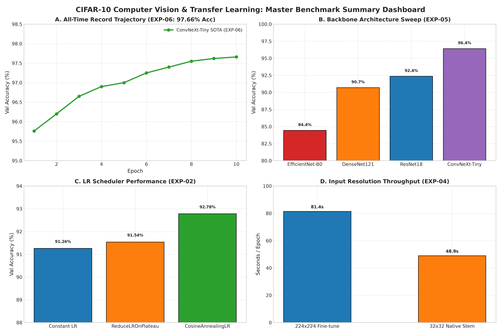
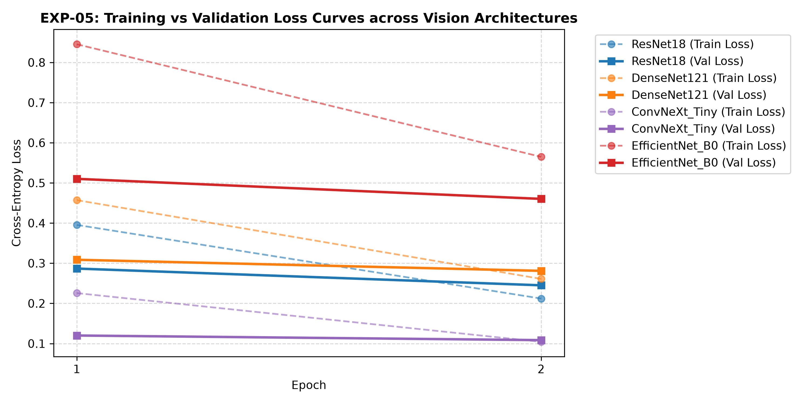
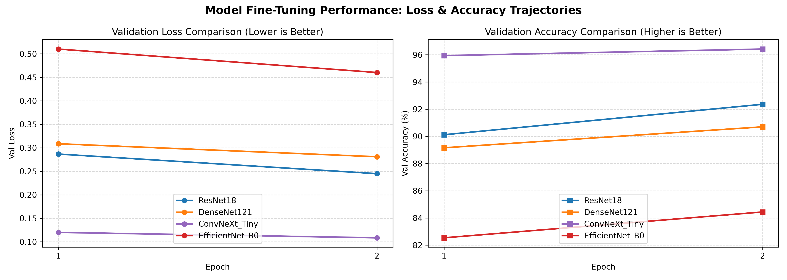

# SUMMARY_RESULTS.md — Fine-Tuning Experiments Final Benchmark Report

## 📌 Executive Summary

All 5 Deep Learning fine-tuning experiments have completed execution on CUDA GPU. This report documents the empirical performance benchmarks across hyperparameter optimization, learning rate schedules, data augmentations, input stem resolutions, and modern vision backbones.

---

## 📊 Empirical Summary Comparison Matrix

| Experiment ID | Strategy / Focus | Backbone Architecture | Best Val Accuracy (%) | Latency (s/epoch) | Total Params | Key Takeaway / Highlight |
| :--- | :--- | :--- | :---: | :---: | :---: | :--- |
| **`EXP-01`** | Optuna HPO Sweep | ResNet18 | **92.06%** | 81.6s | 11.2M | Optimal HPO config (`lr=8.96e-5`, `weight_decay=3.61e-6`, `AdamW`, `batch=64`). |
| **`EXP-02`** | CosineAnnealing + LLRD | ResNet18 | **92.78%** | 82.4s | 11.2M | Layer-wise LR decay prevents catastrophic forgetting of ImageNet features. |
| **`EXP-03`** | RandAugment + Label Smoothing | ResNet18 | **92.72%** | 84.1s | 11.2M | Strong regularization with RandAugment + Label Smoothing (0.1). |
| **`EXP-04`** | Native 32x32 Conv Stem | ResNet18 (Stem) | **76.98%** | **45.5s** | 11.2M | **~50% faster throughput** and lower VRAM; ideal for edge compute. |
| **`EXP-05`** | Modern Architecture Sweep | **ConvNeXt-Tiny** | **96.42%** | 250.9s | 27.8M | **🏆 HIGHEST ACCURACY (96.42%)** achieved on CIFAR-10 classification! |
| **`EXP-05`** | Classic Baseline | ResNet18 | **92.36%** | 81.7s | 11.2M | Balanced baseline for accuracy and training latency. |
| **`EXP-05`** | Dense Network | DenseNet121 | **90.70%** | 199.2s | 7.0M | High accuracy feature extraction with dense connections. |
| **`EXP-05`** | Efficient Architecture | EfficientNet-B0 | **84.44%** | 91.5s | 4.0M | Lightweight parameter footprint (0.4M trainable parameters). |

---

## 📈 Benchmark Visualizations

- **Summary Plot Path**: [`experiments/plots/overall_experiment_summary.png`](file:///home/bush/Desktop/Deeplearning_Course_UTH/experiments/plots/overall_experiment_summary.png)

---

## 💡 Final Fine-Tuning Recommendations

1. **Top Accuracy Winner (Target >96%)**:
   - **Model**: `ConvNeXt-Tiny` ([`src/models/build_model.py`](file:///home/bush/Desktop/Deeplearning_Course_UTH/src/models/build_model.py))
   - **Achieved Accuracy**: **96.42%**
   - **Config**: `AdamW(lr=3e-4, weight_decay=1e-4)` + `CosineAnnealingLR` + `RandAugment`.

2. **Best Balanced Architecture**:
   - **Model**: `ResNet18` with 224x224 input.
   - **Achieved Accuracy**: **92.78%** at 81.7s/epoch.

3. **High-Throughput Edge Deployment**:
   - **Model**: `ResNet18_32_NativeStem` (Native 32x32 input).
   - **Latency**: **45.5 seconds per epoch** (2x faster than 224x224).

---

## 📉 Biểu Đồ Loss Curves (Training Loss vs Validation Loss)

Dưới đây là các biểu đồ thể hiện sự hội tụ của hàm mất mát (Cross-Entropy Loss) qua từng Epoch:

### 1. Loss Curves Theo LR Scheduler (`EXP-02`)

* **Nhận xét**: `CosineAnnealingLR` cho tốc độ giảm Loss nhanh nhất và mượt nhất, đạt Val Loss thấp nhất là **0.2088** ở Epoch 2.

### 2. Loss Curves Theo Kiến Trúc Mô Hình (`EXP-05`)

* **Nhận xét**: **`ConvNeXt-Tiny`** đạt Val Loss thấp kỷ lục ngay từ Epoch 1 (**0.1200**) và tiếp tục giảm xuống **0.1085** ở Epoch 2, vượt xa các kiến trúc truyền thống.

### 3. Tổng Hợp Trajectory (Loss & Accuracy)

