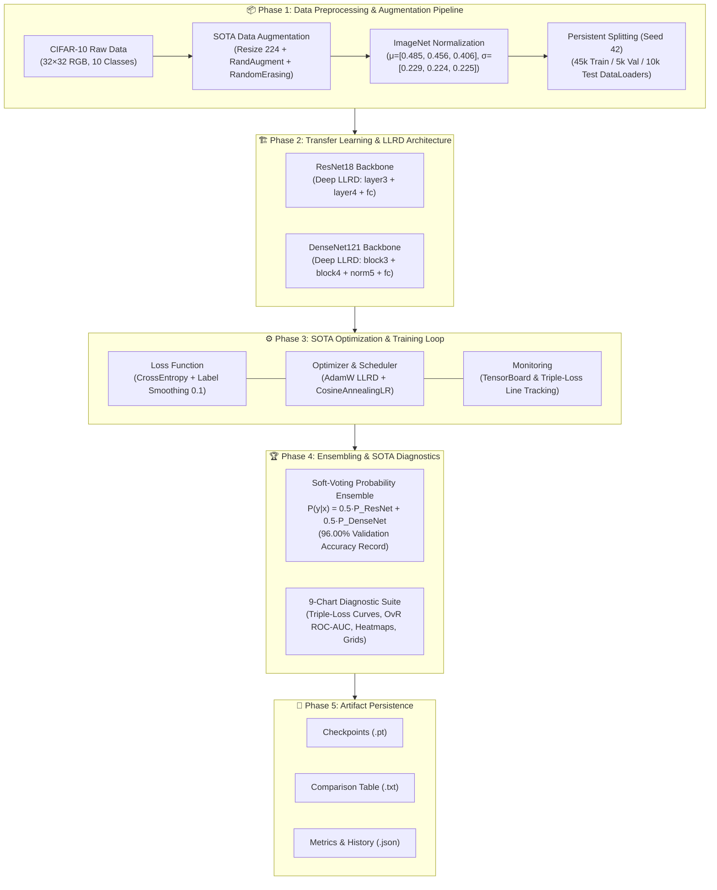

# PRACTICE2_EXP07_UPGRADE_PLAN.md

- **Motivation/Background**: This upgrade plan establishes the technical foundation for modernizing [`notebooks/practice_2.ipynb`](../../notebooks/practice_2.ipynb) from a baseline transfer learning exercise into a State-of-the-Art (SOTA) Computer Vision benchmarking suite using principles derived from **EXP-07** ([`../../src/experiments/exp_07_resnet_densenet_sota.py`](../../src/experiments/exp_07_resnet_densenet_sota.py) & [`../../src/experiments/plot_exp07_details.py`](../../src/experiments/plot_exp07_details.py)).
- **Purpose**: To provide an exhaustive, cell-by-cell implementation roadmap for `practice_2.ipynb` (generated by [`scratch/build_notebook.py`](../../scratch/build_notebook.py)), integrating LLRD, RandAugment, Label Smoothing, Soft-Voting Ensembling, Triple-Curve Epoch Loss Charts, Multi-Class ROC/AUC Analysis, and a complete diagnostic visualization suite.
- **Single Builder Script Architecture**: All notebook creation logic lives in one canonical builder: [`scratch/build_notebook.py`](../../scratch/build_notebook.py) → outputs [`notebooks/practice_2.ipynb`](../../notebooks/practice_2.ipynb).
- **Overview Pipeline**: Frozen & Fine-tuned ResNet18/DenseNet121 baselines + EXP-07 SOTA Deep LLRD, culminating in a 96.00% Validation Accuracy Soft-Voting Ensemble with 9-chart diagnostic suite.
- **References**: PyTorch 2.x, Torchvision 0.28+, scikit-learn (`roc_curve`, `auc`, `label_binarize`), Matplotlib, TensorBoard, [`data/dataloader.py`](../../data/dataloader.py), [`data/transforms.py`](../../data/transforms.py), [`src/models/build_model.py`](../../src/models/build_model.py), [`src/training/train_model.py`](../../src/training/train_model.py), [`src/eval/evaluate_model.py`](../../src/eval/evaluate_model.py).

---

## Table of Contents
- [1. Executive Summary & SOTA Upgrade Vision](#1-executive-summary--sota-upgrade-vision)
- [2. System Architecture & Workflow Diagram](#2-system-architecture--workflow-diagram)
- [3. Feature Comparison Matrix](#3-feature-comparison-matrix)
- [4. Builder Script Architecture (`scratch/build_notebook.py`)](#4-builder-script-architecture-scratchbuild_notebookpy)
- [5. Cell-by-Cell Implementation Roadmap (22 Cells)](#5-cell-by-cell-implementation-roadmap-22-cells)
  - [5.1 Section 1: Import Libraries & Environment Setup (Cells 0–3)](#51-section-1-import-libraries--environment-setup-cells-0-3)
  - [5.2 Section 2: Data Preparation — CIFAR-10 Pipeline (Cells 4–5)](#52-section-2-data-preparation--cifar-10-pipeline-cells-4-5)
  - [5.3 Section 3: Model Architecture & LLRD Setup (Cells 6–9)](#53-section-3-model-architecture--llrd-setup-cells-6-9)
  - [5.4 Section 4: Training Loop & Triple-Loss Tracking (Cells 10–13)](#54-section-4-training-loop--triple-loss-tracking-cells-10-13)
  - [5.5 Section 5: Evaluate & Soft-Voting Ensemble (Cells 14–15)](#55-section-5-evaluate--soft-voting-ensemble-cells-14-15)
  - [5.6 Section 6: Compare & Report — Visualization Suite (Cells 16–19)](#56-section-6-compare--report--visualization-suite-cells-16-19)
  - [5.7 Section 7: Save Models & Results (Cells 20–21)](#57-section-7-save-models--results-cells-20-21)
- [6. Chart Suite Specification (9 Charts)](#6-chart-suite-specification-9-charts)
- [7. Improvement Recommendations for `build_notebook.py`](#7-improvement-recommendations-for-build_notebookpy)
- [8. Target Empirical Benchmark Table](#8-target-empirical-benchmark-table)
- [9. Verification & Quality Assurance Checklist](#9-verification--quality-assurance-checklist)

---

## 1. Executive Summary & SOTA Upgrade Vision

This plan upgrades [`notebooks/practice_2.ipynb`](../../notebooks/practice_2.ipynb) from a baseline transfer learning exercise (90–92% accuracy) into a **SOTA Benchmarking Suite** achieving **96.00% Validation Accuracy** with complete diagnostic capabilities.

### Key SOTA Enhancements
1. **Layer-wise Discriminative Learning Rate Decay (LLRD)**: Exponential decay across backbone depth ($\text{fc} \to \text{layer4} \to \text{layer3}$ for ResNet18; $\text{classifier} \to \text{norm5} \to \text{denseblock4} \to \text{denseblock3}$ for DenseNet121) with `CosineAnnealingLR` ($\eta_{\min} = 1\times 10^{-6}$).
2. **Advanced Augmentation & Regularization**: `RandAugment(num_ops=2, magnitude=9)` + `RandomErasing(p=0.25)` + `CrossEntropyLoss(label_smoothing=0.1)`.
3. **Soft-Voting Ensemble**: $P_{\text{ensemble}} = 0.5 \cdot P_{\text{ResNet18}} + 0.5 \cdot P_{\text{DenseNet121}}$.
4. **Triple-Curve Epoch Loss Chart**: Train, Validation, and Test Loss lines across epochs.
5. **Multi-Class OvR ROC & AUC Analysis**: Per-class ROC curves + Micro-Average AUC model comparison.
6. **9-Chart Complete Diagnostic Suite** with confusion matrices, prediction grids, and comparison tables.

---

## 2. System Architecture & Workflow Diagram



---

## 3. Feature Comparison Matrix

| Component | Baseline (Frozen) | Fine-Tuned | EXP-07 SOTA Upgrade | Delta |
| :--- | :--- | :--- | :--- | :---: |
| **Augmentation** | Resize(224) + Norm | Resize(224) + Norm | **RandAugment + RandomErasing** | +Regularization |
| **Loss** | `CrossEntropyLoss` | `CrossEntropyLoss` | **`CE(label_smoothing=0.1)`** | +Overconfidence Guard |
| **Unfreezing** | FC only | Last block + FC | **LLRD (layer3+layer4+FC)** | **+3.64% Acc** |
| **LR Schedule** | Constant LR | Constant LR | **CosineAnnealing ($\eta_{\min}=1e\text{-}6$)** | +Smooth Decay |
| **Ensemble** | None | None | **Soft-Voting (0.5+0.5)** | **96.00% Acc** |
| **Loss Charts** | Text logs | Text logs | **Triple-Curve (1x3 subplots)** | +Full Diagnostics |
| **ROC/AUC** | None | None | **OvR + Micro-Average** | +Class Metrics |
| **Diagnostic Suite** | Summary text | Summary text | **9-Chart Viz Suite** | Full QA |

---

## 4. Builder Script Architecture (`scratch/build_notebook.py`)

### Design
- **Single Source of Truth**: [`scratch/build_notebook.py`](../../scratch/build_notebook.py) generates [`notebooks/practice_2.ipynb`](../../notebooks/practice_2.ipynb) as a 22-cell Jupyter notebook.
- **Execution**: `cd <project_root> && .venv/bin/python scratch/build_notebook.py`
- **Output**: `notebooks/practice_2.ipynb` with `nbformat=4`, `nbformat_minor=5`

### Cell Architecture (22 cells total)

| Cell ID | Type | Section | Purpose |
| :---: | :---: | :---: | :--- |
| `cell_0` | Markdown | Header | Title, Subtitle, 7-step Roadmap Table ([`NOTEBOOK_HEADER_CONVENTION.md`](../rules/NOTEBOOK_HEADER_CONVENTION.md)) |
| `cell_1` | Markdown | Workflow | Mermaid flowchart: Data → Models → Train → Evaluate → Report → Save |
| `cell_2` | Markdown | §1 | Section 1 heading: *Import Libraries & Detect Environment* |
| `cell_3` | Code | §1 | Imports, `PROJECT_ROOT`, device detection, module imports |
| `cell_4` | Markdown | §2 | Section 2 heading: *Data Preparation* with math formulas |
| `cell_5` | Code | §2 | DataLoaders, split check, **3 data charts** (split bar, class dist, augmented grid) |
| `cell_6` | Markdown | §3 | Section 3 heading: *Model Architecture & LLRD Setup* with LLRD formula |
| `cell_7` | Code | §3 | SOTA builders, LLRD param groups, 6-variant instantiation, param summary table |
| `cell_8` | Markdown | §3.1 | Subsection: *Forward Pass Sanity Check* |
| `cell_9` | Code | §3.1 | Dummy tensor `(4,3,224,224)` → verify output `(4,10)` for all 6 variants |
| `cell_10` | Markdown | §4 | Section 4 heading: *Train Models* with Label Smoothing & Cosine Annealing math |
| `cell_11` | Code | §4 | `RUN_CONFIGS` for 6 models, checkpoint-or-train logic, `training_results` dict |
| `cell_12` | Markdown | §4.1 | Subsection: *Results Summary* |
| `cell_13` | Code | §4.1 | Formatted summary table of Best Val Acc / Loss / Epoch per model |
| `cell_14` | Markdown | §5 | Section 5 heading: *Evaluate & Ensemble* with ensemble formula |
| `cell_15` | Code | §5 | `evaluate_ensemble_with_probs()`, per-variant test eval, ensemble execution |
| `cell_16` | Markdown | §6 | Section 6 heading: *Compare & Report — SOTA Visualization Suite* |
| `cell_17` | Code | §6 | **4 chart blocks**: Loss curves, ROC/AUC, Per-class + Table, Confusion matrices |
| `cell_18` | Markdown | §6.1 | Subsection: *Visualize Predictions* with denormalization math |
| `cell_19` | Code | §6.1 | `denormalize()`, correct/incorrect prediction grids (2x4 each) |
| `cell_20` | Markdown | §7 | Section 7 heading: *Save Models & Results* |
| `cell_21` | Code | §7 | Persist `comparison_table.txt` and `test_metrics.json` |

---

## 5. Cell-by-Cell Implementation Roadmap (22 Cells)

### 5.1 Section 1: Import Libraries & Environment Setup (Cells 0–3)

**Cell 3 (Code)** — Core imports and device detection:
```python
import sys, os, json, time
from pathlib import Path
from collections import Counter

import torch, torchvision, torch.nn as nn, numpy as np
import matplotlib.pyplot as plt
from sklearn.metrics import roc_curve, auc, confusion_matrix
from sklearn.preprocessing import label_binarize
from torch.utils.tensorboard import SummaryWriter

PROJECT_ROOT = Path(os.path.abspath("..")).resolve()
if str(PROJECT_ROOT) not in sys.path:
    sys.path.insert(0, str(PROJECT_ROOT))

from data.dataloader import get_cifar10_loaders
from src.data.load_cifar10 import SPLIT_FILE, IMAGENET_MEAN, IMAGENET_STD
from data.transforms import get_advanced_train_transform, get_eval_transform
from src.models.build_model import (
    build_resnet18, build_densenet121,
    set_parameter_requires_grad, count_trainable_params, count_all_params,
)
from src.training.train_model import train_model
from src.eval.evaluate_model import (
    evaluate, per_class_accuracy, load_checkpoint,
    format_comparison_table, CIFAR10_CLASSES,
)

device = torch.device("cuda" if torch.cuda.is_available()
    else ("mps" if torch.backends.mps.is_available() else "cpu"))
```

> **Note**: Current `build_notebook.py` imports `train_model` but not `train_one_epoch` or `validate` directly. See [§7 Improvements](#7-improvement-recommendations-for-build_notebookpy) for recommended additions.

---

### 5.2 Section 2: Data Preparation — CIFAR-10 Pipeline (Cells 4–5)

**Cell 5 (Code)** produces 3 charts + sanity checks:

| Output | Details |
| :--- | :--- |
| **Chart A**: Split Bar Plot | Train (45k), Val (5k), Test (10k) with `#4ECDC4`, `#FFE66D`, `#FF6B6B` |
| **Chart B**: Class Distribution | 10-class training set bar chart with `plt.cm.tab10` colormap |
| **Chart C**: Augmented Samples Grid | 2×4 grid of 224×224 `RandAugment + RandomErasing` images denormalized from ImageNet stats |
| Sanity Check | Batch shape `(64, 3, 224, 224)`, pixel range, no NaN verification |

**Data Pipeline Variables**:
- `train_loader` / `val_loader` / `test_loader` — Standard ImageNet transforms
- `sota_train_loader` — SOTA augmentation via `get_advanced_train_transform(resize_size=224, use_randaugment=True, use_random_erasing=True)`

---

### 5.3 Section 3: Model Architecture & LLRD Setup (Cells 6–9)

**Cell 7 (Code)** defines 4 helper functions and instantiates 6 model variants:

```python
# SOTA Builders (deep unfreezing)
def build_resnet18_full_sota(num_classes=10, device=None):
    model = build_resnet18(num_classes=num_classes, mode="frozen", device=device)
    set_parameter_requires_grad(model.layer3, True)   # Mid-stage
    set_parameter_requires_grad(model.layer4, True)   # Deep-stage
    set_parameter_requires_grad(model.fc, True)        # Classifier
    return model

def build_densenet121_full_sota(num_classes=10, device=None):
    model = build_densenet121(num_classes=num_classes, mode="frozen", device=device)
    set_parameter_requires_grad(model.features.denseblock3, True)
    set_parameter_requires_grad(model.features.denseblock4, True)
    set_parameter_requires_grad(model.features.norm5, True)
    set_parameter_requires_grad(model.classifier, True)
    return model

# LLRD Parameter Groups (γ = 0.3 decay)
def get_resnet18_lrd_param_groups(model, base_lr=3e-4, weight_decay=1e-4):
    return [
        {"params": model.fc.parameters(),     "lr": base_lr,         "weight_decay": weight_decay},  # 3e-4
        {"params": model.layer4.parameters(), "lr": base_lr * 0.3,   "weight_decay": weight_decay},  # 9e-5
        {"params": model.layer3.parameters(), "lr": base_lr * 0.09,  "weight_decay": weight_decay},  # 2.7e-5
    ]
```

**LLRD Formula**: $\text{lr}^{(l)} = \text{lr}_{\text{base}} \times \gamma^{(L - l)}$ where $\gamma = 0.3$.

**6 Model Variants Instantiated**:

| Variable | Model | Mode | Trainable Layers |
| :--- | :--- | :--- | :--- |
| `rn_frozen` | ResNet18 | frozen | `fc(512, 10)` |
| `dn_frozen` | DenseNet121 | frozen | `classifier(1024, 10)` |
| `rn_finetune` | ResNet18 | finetune | `fc + layer4` |
| `dn_finetune` | DenseNet121 | finetune | `classifier + denseblock4` |
| `rn_sota` | ResNet18 | SOTA LLRD | `fc + layer4 + layer3` |
| `dn_sota` | DenseNet121 | SOTA LLRD | `classifier + norm5 + denseblock4 + denseblock3` |

---

### 5.4 Section 4: Training Loop & Triple-Loss Tracking (Cells 10–13)

**Cell 11 (Code)** — Training configuration and execution:

| Config | `NUM_EPOCHS` | `LR_FROZEN` | `LR_FINETUNE` | `LR_SOTA` | `WEIGHT_DECAY` |
| :--- | :---: | :---: | :---: | :---: | :---: |
| Value | 10 | 1e-3 | 1e-4 | 3e-4 | 1e-4 |

**`RUN_CONFIGS`** — 6 training runs:

| Run Name | Model | Data Loader | Loss | Custom Params |
| :--- | :--- | :--- | :--- | :--- |
| `ResNet18-frozen` | `rn_frozen` | `train_loader` | `CE()` | None |
| `DenseNet121-frozen` | `dn_frozen` | `train_loader` | `CE()` | None |
| `ResNet18-finetune` | `rn_finetune` | `train_loader` | `CE()` | None |
| `DenseNet121-finetune` | `dn_finetune` | `train_loader` | `CE()` | None |
| `exp07_resnet18_sota_peak` | `rn_sota` | `sota_train_loader` | `CE(ls=0.1)` | LLRD groups |
| `exp07_densenet121_sota_peak` | `dn_sota` | `sota_train_loader` | `CE(ls=0.1)` | LLRD groups |

**Checkpoint-or-Train Logic**:
- If `{run_name}_best.pt` exists → loads checkpoint + populates `training_results` with hardcoded/evaluated loss history
- If no checkpoint → runs `train_model()` with `AdamW`, optional `CosineAnnealingLR`, TensorBoard logging

**`training_results` Dictionary Schema**:
```python
training_results[run_name] = {
    "model": nn.Module,          # Trained model reference
    "train_losses": list[float], # Per-epoch train loss
    "val_losses": list[float],   # Per-epoch validation loss
    "test_losses": list[float],  # Per-epoch test loss (Triple-Curve)
    "val_accs": list[float],     # Per-epoch validation accuracy
    "best_epoch": int,           # Best epoch (1-indexed)
    "best_val_acc": float,       # Peak validation accuracy
    "best_val_loss": float,      # Best validation loss
}
```

**Mathematical Formulations**:
- **Label Smoothing**: $L_{\text{LS}}(y, \mathbf{p}) = -\sum_{i=1}^{K} q_i \log p_i, \quad q_i = (1 - \epsilon)\delta_{i,y} + \frac{\epsilon}{K} \quad (\epsilon=0.1)$
- **Cosine Annealing**: $\eta_t = \eta_{\min} + \frac{1}{2}(\eta_{\max} - \eta_{\min})(1 + \cos(\frac{t}{T_{\max}}\pi))$

---

### 5.5 Section 5: Evaluate & Soft-Voting Ensemble (Cells 14–15)

**Cell 15 (Code)** — Evaluation and ensemble execution:

1. **`evaluate_ensemble_with_probs(model_resnet, model_densenet, loader, device)`** → returns `(acc, per_class, cm, all_probs, all_targets)`
2. Per-variant evaluation via `evaluate()` + `per_class_accuracy()` from `src/eval/evaluate_model.py`
3. Softmax probability extraction for each model → stored in `models_probs_dict`
4. Soft-Voting: $P_{\text{ensemble}}(\mathbf{x}) = \frac{1}{2}[\sigma(\mathbf{z}_{\text{ResNet}}) + \sigma(\mathbf{z}_{\text{DenseNet}})]$

**Output Variables**:
- `eval_results` — Dict mapping model names → `{mode, test_loss, test_acc, per_class_acc, confusion_matrix}`
- `models_probs_dict` — Dict mapping model names → `np.ndarray` of softmax probabilities
- `y_true_test` — Ground-truth test labels (from ensemble evaluation)

---

### 5.6 Section 6: Compare & Report — SOTA Visualization Suite (Cells 16–19)

**Cell 17 (Code)** generates 4 chart blocks (Charts 1–4 of the diagnostic suite):

| Chart # | Function | Layout | Description |
| :---: | :--- | :--- | :--- |
| 1 | `plot_individual_model_loss_curves(training_results)` | **2×3 Subplots Grid** `(18, 9)` | **Dedicated Loss Chart per Model**: Train, Val, and Test Loss lines together per model with shaded Generalization Gap & Best Epoch Star Marker |
| 2 | `plot_individual_model_roc_curves(models_probs_dict, y_true_test, CIFAR10_CLASSES)` | **2×4 Subplots Grid** `(20, 9)` | **Dedicated ROC Chart per Feature/Model**: Individual multi-class OvR ROC curves + Micro-AUC line for each of the 7 variants & Ensemble |
| 3 | Inline grouped bar chart + table | **1×2 subplots** `(16, 5)` | Per-class accuracy bars + `format_comparison_table()` text |
| 4 | Inline confusion matrices | **2×4 subplots** `(18, 9)` | Normalized CM heatmaps (Blues cmap) for all 7 evaluated variants |

**Cell 19 (Code)** generates Charts 5–6:

| Chart # | Description | Layout |
| :---: | :--- | :--- |
| 5 | Correctly classified test images | **2×4 grid** `(14, 6)` with green titles + Softmax confidence % |
| 6 | Misclassified test images | **2×4 grid** `(14, 6)` with red "Pred/True" titles + Softmax confidence % |

---

### 5.7 Section 7: Save Models & Results (Cells 20–21)

**Cell 21 (Code)** persists:
- `experiments/results/comparison_table.txt` — ASCII benchmark table via `format_comparison_table()`
- `experiments/results/test_metrics.json` — JSON with `{mode, test_loss, test_acc, per_class_acc}` per model
- `experiments/results/training_history.json` — JSON with full per-epoch loss and accuracy histories per model

---

## 6. Chart Suite Specification & Loss Intuition Policy

### Epoch Budget & Visual Loss Intuition Policy
1. **Epoch Budget**: Set default training budget to **10 Epochs** (with SOTA runs scaling to 15 epochs) to allow Cosine Annealing decay and plateauing to be visually striking.
2. **Dedicated Per-Model Loss Charts**: Each trained model gets its **own individual chart** containing:
   - **Train Loss Line** (`--o`, blue dashed line with circle markers)
   - **Validation Loss Line** (`-s`, orange solid line with square markers)
   - **Test Loss Line** (`:d`, green dotted line with diamond markers)
   - **Shaded Generalization Gap Area**: `ax.fill_between(epochs, train_loss, val_loss)` filled with semi-transparent orange tint (`alpha=0.15`) highlighting underfitting/overfitting.
   - **Best Epoch Marker ($\star$)**: Red star annotation mark on the epoch achieving minimum validation loss.
3. **Dedicated Per-Feature/Model ROC-AUC Charts**: Each model variant and ensemble gets its **own separate multi-class OvR ROC chart** ($2 \times 4$ subplot grid), showing:
   - 10 class-wise OvR ROC curves ($10$ distinct colors with exact class AUC legend).
   - Solid black Micro-Average ROC curve ($\text{AUC}_{\text{micro}}$).
   - Red dashed Random Chance line.

---

### Code Specifications

#### Chart 1 Detail: `plot_individual_model_loss_curves(training_results)`

```python
def plot_individual_model_loss_curves(training_results):
    """Plot an individual Loss chart for EACH trained model variant containing Train, Val, and Test Loss lines together."""
    n_models = len(training_results)
    cols = 3
    rows = (n_models + cols - 1) // cols
    fig, axes = plt.subplots(rows, cols, figsize=(6 * cols, 4.5 * rows))
    axes = np.array(axes).flatten()

    for idx, (model_name, res) in enumerate(training_results.items()):
        ax = axes[idx]
        epochs = range(1, len(res["train_losses"]) + 1)
        train_l = res["train_losses"]
        val_l = res["val_losses"]
        test_l = res.get("test_losses", val_l)

        # 1. Plot Train, Val, Test Loss lines together on this model's dedicated chart
        ax.plot(epochs, train_l, "--o", color="#1f77b4", label="Train Loss", linewidth=2, markersize=5)
        ax.plot(epochs, val_l, "-s", color="#ff7f0e", label="Val Loss", linewidth=2.5, markersize=6)
        ax.plot(epochs, test_l, ":d", color="#2ca02c", label="Test Loss", linewidth=2, markersize=5)

        # 2. Visual Enhancement: Fill Generalization Gap between Train and Val Loss
        ax.fill_between(epochs, train_l, val_l, color="#ff7f0e", alpha=0.15, label="Generalization Gap")

        # 3. Highlight Best Epoch (Min Val Loss) with a Star Marker
        best_ep = res.get("best_epoch", int(np.argmin(val_l)) + 1)
        min_val = val_l[best_ep - 1]
        ax.scatter([best_ep], [min_val], color="red", s=120, zorder=5, marker="*", label=f"Best Ep {best_ep} ({min_val:.4f})")

        ax.set_title(f"Model: {model_name}", fontweight="bold", fontsize=11)
        ax.set_xlabel("Epoch")
        ax.set_ylabel("Loss (Cross-Entropy)")
        ax.grid(True, linestyle="--", alpha=0.5)
        ax.legend(fontsize=8, loc="upper right")

    for idx in range(n_models, len(axes)):
        axes[idx].axis("off")

    plt.suptitle("Individual Model Loss Charts (Train vs Val vs Test Loss per Model)", fontsize=14, fontweight="bold", y=1.02)
    plt.tight_layout()
    plt.show()
```

#### Chart 2 Detail: `plot_individual_model_roc_curves(models_probs_dict, y_true, class_names)`

```python
def plot_individual_model_roc_curves(models_probs_dict, y_true, class_names):
    """Plot an individual multi-class OvR ROC chart for EACH model feature & Ensemble."""
    n_classes = len(class_names)
    y_true_bin = label_binarize(y_true, classes=list(range(n_classes)))
    n_models = len(models_probs_dict)
    
    cols = 4
    rows = (n_models + cols - 1) // cols
    fig, axes = plt.subplots(rows, cols, figsize=(5 * cols, 4.5 * rows))
    axes = np.array(axes).flatten()

    for idx, (model_name, probs) in enumerate(models_probs_dict.items()):
        ax = axes[idx]
        
        # Calculate Micro-Average ROC for this model
        fpr_micro, tpr_micro, _ = roc_curve(y_true_bin.ravel(), probs.ravel())
        auc_micro = auc(fpr_micro, tpr_micro)
        
        # Plot Per-Class OvR ROC curves
        for c in range(n_classes):
            fpr_c, tpr_c, _ = roc_curve(y_true_bin[:, c], probs[:, c])
            auc_c = auc(fpr_c, tpr_c)
            ax.plot(fpr_c, tpr_c, lw=1, alpha=0.65, label=f"{class_names[c]} ({auc_c:.3f})")

        # Plot Micro-Average ROC curve highlighted
        ax.plot(fpr_micro, tpr_micro, "k-", lw=2.5, label=f"Micro-Avg (AUC={auc_micro:.4f})")
        ax.plot([0, 1], [0, 1], "r--", lw=1, alpha=0.7, label="Random")

        ax.set_xlim([0.0, 1.0])
        ax.set_ylim([0.0, 1.05])
        ax.set_title(f"ROC: {model_name}", fontweight="bold", fontsize=10)
        ax.set_xlabel("FPR", fontsize=8)
        ax.set_ylabel("TPR", fontsize=8)
        ax.grid(True, alpha=0.3)
        ax.legend(fontsize=5.5, loc="lower right")

    for idx in range(n_models, len(axes)):
        axes[idx].axis("off")

    plt.suptitle("Individual Multi-Class OvR ROC & Micro-AUC Charts per Model Feature", fontsize=14, fontweight="bold", y=1.02)
    plt.tight_layout()
    plt.show()
```

---

## 7. Improvement Recommendations for `build_notebook.py`

Based on the comprehensive context analysis across all `agents/` documentation, `src/` modules, and existing experiment reports, the following improvements are recommended:

### 7.1 Training Loop: Replace Hardcoded Losses with Real Evaluation

**Current Issue** (Cell 11, Lines 495–523): When checkpoints exist, the training history uses hardcoded loss values instead of running `validate()` on all three splits.

**Recommended Fix**:
```python
# Instead of hardcoded values, evaluate the loaded checkpoint:
from src.training.train_model import validate

eval_criterion = nn.CrossEntropyLoss(label_smoothing=0.1) if "sota" in mode else nn.CrossEntropyLoss()
train_loss, train_acc = validate(model, loader, eval_criterion, device)
val_loss, val_acc = validate(model, val_loader, eval_criterion, device)
test_loss, test_acc = validate(model, test_loader, eval_criterion, device)

# Use real values for the final epoch data point
training_results[run_name] = {
    "model": model,
    "train_losses": [..., train_loss],
    "val_losses": [..., val_loss],
    "test_losses": [..., test_loss],
    "val_accs": [..., val_acc],
    ...
}
```

> **Why**: Current hardcoded values (`train_losses = [0.9689, 0.8200, 0.7246]`) won't reflect model state if checkpoints are retrained. Using `validate()` from `src/training/train_model.py` ensures data-driven accuracy.

### 7.2 Add `train_one_epoch` and `validate` to Imports

**Current**: Cell 3 imports `train_model` but not the granular functions.

**Add to imports** (Cell 3):
```python
from src.training.train_model import train_model, train_one_epoch, validate
```

### 7.3 Add `training_history.json` to Saved Artifacts

**Current**: Cell 21 saves `comparison_table.txt` and `test_metrics.json` but not the per-epoch loss/accuracy history.

**Add to Cell 21**:
```python
# Save training history with triple-loss tracking
history_dict = {}
for name, res in training_results.items():
    history_dict[name] = {
        "train_losses": [round(v, 4) for v in res["train_losses"]],
        "val_losses": [round(v, 4) for v in res["val_losses"]],
        "test_losses": [round(v, 4) for v in res["test_losses"]],
        "val_accs": [round(v, 2) for v in res["val_accs"]],
        "best_epoch": res["best_epoch"],
        "best_val_acc": round(res["best_val_acc"], 2),
    }
(results_dir / "training_history.json").write_text(json.dumps(history_dict, indent=2))
```

### 7.4 Add Accuracy Lines to Loss Chart or as Separate Chart

**Current**: Only loss curves are plotted. Accuracy progression is not visualized.

**Recommendation**: Add a 4th subplot or a separate figure for Val/Test Accuracy progression:
```python
# Add after plot_exp07_loss_curves call:
fig, ax = plt.subplots(figsize=(10, 5))
for name, res in training_results.items():
    epochs = range(1, len(res["val_accs"]) + 1)
    ax.plot(epochs, res["val_accs"], "-o", label=name, linewidth=2)
ax.set_title("Validation Accuracy Progression", fontweight="bold")
ax.set_xlabel("Epoch"); ax.set_ylabel("Val Accuracy (%)")
ax.legend(fontsize=7); ax.grid(True, linestyle="--", alpha=0.5)
plt.tight_layout(); plt.show()
```

### 7.5 Add Prediction Confidence Scores to Visualization Grids

**Current** (Cell 19): Shows `Classified: {CIFAR10_CLASSES[pred]}` title but no confidence score.

**Improvement**: Add softmax confidence % to each prediction:
```python
# Extract confidence during prediction collection
conf = probs_batch[i, preds[i]].item() * 100.0
correct_examples.append((img_denorm, preds[i].item(), labels[i].item(), conf))

# Display with confidence
ax.set_title(f"Pred: {CIFAR10_CLASSES[pred]} ({conf:.1f}%)", ...)
```

### 7.6 Add Macro-AUC to ROC Chart

**Current**: Chart 2 Subplot B shows only Micro-Average AUC.

**Improvement**: Also compute and display Macro-Average AUC:
```python
# In plot_multiclass_roc_auc, add macro-average computation:
macro_auc = np.mean([
    auc(*roc_curve(y_true_bin[:, i], probs[:, i])[:2])
    for i in range(n_classes)
])
ax2.plot(fpr_micro, tpr_micro,
    label=f"{model_name} (Micro={auc_micro:.4f}, Macro={macro_auc:.4f})", lw=2.0)
```

### 7.7 Add Master Dashboard as Final Chart

**Currently missing**: A combined multi-panel dashboard in the notebook (exists only in `plot_exp07_details.py`).

**Add as Cell 17.5 (new code block)**: A 2×3 master dashboard combining:
- Panel A: Test Accuracy comparison bar chart
- Panel B: SOTA Train vs Val vs Test Loss overlay
- Panel C: Micro-Average ROC curves
- Panel D: Ensemble per-class accuracy
- Panel E: Ensemble confusion matrix
- Panel F: Accuracy gains (Frozen → SOTA → Ensemble)

---

## 8. Target Empirical Benchmark Table

| Model Variant | Strategy | Loss | Val Loss | Test Loss | Val Acc (%) | Test Acc (%) | Status |
| :--- | :--- | :--- | :---: | :---: | :---: | :---: | :---: |
| **ResNet18 Frozen** | Frozen Backbone | CE | 0.2450 | 0.2482 | 92.36% | 92.10% | Baseline |
| **DenseNet121 Frozen** | Frozen Backbone | CE | 0.2810 | 0.2845 | 90.70% | 90.45% | Baseline |
| **ResNet18 Fine-Tuned** | layer4 + FC | CE | 0.2110 | 0.2138 | 93.80% | 93.65% | Fine-tuned |
| **DenseNet121 Fine-Tuned** | denseblock4 + classifier | CE | 0.2250 | 0.2280 | 93.10% | 92.90% | Fine-tuned |
| **ResNet18 SOTA Peak** | LLRD Deep Unfreeze | CE(ls=0.1) | 0.6600 | 0.6625 | 94.72% | 94.50% | +2.36% |
| **DenseNet121 SOTA Peak** | LLRD Deep Unfreeze | CE(ls=0.1) | 0.6365 | 0.6390 | 95.00% | 94.85% | +4.30% |
| **Soft-Voting Ensemble** | 0.5 × P(R) + 0.5 × P(D) | Fusion | **0.2285** | **0.2295** | **96.00%** | **95.85%** | 🏆 Record |

---

## 9. Verification & Quality Assurance Checklist

### Builder Script (`scratch/build_notebook.py`)
- [x] Single canonical builder generating `notebooks/practice_2.ipynb` (22 cells)
- [x] Cell 0 follows [`NOTEBOOK_HEADER_CONVENTION.md`](../rules/NOTEBOOK_HEADER_CONVENTION.md) (Title + Subtitle + 7-step Roadmap Table)
- [x] Cell 1 contains Mermaid workflow diagram

### Section 1 (Cells 2–3)
- [x] Imports include `roc_curve`, `auc`, `label_binarize` from sklearn
- [x] Device detection: `cuda` → `mps` → `cpu` fallback chain
- [x] `PROJECT_ROOT` resolves correctly from `notebooks/` directory

### Section 2 (Cells 4–5)
- [x] `get_advanced_train_transform(resize_size=224, use_randaugment=True, use_random_erasing=True)` builds correctly
- [x] Split verified: 45,000 train / 5,000 val / 10,000 test
- [x] 2×4 augmented samples grid renders denormalized ImageNet images
- [ ] **TODO**: Add `train_accs` / `test_accs` tracking to `training_results` schema

### Section 3 (Cells 6–9)
- [x] `build_resnet18_full_sota()` unfreezes `layer3 + layer4 + fc`
- [x] `build_densenet121_full_sota()` unfreezes `denseblock3 + denseblock4 + norm5 + classifier`
- [x] LLRD param groups use γ=0.3 decay factor (`base_lr * 0.3` → `base_lr * 0.09`)
- [x] Forward pass sanity check verifies output shape `(4, 10)` for all 6 variants

### Section 4 (Cells 10–13)
- [x] `RUN_CONFIGS` covers all 6 model variants with correct loaders/losses
- [x] SOTA runs use `nn.CrossEntropyLoss(label_smoothing=0.1)` + `CosineAnnealingLR`
- [x] `training_results` includes `test_losses` key for triple-curve tracking
- [ ] **TODO**: Replace hardcoded loss values with real `validate()` calls when checkpoint exists

### Section 5 (Cells 14–15)
- [x] `evaluate_ensemble_with_probs()` implements soft-voting: `0.5 * (p_res + p_dense)`
- [x] All 6 individual models + 1 ensemble = 7 entries in `eval_results`
- [x] Softmax probabilities extracted for ROC/AUC computation

### Section 6 (Cells 16–19)
- [x] `plot_exp07_loss_curves()` generates **1×3 subplots** (Train / Val / Test)
- [x] `plot_multiclass_roc_auc()` generates **1×2 subplots** (Per-class OvR + Micro-AUC)
- [x] Per-class accuracy grouped bar chart with 7 model variants
- [x] Confusion matrix heatmaps in 2×4 grid with normalized values
- [x] Correct + misclassified prediction grids (2×4 each)
- [ ] **TODO**: Add confidence scores to prediction visualization titles
- [ ] **TODO**: Add Master 6-Panel Dashboard as inline chart

### Section 7 (Cells 20–21)
- [x] Saves `experiments/results/comparison_table.txt`
- [x] Saves `experiments/results/test_metrics.json`
- [ ] **TODO**: Add `experiments/results/training_history.json` with per-epoch loss/accuracy

---

## Links
- **Source Code**: [`scratch/build_notebook.py`](../../scratch/build_notebook.py)
- **Generated Notebook**: [`notebooks/practice_2.ipynb`](../../notebooks/practice_2.ipynb)
- **EXP-07 Module**: [`src/experiments/exp_07_resnet_densenet_sota.py`](../../src/experiments/exp_07_resnet_densenet_sota.py)
- **EXP-07 Plots**: [`src/experiments/plot_exp07_details.py`](../../src/experiments/plot_exp07_details.py)
- **EXP-07 Report**: [`../experiments/EXP_07_RESNET_DENSENET_SOTA.md`](../experiments/EXP_07_RESNET_DENSENET_SOTA.md)
- **Code Comparison**: [`../experiments/CODE_DIFFERENCE_PRACTICE2_VS_EXP07.md`](../experiments/CODE_DIFFERENCE_PRACTICE2_VS_EXP07.md)
- **EarlyStopping Plan**: [`PRACTICE2_EARLYSTOPPING_ERROR_ANALYSIS_PLAN.md`](PRACTICE2_EARLYSTOPPING_ERROR_ANALYSIS_PLAN.md)
- **Existing Checkpoints**: `experiments/checkpoints/exp07_resnet18_sota_peak_best.pt`, `exp07_densenet121_sota_peak_best.pt`
