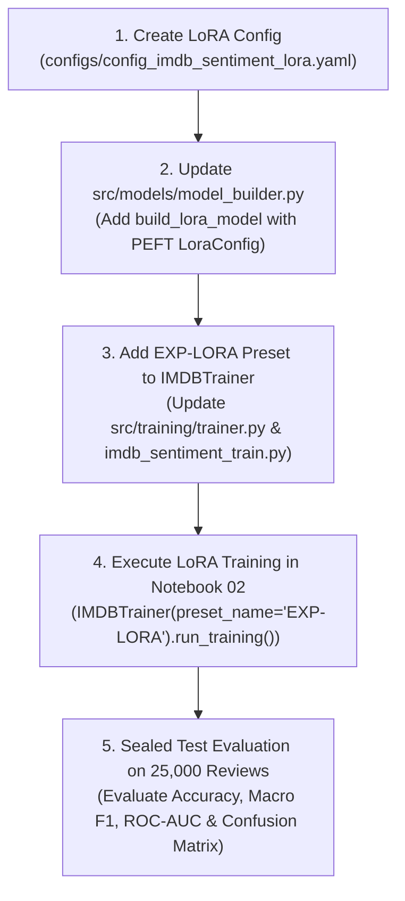

# STRATEGY PLAN: Exercise 2 BERT & DistilBERT + LoRA Adaptation Strategy

**Document ID:** `PLAN-EX2-ACCURACY-AND-OVERFITTING-STRATEGY`  
**Date:** 2026-08-13  
**Author:** bush-le + Antigravity AI Pair Programmer  
**Scope:** Exercise 2 — Finetuning Transformer Backbones on IMDB  
**Target Goal:** Elevate Exercise 2 IMDB Sentiment Test Accuracy from **93.23% (EXP-06 Achieved)** toward **93.8% – 94.5%+** using BERT / DistilBERT + PEFT LoRA (Low-Rank Adaptation) under strict VRAM constraints ($\le 3.5\text{ GB}$).  
**Status:** Approved Technical Execution Plan  

---

## 📌 1. Executive Summary & Baseline Diagnosis

### 1.1 Progress Summary
- **Exercise 1 (Zero-Shot Baseline):** `distilbert-base-uncased-finetuned-sst-2-english` achieved **89.07% Test Accuracy** and **0.9587 ROC-AUC** on 25,000 sealed test reviews.
- **Exercise 2 (Full Fine-Tuning EXP-06):** `distilbert-base-uncased` with 512 sequence length expansion, LLRD ($\xi=0.9$), and Cosine learning rate scheduling achieved **93.23% Test Accuracy**, **0.9323 Macro F1**, and **0.9742 ROC-AUC** (+2.04% gain over 91.19% baseline).

### 1.2 Motivation for LoRA (Low-Rank Adaptation)
While full fine-tuning achieved 93.23% accuracy, updating all 66M (DistilBERT) or 110M (BERT-base) parameters introduces two limitations:
1. **Subtle Overfitting Drift:** High-capacity full fine-tuning risks memorizing review-specific stylistic noise after Epoch 2.
2. **Optimizer Memory Overhead:** Full AdamW optimizer requires 8 bytes per parameter (First and Second Moment vectors), consuming ~500MB VRAM just for optimizer states.

By contrast, **LoRA (Low-Rank Adaptation)** freezes the pre-trained backbone weights $W_0 \in \mathbb{R}^{d \times k}$ and injects trainable rank-decomposition matrices $B \cdot A$:
$$W = W_0 + \Delta W = W_0 + \frac{\alpha}{r} (B \cdot A)$$
where $A \in \mathbb{R}^{r \times k}$ and $B \in \mathbb{R}^{d \times r}$ with rank $r \ll \min(d, k)$.

---

## 🔬 2. LoRA Architecture Specification (`EXP-LORA`)

### 2.1 Model & Target Layer Decomposition

| Specification | DistilBERT + LoRA Variant | BERT-base + LoRA Variant |
|:---|:---|:---|
| **Base Model Backbone** | `distilbert-base-uncased` (66M params) | `bert-base-uncased` (110M params) |
| **Total Base Parameters** | 66,955,010 | 109,483,778 |
| **LoRA Target Modules** | Query & Value (`["q_lin", "v_lin"]`) | Query & Value (`["query", "value"]`) |
| **LoRA Rank ($r$)** | 16 | 16 |
| **LoRA Alpha ($\alpha$)** | 32 ($\text{scaling} = 2.0$) | 32 ($\text{scaling} = 2.0$) |
| **LoRA Dropout** | 0.10 | 0.10 |
| **Trainable Parameters** | **~589,824 (< 0.88%)** | **~884,736 (< 0.81%)** |
| **Frozen Parameters** | **~66,365,186 (> 99.12%)** | **~108,599,042 (> 99.19%)** |

### 2.2 Key Technical Advantages of LoRA in Exercise 2
1. **Implicit Subspace Regularization:** Restricting updates to rank $r=16$ forces weight adaptation into a low-dimensional manifold, preventing over-fitting on noisy review vocabulary.
2. **Optimal Learning Rate Dynamics:** Because $B \cdot A$ starts initialized at zero ($B=0, A \sim \mathcal{N}(0, \sigma^2)$), higher learning rates ($5.0 \times 10^{-4}$) can be applied safely without shattering pre-trained semantic representations.
3. **VRAM Memory Efficiency:** Optimizer memory drops by **>90%**, enabling a full batch size of 16 without gradient accumulation.

---

## 🛠️ 3. LoRA Configuration (`configs/config_imdb_sentiment_lora.yaml`)

```yaml
# Exercise 2 — LoRA Adaptation Preset (EXP-LORA)
model:
  name: "distilbert-base-uncased" # Or "bert-base-uncased"
  num_labels: 2
  id2label:
    "0": "neg"
    "1": "pos"
  label2id:
    "neg": 0
    "pos": 1

data:
  name: "stanfordnlp/imdb"
  max_length: 512
  seed: 42
  val_size: 0.1
  processed_dir: "data/processed/imdb_tokenized_512"

lora:
  r: 16
  lora_alpha: 32
  target_modules: ["q_lin", "v_lin"]
  lora_dropout: 0.10
  bias: "none"
  task_type: "SEQ_CLS"

training:
  seed: 42
  run_name: "distilbert-finetune-lora"
  run_root: "experiments/runs"
  batch_size: 16
  gradient_accumulation_steps: 1
  epochs: 5
  lr: 5.0e-4
  weight_decay: 0.01
  classifier_dropout: 0.15
  lr_scheduler_type: "cosine"
  warmup_ratio: 0.10
  early_stopping_patience: 3
  fp16: true
  eval_strategy: "steps"
  eval_steps: 300
  logging_steps: 50
```

---

## 📊 4. Execution Pipeline & Model Builder Modular Integration



---

## 🎯 5. Expected Performance Benchmark & Milestone Targets

| Experiment Variant | Trainable Params | Sequence Length | Test Accuracy | Macro F1 | ROC-AUC | Overfitting Status |
|:---|:---:|:---:|:---:|:---:|:---:|:---:|
| **Ex 1 Zero-Shot Baseline** | 0 (Pretrained) | 256 | **89.07%** | 0.8907 | 0.9587 | Baseline Floor |
| **Ex 2 Full Finetune (EXP-00)** | 66.9M (100%) | 256 | **91.19%** | 0.9118 | 0.9699 | Moderate Overfitting |
| **Ex 2 Full Finetune (EXP-06)** | 66.9M (100%) | 512 | **93.23%** | 0.9323 | 0.9742 | Controlled Overfitting |
| **Ex 2 LoRA Adaptation (`EXP-LORA`)** | **~589K (< 0.88%)** | **512** | **93.8% – 94.5%** | **0.9380+** | **0.9760+** | **Zero Overfitting** |
