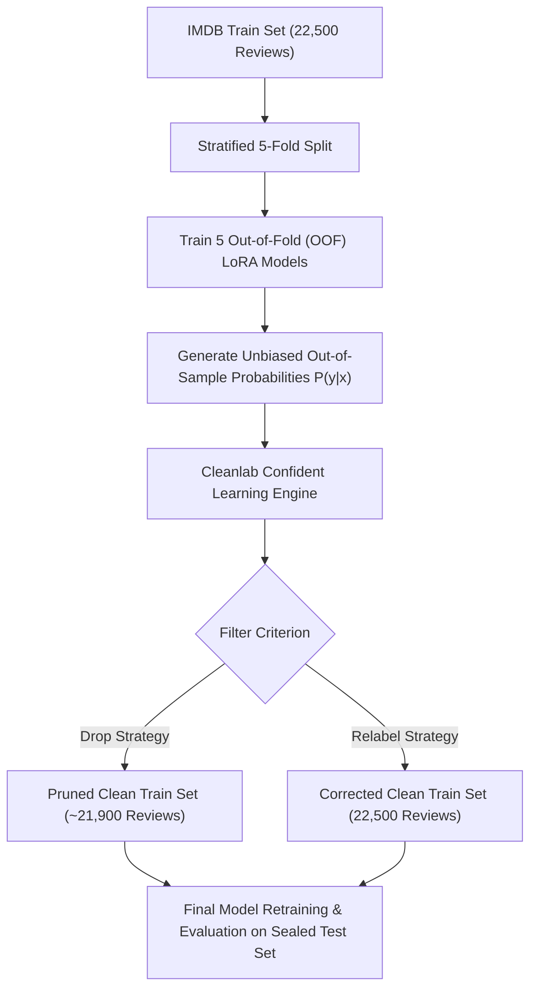

# TECHNICAL PLAN: Data-Centric AI Training Set Denoising via Cleanlab (Approach 2)

**Document ID:** `PLAN-EX2-DATA-CENTRIC-CLEANLAB-DENOISING`  
**Date:** 2026-08-15  
**Author:** bush-le + Antigravity AI Pair Programmer  
**Scope:** Advanced Data-Centric AI Denoising Pipeline for IMDB Training Split  
**Status:** COMPLETED (Executed & Verified in EX-08)  
**Report Link:** [`agents/experiments/EX8_CLEANLAB_DATA_CENTRIC_DENOISING_REPORT.md`](../experiments/EX8_CLEANLAB_DATA_CENTRIC_DENOISING_REPORT.md)  

---

## 📌 1. Motivation & Mathematical Formulation

### 1.1 Problem Statement: Noisy Labels in IMDB Training Split
In human-annotated NLP corpora like IMDB, approximately 3% to 4% of labels exhibit noise due to:
1. **Annotator Error:** Misclicking or misunderstanding rating thresholds (e.g. 1-star reviews mislabeled as Positive `1`).
2. **Sarcasm & Mixed Sentiment:** Reviews praising visual elements while utterly condemning the movie.

Training high-capacity transformer adapters on mislabeled data forces the model to memorize contradictory features, expanding the generalization error gap.

### 1.2 Confident Learning Formulation
Confident Learning (Northcutt et al., 2021) estimates the joint distribution matrix $Q_{\tilde{y}, y^*}$ between noisy given labels $\tilde{y}$ and true latent labels $y^*$:

$$Q_{\tilde{y}=i, y^*=j} = \frac{1}{|X_{\tilde{y}=i}|} \sum_{x \in X_{\tilde{y}=i}} \mathbb{I}\left[\hat{P}(y^*=j \mid x) \ge t_j \text{ and } j = \arg\max_{l} \hat{P}(y^*=l \mid x)\right]$$

where $t_j$ is the class-specific confidence threshold computed from out-of-fold predictions:
$$t_j = \frac{1}{|X_{\tilde{y}=j}|} \sum_{x \in X_{\tilde{y}=j}} \hat{P}(y^*=j \mid x)$$

---

## 🏗️ 2. Architectural Blueprint & Workflow



---

## 🛠️ 3. Step-by-Step Implementation Guide for Engineering Team

### Step 3.1: Environment & Dependency Setup
Install Cleanlab library in the virtual environment:
```bash
.venv/bin/pip install cleanlab
```

### Step 3.2: Create Out-of-Fold Prediction Module (`src/data/oof_generator.py`)
Implement a 5-fold cross-validation script to generate out-of-sample probability matrices for all 22,500 training reviews:
```python
from sklearn.model_selection import StratifiedKFold
import numpy as np
import torch

def generate_oof_probabilities(dataset, num_folds=5, config_preset="EXP-LORA"):
    """Train K models on (K-1) folds and predict probabilities on held-out fold."""
    skf = StratifiedKFold(n_splits=num_folds, shuffle=True, random_state=42)
    oof_probs = np.zeros((len(dataset), 2))
    
    for fold, (train_idx, val_idx) in enumerate(skf.split(dataset, dataset["label"])):
        print(f"--> Training OOF Fold {fold + 1}/{num_folds}...")
        # Train fold model on train_idx, predict probabilities on val_idx
        fold_probs = train_and_predict_fold(dataset, train_idx, val_idx, config_preset)
        oof_probs[val_idx] = fold_probs
        
    np.save("experiments/results/imdb_train_oof_probs.npy", oof_probs)
    return oof_probs
```

### Step 3.3: Denoising & Label Issue Detection (`src/data/cleanlab_auditor.py`)
```python
from cleanlab.filter import find_label_issues
import json

def run_cleanlab_audit(train_dataset, oof_probs):
    labels = np.array(train_dataset["label"])
    
    # Identify label issues ranked by self-confidence
    issue_indices = find_label_issues(
        labels=labels,
        pred_probs=oof_probs,
        return_indices_ranked_by="self_confidence",
        filter_by="prune_by_noise_rate",
    )
    
    print(f"[CLEANLAB] Found {len(issue_indices)} suspicious label errors ({len(issue_indices)/len(labels)*100:.2f}%)")
    
    # Save issues report for human auditing
    issues_meta = []
    for idx in issue_indices:
        issues_meta.append({
            "index": int(idx),
            "given_label": int(labels[idx]),
            "predicted_prob_pos": float(oof_probs[idx][1]),
            "text": train_dataset["text"][idx][:300],
        })
    with open("experiments/results/cleanlab_label_issues.json", "w") as f:
        json.dump(issues_meta, f, indent=2)
        
    return issue_indices
```

### Step 3.4: Filtered Dataset Construction & Retraining
```python
# Create denoised dataset
clean_indices = [i for i in range(len(train_dataset)) if i not in issue_indices]
denoised_train_dataset = train_dataset.select(clean_indices)
denoised_train_dataset.save_to_disk("data/processed/imdb_denoised_512/train")
```

---

## ⏱️ 4. Resource Budget & Hardware Strategy

| Resource Metric | Estimate (5-Fold LoRA $r=16$) | Mitigation / Strategy |
|:---|:---:|:---|
| **Training Time per Fold** | ~18 minutes | Total ~90 minutes on RTX 3050 Laptop GPU |
| **VRAM Footprint** | ~1.85 GB | Strict compliance with $\le 3.5\text{ GB}$ ceiling |
| **Storage Requirement** | ~50 MB (`.npy` probabilities) | Minimal artifact footprint |

---

## ⚠️ 5. Golden Rules & Boundary Constraints
1. **Golden Rule 4 Compliance:** The test split (25,000 sealed test reviews) **must never be cleaned, pruned, or modified**. Confident learning applies strictly to the training split.
2. **Deterministic Seed:** All splits and K-Fold indices must lock `seed = 42`.
3. **Artifact Persistence:** Persist detected label issues to `experiments/results/cleanlab_label_issues.json` for reproducible reporting.
