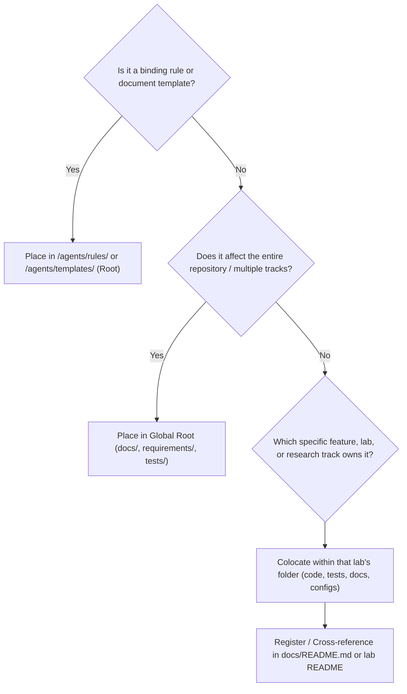

# FOLDER_STRUCTURE.md — Repository Directory Layout & Organizational Principles

- **Motivation/Background**: Unclear directory boundaries between universal governance, track-specific research notes, runtime outputs, and modular packages cause severe architectural drift and expensive consolidation rework.
- **Purpose**: Serve as the immutable single source of truth for repository directory layout, file ownership, runtime artifact segregation, and the boundary between global governance (`/agents`) and colocated modular tracks (`lab1`, `lab2`, `lab3`).
- **Overview Pipeline**: Formulated from the LAB1, LAB2, and LAB3 consolidation into `main` and codified as an immutable project governance rule.
- **Detailed Plan**: §1 Constitutional Core & Governance Discoverability; §2 Dual-Paradigm Architecture & Archetype B (Multi-Track Coursework Layout); §3 Global vs. Colocated Classification Matrix; §4 Agent Decision Rules for Artifact Placement; §5 Runtime Output Namespacing & Sentinel Rules; §6 Audit & Enforcement Protocol.
- **References**: `agents/rules/CODEBASE_AUDIT.md`, `agents/rules/LOGGING_CHECKPOINT_RULES.md`, `docs/README.md`.
- **Created**: 2026-09-06T13:05:18+07:00
- **Last Updated**: 2026-09-06T21:25:00+07:00

---

## Table of Contents

- [1. Constitutional Core & Governance Discoverability](#1-constitutional-core--governance-discoverability)
- [2. Dual-Paradigm Architecture & Coursework Multi-Track Layout](#2-dual-paradigm-architecture--coursework-multi-track-layout)
- [3. Global vs. Colocated Classification Matrix](#3-global-vs-colocated-classification-matrix)
- [4. Agent Decision Rules for Artifact Placement](#4-agent-decision-rules-for-artifact-placement)
- [5. Runtime Output Namespacing & Sentinel Rules](#5-runtime-output-namespacing--sentinel-rules)
- [6. Audit & Enforcement Protocol](#6-audit--enforcement-protocol)

---

## 1. Constitutional Core & Governance Discoverability

Regardless of project scale or track topology, the root **`/agents`** directory is the immutable constitutional anchor of the entire repository:

1. **Always at Repository Root:** AI agents land at the workspace root. `/agents` MUST reside at the top level so that any agent, tool, or human engineer immediately discovers the binding rules and templates upon arrival.
2. **Never Duplicated Across Features/Labs:** Never create nested `lab1/agents/` or `lab2/agents/`. Governance is unified and repository-wide.
3. **Strict Content Isolation:** `/agents` contains ONLY immutable rules (`agents/rules/`), document templates (`agents/templates/`), and the agent entry point (`agents/README.md`). All evolving project notes, plans, and reports live outside `/agents`.

---

## 2. Dual-Paradigm Architecture & Coursework Multi-Track Layout

The project adheres to the **Dual-Paradigm Architecture**:
- **Archetype A (Single-Track / Monolithic):** For focused single-task projects with flat global layers.
- **Archetype B (Multi-Track / Feature-Modular):** For multi-lab coursework, research suites evaluating independent domains, or multi-feature systems.

This repository implements **Archetype B (Multi-Track Coursework)**, where independent labs (`lab1`, `lab2`, `lab3`) operate as self-contained feature tracks with domain-segregated code, tests, and documentation:

```text
project_root/
├── agents/                                # CONSTITUTIONAL AI GOVERNANCE (Immutable rules & templates only)
│   ├── README.md                          # Guide to repository agent constitution
│   ├── rules/                             # What the AI agent MUST consistently do
│   │   ├── AGENT_AI.md                    # Core behavior layer, 6-stage workflow & prompting rules
│   │   ├── CODEBASE_AUDIT.md              # Drift audit procedure & finding resolution lifecycle
│   │   ├── FOLDER_STRUCTURE.md            # Canonical repository directory layout (this file)
│   │   ├── LOGGING_CHECKPOINT_RULES.md    # Script-only training & full-state checkpoint rules
│   │   ├── MD_CONVENTION.md               # Markdown formatting, timestamps & clickable link standards
│   │   ├── NAMING_CONVENTION.md           # File, code, and experiment naming rules
│   │   ├── NOTEBOOK_HEADER_CONVENTION.md  # Standardized notebook first-cell headers
│   │   ├── PYTORCH_FRAMEWORK_RULES.md     # PyTorch device/seed/VRAM/eval rules
│   │   └── RESULTS_REPORTING.md           # 5W1H empirical reporting protocol
│   └── templates/                         # Standardized document skeletons
│       ├── BUG_TEMPLATE.md                # Bug report skeleton
│       ├── CODEBASE_AUDIT_TEMPLATE.md     # Audit report skeleton (with Status lifecycle)
│       ├── EXPERIMENT_TEMPLATE.md         # Experiment report skeleton
│       ├── PHASE_DOC_TEMPLATE.md          # Pipeline phase specification skeleton
│       ├── PROGRESS_STATUS_TEMPLATE.md    # Phase progress tracking skeleton
│       ├── PROJECT_ROADMAP_TEMPLATE.md    # Milestone & execution roadmap skeleton
│       ├── REFERENCE_TEMPLATE.md          # Reusable reference skeleton
│       └── SMOKE_TEST_CHECKLIST.md        # Pre-execution verification checklist
│
├── docs/                                  # EVOLVING RESEARCH & STAGE DOCUMENTATION
│   ├── README.md                          # Master index of coursework research stages
│   ├── shared/                            # Cross-project reference guides, SOPs, and manuals
│   │   ├── HOW_TO_SETUP_AI_AGENT.md       # 10-step agent workflow setup SOP
│   │   ├── HANDOFF_TEMPLATE.md            # Inter-agent task handoff specification
│   │   ├── ML_PIPELINE_REFERENCE_v3.md    # 18-step ML engineering reference guide
│   │   ├── MD_CREATION_GUIDE.md           # 5-step pedagogical documentation guide
│   │   ├── OPTUNA_DB_GUIDE.md             # Optuna SQLite analysis and export guide
│   │   └── GIT_AND_RELEASE_BEST_PRACTICES.md # Git commits, CI, and release management SOP
│   ├── archive/                           # Preserved historical drafts
│   │   └── lab1/                          # LAB1 early rulebase and notes
│   ├── lab1/                              # Fashion-MNIST Classification Stage
│   │   ├── README.md                      # Overview of LAB1 research & deliverables
│   │   ├── PURPOSE.md                     # Original brief (renamed from purposre.md)
│   │   ├── GIT_WORKING_GUIDE.md           # Sub-branch collaboration protocol
│   │   └── experiments/README.md          # Index pointing to practice_1 outputs
│   ├── lab2/                              # CIFAR-10 Transfer Learning Stage
│   │   ├── README.md                      # Overview of CIFAR-10 benchmarks & SOTA
│   │   ├── OVERVIEW.md                    # LAB2 execution plan
│   │   ├── PURPOSE.md                     # LAB2 exercise brief & requirements
│   │   ├── CODEBASE_AUDIT_REPORT.md       # LAB2 historical audit baseline
│   │   ├── experiments/                   # EXP-01 to EXP-07, logit bias sweep, SOTA docs
│   │   ├── phases/                        # 13 CIFAR-10 pipeline phase specifications
│   │   ├── progress/                      # CIFAR-10 live phase status tracking
│   │   └── bugs/                          # Bugs 01-02
│   └── lab3/                              # Hugging Face IMDB Sentiment Stage
│       ├── README.md                      # Overview of NLP, LoRA, and Cleanlab breakthroughs
│       ├── OVERVIEW.md                    # LAB3 execution plan
│       ├── PURPOSE.md                     # LAB3 exercise brief & requirements
│       ├── PROJECT_ROADMAP.md             # LAB3 milestone execution roadmap
│       ├── CODEBASE_AUDIT_REPORT.md       # LAB3 historical audit baseline
│       ├── experiments/                   # EX1 to EX14 reports (baseline -> LoRA peak)
│       ├── phases/                        # 8 NLP pipeline phase specifications
│       ├── plans/                         # Active and completed anti-overfitting plans
│       ├── progress/                      # LAB3 live phase status tracking
│       └── bugs/                          # Bugs 01-05
│
├── src/                                   # DOMAIN-SEGREGATED SOURCE CODE
│   ├── lab1/                              # Fashion-MNIST modules (flat utilities)
│   │   ├── __init__.py
│   │   ├── data_utils.py
│   │   ├── model_utils.py
│   │   ├── train_utils.py
│   │   ├── eval_utils.py
│   │   └── vis_utils.py
│   ├── lab2/                              # CIFAR-10 Computer Vision Package
│   │   ├── __init__.py
│   │   ├── data/                          # Dataset, dataloader, transforms, inspection, statistics
│   │   ├── models/                        # build_model (ResNet, DenseNet, ConvNeXt)
│   │   ├── training/                      # train_model, train_lab2_models
│   │   ├── eval/                          # evaluate_model (CIFAR-10 metrics)
│   │   ├── experiments/                   # exp_01 to exp_08, plotters, benchmark_sota
│   │   ├── eda/                           # UMAP feature extraction and visualization
│   │   └── utils/                         # run_logger, checkpoint_utils, optuna_db_report
│   └── lab3/                              # Hugging Face NLP Package
│       ├── __init__.py                    # Lazy exports
│       ├── data/                          # prepare_imdb, eda_imdb, cleanlab_denoiser
│       ├── models/                        # model_builder, predictor
│       ├── training/                      # imdb_sentiment_train, trainer
│       ├── eval/                          # evaluate_model, evaluator, plotter, error_auditor
│       ├── experiments/                   # baseline_imdb_sentiment
│       └── utils/                         # run_logger, checkpoint_utils, resource_monitor, truncation_viz
│
├── notebooks/                             # INTERACTIVE ANALYSIS NOTEBOOKS
│   ├── lab1/                              # Fashion-MNIST notebooks
│   │   ├── practice_1.ipynb
│   │   └── error_analysis/
│   ├── lab2/                              # CIFAR-10 Transfer Learning notebooks
│   │   ├── practice_2.ipynb
│   │   ├── practice_2_calibration_verification.ipynb
│   │   ├── practice_2_error_analysis.ipynb
│   │   ├── practice_2_logit_bias_sweep.ipynb
│   │   ├── practice_2_moe.ipynb
│   │   ├── practice_2_stacking_mlp.ipynb
│   │   └── practice_2_tta.ipynb
│   └── lab3/                              # Hugging Face IMDB Sentiment notebooks
│       ├── 01_ex1_sentiment_baseline.ipynb
│       └── 02_ex2_finetune.ipynb
│
├── experiments/                           # PERSISTED RUN ARTIFACTS BY STAGE
│   ├── lab1/                              # Fashion-MNIST outputs
│   │   ├── practice_1/                    # Metrics, plots, model weights
│   │   └── error_analysis/
│   ├── lab2/                              # CIFAR-10 outputs
│   │   ├── plots/                         # ~60 visualization PNGs
│   │   ├── results/                       # benchmark_metrics.json, UMAP embeddings
│   │   └── runs/                          # Gitignored run states (.gitkeep)
│   └── lab3/                              # Hugging Face outputs
│       ├── plots/                         # ~15 visualization PNGs
│       ├── results/                       # benchmark_metrics.json, Cleanlab issues JSON
│       └── runs/                          # Gitignored run states (.gitkeep)
│
├── data/                                  # DATASETS & ARTIFACT CACHES
│   ├── raw/                               # Read-only external datasets (.gitkeep)
│   ├── lab1/
│   │   └── splits/                        # JSON split indices
│   ├── lab2/
│   │   └── processed/                     # cifar10_split_seed42.json
│   └── lab3/
│       └── processed/                     # Cached denoised & tokenized arrow splits
│
├── configs/                               # EXPERIMENT CONFIGURATIONS
│   ├── lab2_data.yaml                     # CIFAR-10 data configuration
│   └── config_imdb_sentiment*.yaml        # 9 IMDB experiment configurations
│
├── tests/                                 # UNIT & INTEGRATION TESTS
│   ├── lab1/                              # Fashion-MNIST smoke tests
│   ├── lab2/                              # CIFAR-10 test suite (14 files + conftest.py)
│   └── lab3/                              # Hugging Face test suite (6 files + conftest.py)
│
├── requirements/                          # MULTI-TIER ENVIRONMENT DEPENDENCIES
│   ├── base.txt                           # Shared scientific core (numpy, pandas, torch, optuna)
│   ├── lab1.txt                           # Base + tabulate, jupyter
│   ├── lab2.txt                           # Base + tensorboard, pillow
│   ├── lab3.txt                           # Base + transformers, datasets, cleanlab, peft
│   └── dev.txt                            # Full dev environment + pytest, ruff, mypy
│
├── pyproject.toml                         # Unified build system, ruff, mypy, pytest config
├── pytest.ini                             # Root pytest configuration
├── requirements.txt                       # Convenience proxy file
└── README.MD                              # Unified project presentation
```

---

## 3. Global vs. Colocated Classification Matrix

| Artifact Type | Scope | Canonical Placement | Architectural Rationale |
| :--- | :--- | :--- | :--- |
| **Agent Constitution (`/agents`)** | **Global** | Root `agents/` (`rules/`, `templates/`, `README.md`) | Universal rules apply across all labs. Agents land at root and require deterministic discovery. Never duplicate `/agents`. |
| **Unified Project Presentation & Index** | **Global** | Root `README.MD`, `docs/README.md` | Central entry point indexing all labs, environments, benchmarks, and deliverables. |
| **Shared Engineering SOPs** | **Global** | `docs/shared/` (`HOW_TO_SETUP_AI_AGENT.md`, `HANDOFF_TEMPLATE.md`, `ML_PIPELINE_REFERENCE_v3.md`) | Cross-cutting operational protocols used identically by all labs. |
| **Dependency & Build Config** | **Global** | `pyproject.toml`, `requirements/` (`base.txt`, `dev.txt`), `.github/workflows/ci.yml` | Unified packaging discovery, central linting, and CI pipeline execution. |
| **Cross-Lab Integration Tests** | **Global** | Root `tests/` (`test_smoke.py`, cross-lab imports) | Validates that all labs co-exist cleanly without package or dependency collisions. |
| **Lab Source Code** | **Colocated** | `src/lab1/`, `src/lab2/`, `src/lab3/` | Keeps implementation isolated within its logical domain; prevents premature coupling. |
| **Lab Unit Tests** | **Colocated** | `tests/lab1/`, `tests/lab2/`, `tests/lab3/` | Keeps tests adjacent to code; enables targeted test execution without running unrelated labs. |
| **Lab Experiment Specifications** | **Colocated** | `docs/lab1/`, `docs/lab2/experiments/`, `docs/lab3/experiments/` | Prevents high-volume experiment writeups from cluttering global folders. |
| **Lab Bug Post-Mortems** | **Colocated** | `docs/lab2/bugs/`, `docs/lab3/bugs/` | Isolates defect history to the affected lab. |
| **Lab Configurations** | **Colocated** | `configs/lab2_data.yaml`, `configs/config_imdb_sentiment*.yaml` | Hyperparameters and data paths remain packaged with the code that consumes them. |
| **Runtime Artifacts (Runs/Weights)** | **Isolated** | `experiments/lab1/`, `experiments/lab2/runs/`, `experiments/lab3/runs/` | Strictly gitignored (sentinel `.gitkeep` only). Never save weights in `src/` or repository root. |

---

## 4. Agent Decision Rules for Artifact Placement

When an AI agent or human engineer needs to create a new file or directory, follow this 3-step decision flow:



### The 3 Placement Principles:

1. **The Scope Test:**
   - Ask: *"If this lab were deleted or extracted into its own repository tomorrow, would this artifact become irrelevant?"*
   - If **YES** -> It is **Lab-Scoped** and must be **colocated** within that lab (`src/labX/`, `docs/labX/`, `tests/labX/`).
   - If **NO** (e.g., repository roadmap, agent setup guide, base requirements) -> It is **Global**.

2. **The Colocation Principle ("Keep Together What Changes Together"):**
   - Do NOT scatter a lab's artifacts across unrelated global folders.
   - If creating an experiment for LAB3, place its experiment spec in `docs/lab3/experiments/`, its test in `tests/lab3/`, and its config in `configs/`.

3. **The Global Discoverability Rule:**
   - Any colocated lab, phase, or milestone MUST be indexed in [docs/README.md](../docs/README.md) and the lab's own `README.md`.
   - Colocated never means hidden: root documentation always links to modular documentation.

---

## 5. Runtime Output Namespacing & Sentinel Rules

1. **Clean Root Protection:**
   - Generated model weights, training checkpoints, logs, and metrics must NEVER be saved to the repository root or flat inside `src/`.
   - All runtime execution outputs MUST resolve to `experiments/<lab>/runs/<ts>_<run_name>/` or `experiments/<lab>/results/`.
2. **Version Control Protection (`.gitignore`):**
   - All runtime runs (`experiments/*/runs/*`), checkpoints (`*.pt`, `*.bin`, `*.safetensors`), processed data, and caches must be ignored in `.gitignore`.
   - Sentinel `.gitkeep` files must be committed to ensure runtime directory hierarchies exist on fresh checkouts.

---

## 6. Audit & Enforcement Protocol

- Before beginning non-trivial work, agents must execute the procedure in [agents/rules/CODEBASE_AUDIT.md](CODEBASE_AUDIT.md) to ensure the current tree aligns with the declared project archetype.
- **Zero Premature Abstraction:** Keep lab source implementations isolated under `src/labN` until a module meets the strict 3-point test for shared code (used by ≥2 labs, identical semantics, zero change to research behavior).
- Any unauthorized scattering of lab-specific files into global folders, or any intrusion of mutable project files into `/agents`, represents an actionable finding with resolution tracked in the audit report.
