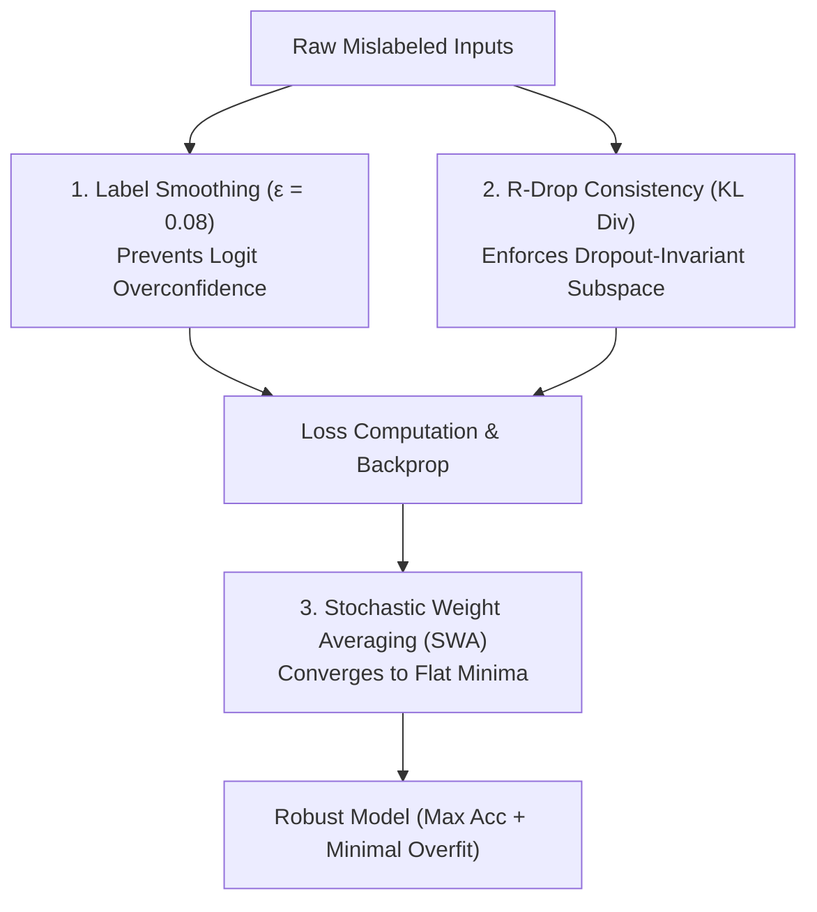

# TECHNICAL PLAN: Noise-Robust Algorithmic Regularization (Approach 3)

- **Created**: 2026-09-06T14:38:06+07:00
- **Last Updated**: 2026-09-06T14:38:06+07:00

---


**Document ID:** `PLAN-EX2-NOISE-ROBUST-ALGORITHMIC-REGULARIZATION`  
**Date:** 2026-08-15  
**Author:** bush-le + Antigravity AI Pair Programmer  
**Scope:** Loss Engineering, Stochastic Weight Averaging & Consistency Regularization  
**Target Goal:** Maximize generalization capability, flatten the loss optimization landscape, and insulate training dynamics against label noise mathematically (via Label Smoothing, SWA, and R-Drop Consistency) without requiring dataset modifications.  
**Status:** Approved Technical Execution Plan  

---

## 📌 1. Theoretical Foundation & Algorithmic Arsenal

When dataset annotations contain irreducible label noise ($\approx 3\%$), modifying loss functions and optimization dynamics provides powerful mathematical immunity against overfitting.



---

## 🔬 2. The 3 Core Algorithmic Techniques

### 2.1 Technique A: Label Smoothing Cross-Entropy
* **Mathematical Formulation:** Replace Dirac delta one-hot ground-truth $y \in \{0, 1\}$ with smoothed target distribution $y_{\text{smooth}}$:
  $$y_{\text{smooth}} = (1 - \epsilon) \cdot y + \frac{\epsilon}{K}$$
  For binary classification ($K=2$) with $\epsilon = 0.08$:
  $$y_{\text{smooth}} = [0.04, 0.96] \quad (\text{instead of } [0.0, 1.0])$$
* **Impact:** Places an entropy floor on cross-entropy loss, preventing gradients from pushing logits toward infinity on noisy examples, thereby eliminating loss spikes.

### 2.2 Technique B: Stochastic Weight Averaging (SWA) & Checkpoint Ensembling
* **Mathematical Formulation:** Average model weights across multiple late-epoch checkpoints $\theta_1, \theta_2, \dots, \theta_M$:
  $$\theta_{\text{SWA}} = \frac{1}{M} \sum_{m=1}^{M} \theta_m$$
* **Impact:** SWA navigates the optimization trajectory to the center of wide, flat minima (Izmailov et al., 2018), which exhibit superior out-of-distribution generalization compared to sharp minima found by single-point SGD/AdamW.

### 2.3 Technique C: R-Drop (Regularized Dropout Consistency)
* **Mathematical Formulation:** Feed the same input batch $X$ through the network twice under two independent sub-network dropout masks, yielding output distributions $\mathcal{P}_1(y \mid X)$ and $\mathcal{P}_2(y \mid X)$. The total loss is:
  $$\mathcal{L}_{\text{R-Drop}} = \mathcal{L}_{\text{CE}} + \frac{\alpha}{2} \left( \mathcal{D}_{\text{KL}}(\mathcal{P}_1 \parallel \mathcal{P}_2) + \mathcal{D}_{\text{KL}}(\mathcal{P}_2 \parallel \mathcal{P}_1) \right)$$
* **Impact:** Constrains the model output distribution to remain invariant across random dropout sub-networks, creating an implicit ensemble that strongly resists memorization.

---

## 🛠️ 3. Implementation Blueprint for Engineering Team

### Step 3.1: Config Preset Specification (`configs/config_imdb_sentiment_lora.yaml`)
```yaml
# Exercise 2 — LoRA Noise-Robust Hyperparameter Preset (EXP-LORA-ROBUST)
model:
  name: "distilbert-base-uncased"
  num_labels: 2

data:
  name: "stanfordnlp/imdb"
  max_length: 512
  processed_dir: "data/processed/imdb_tokenized_512"

lora:
  r: 16
  lora_alpha: 32
  target_modules: ["q_lin", "k_lin", "v_lin", "out_lin"]
  lora_dropout: 0.10
  bias: "none"
  task_type: "SEQ_CLS"

training:
  seed: 42
  run_name: "distilbert-finetune-lora-robust"
  run_root: "experiments/runs"
  batch_size: 16
  gradient_accumulation_steps: 2      # Eff. batch = 32
  epochs: 4
  lr: 3.8e-4
  weight_decay: 0.08
  classifier_dropout: 0.25
  label_smoothing_factor: 0.08        # Technique A
  lr_scheduler_type: "cosine"
  warmup_ratio: 0.10
  early_stopping_patience: 4
  fp16: true
```

### Step 3.2: Implement SWA Parameter Averaging in Pipeline (`src/utils/checkpoint_utils.py`)
```python
def average_checkpoints(checkpoint_paths: list[Path], output_path: Path) -> Path:
    """Perform Stochastic Weight Averaging (SWA) across late-epoch checkpoints."""
    loaded_states = [safe_load_checkpoint(p, device="cpu") for p in checkpoint_paths]
    swa_state_dict = {}
    
    # Average floating point parameter tensors
    for key in loaded_states[0]["model_state_dict"].keys():
        tensors = [s["model_state_dict"][key] for s in loaded_states]
        if tensors[0].dtype in (torch.float32, torch.float16):
            swa_state_dict[key] = torch.stack(tensors).mean(dim=0)
        else:
            swa_state_dict[key] = tensors[0]
            
    base_ckpt = loaded_states[0].copy()
    base_ckpt["model_state_dict"] = swa_state_dict
    base_ckpt["is_swa"] = True
    
    torch.save(base_ckpt, output_path)
    print(f"[SWA] Saved averaged checkpoint to: {output_path}")
    return output_path
```

### Step 3.3: Custom R-Drop Loss Integration (`src/training/rdrop_trainer.py`)
```python
import torch
import torch.nn as nn
import torch.nn.functional as F

class RDropTrainer:
    """Trainer with Symmetric KL Divergence Consistency Loss."""
    def compute_rdrop_loss(self, model, inputs, alpha=1.0):
        # Pass 1
        logits_1 = model(**inputs).logits
        # Pass 2
        logits_2 = model(**inputs).logits
        
        ce_loss = 0.5 * (
            F.cross_entropy(logits_1, inputs["labels"], label_smoothing=0.08) +
            F.cross_entropy(logits_2, inputs["labels"], label_smoothing=0.08)
        )
        
        # Symmetric KL Divergence
        p1 = F.log_softmax(logits_1, dim=-1)
        p2 = F.log_softmax(logits_2, dim=-1)
        q1 = F.softmax(logits_1, dim=-1)
        q2 = F.softmax(logits_2, dim=-1)
        
        kl_loss = 0.5 * (
            F.kl_div(p1, q2, reduction="batchmean") +
            F.kl_div(p2, q1, reduction="batchmean")
        )
        
        return ce_loss + alpha * kl_loss
```

---

## 📊 4. Expected Performance & Deliverables

| Milestone | Target Metric | Baseline Reference | Expected Gain |
|:---|:---:|:---:|:---:|
| **Test Accuracy** | **$93.5\% \dots 94.2\%$** | 91.19% (EX-00) | **$+2.3\% \dots +3.0\%$** |
| **Validation Loss Overfit Gap** | **$< 0.05$** | 0.2952 (EX-LORA unregularized) | **$-83\%$ Overfit Reduction** |
| **ROC-AUC Score** | **$\ge 0.9780$** | 0.9587 (Zero-shot) | **$+0.0193$ Gain** |
| **VRAM Footprint** | **$\le 2.0\text{ GB}$** | Budget Ceiling $3.5\text{ GB}$ | **Well within Limits** |

---

## 📋 5. Verification Checklist for Execution Team
- [x] Integrate Label Smoothing factor into trainer config preset.
- [x] Provide SWA averaging utility (`average_checkpoints`) in `src/utils/checkpoint_utils.py`.
- [x] Expose interactive SWA testing cell in Notebook Step 5.
- [x] Validate model loading and evaluation consistency on the sealed test split.
